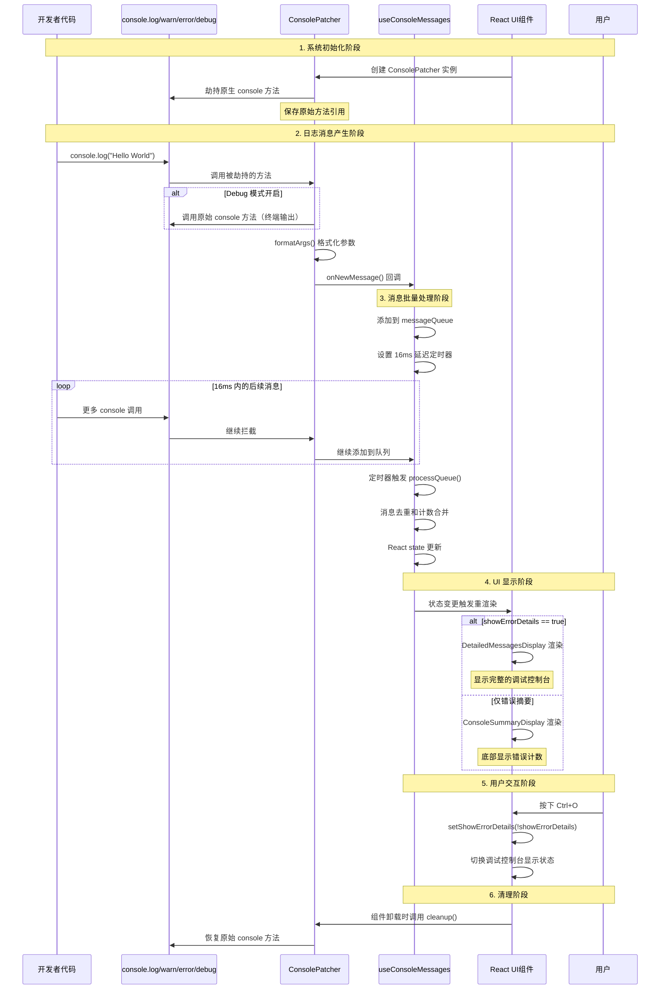

# Gemini CLI Console Debug 日志系统深度分析

## 概述

Gemini CLI 实现了一套完整的 console 日志拦截、处理和显示系统，通过巧妙的控制台方法劫持（Console Patching）、React 状态管理、批量处理和 UI 展示，为开发者提供了强大的调试和监控能力。本文档深入分析该系统的实现原理、架构设计和工作流程。

## 系统架构概览

### 核心组件关系

- **ConsolePatcher**: 控制台方法拦截器，劫持原生 console 方法
- **useConsoleMessages**: React Hook，管理控制台消息状态
- **DetailedMessagesDisplay**: 详细的调试控制台 UI 组件
- **ConsoleSummaryDisplay**: 控制台消息摘要显示组件
- **AppEvent 系统**: 事件驱动的调试控制台控制机制

## 完整工作流程



## 详细实现分析

### 1. ConsolePatcher 核心拦截机制

#### 1.1 类结构设计

**位置**: `packages/cli/src/ui/utils/ConsolePatcher.ts`

```typescript
export class ConsolePatcher {
  // 保存原始 console 方法的引用
  private originalConsoleLog = console.log;
  private originalConsoleWarn = console.warn;
  private originalConsoleError = console.error;
  private originalConsoleDebug = console.debug;

  private params: ConsolePatcherParams;

  constructor(params: ConsolePatcherParams) {
    this.params = params;
  }
}
```

**设计原理**:
- **原始方法保存**: 在类实例化时立即保存原始方法引用，防止被其他代码覆盖
- **参数化配置**: 通过构造函数接收配置参数，支持不同的使用场景
- **类型安全**: 使用 TypeScript 接口确保参数类型正确

#### 1.2 方法劫持实现

```typescript
patch() {
  console.log = this.patchConsoleMethod('log', this.originalConsoleLog);
  console.warn = this.patchConsoleMethod('warn', this.originalConsoleWarn);
  console.error = this.patchConsoleMethod('error', this.originalConsoleError);
  console.debug = this.patchConsoleMethod('debug', this.originalConsoleDebug);
}

private patchConsoleMethod = (
  type: 'log' | 'warn' | 'error' | 'debug',
  originalMethod: (...args: unknown[]) => void,
) => (...args: unknown[]) => {
  // Debug 模式下同时输出到原始控制台
  if (this.params.debugMode) {
    originalMethod.apply(console, args);
  }

  // 过滤 debug 消息（非 debug 模式下）
  if (type !== 'debug' || this.params.debugMode) {
    this.params.onNewMessage({
      type,
      content: this.formatArgs(args),
      count: 1,
    });
  }
};
```

**关键特性**:
- **透明劫持**: 完全替换 console 方法，对调用代码透明
- **双重输出**: Debug 模式下既调用原始方法又发送到 UI 系统
- **类型区分**: 支持不同类型的日志消息处理
- **条件过滤**: Debug 消息仅在 debug 模式下处理

#### 1.3 参数格式化处理

```typescript
private formatArgs = (args: unknown[]): string => util.format(...args);
```

**技术细节**:
- **Node.js util.format**: 使用 Node.js 内置的格式化函数
- **类型兼容**: 处理各种 JavaScript 数据类型
- **格式一致**: 与原生 console 方法的格式化行为保持一致

#### 1.4 清理机制

```typescript
cleanup = () => {
  console.log = this.originalConsoleLog;
  console.warn = this.originalConsoleWarn;
  console.error = this.originalConsoleError;
  console.debug = this.originalConsoleDebug;
};
```

**重要性**:
- **内存泄漏防护**: 防止组件卸载后仍持有引用
- **方法还原**: 确保其他代码能正常使用原始 console 方法
- **测试友好**: 支持测试环境的清理需求

### 2. useConsoleMessages 状态管理

#### 2.1 数据结构定义

```typescript
export interface ConsoleMessageItem {
  type: 'log' | 'warn' | 'error' | 'debug';
  content: string;
  count: number;  // 支持消息计数合并
}

type Action =
  | { type: 'ADD_MESSAGES'; payload: ConsoleMessageItem[] }
  | { type: 'CLEAR' };
```

**设计亮点**:
- **消息计数**: 相同消息自动合并并显示重复次数
- **类型化 Action**: 使用 TypeScript 确保 Reducer 的类型安全
- **扩展性**: 易于添加新的消息类型和操作

#### 2.2 批量处理优化

```typescript
const handleNewMessage = useCallback(
  (message: ConsoleMessageItem) => {
    messageQueueRef.current.push(message);
    if (!timeoutRef.current) {
      // 16ms 批量处理延迟
      timeoutRef.current = setTimeout(processQueue, 16);
    }
  },
  [processQueue],
);

const processQueue = useCallback(() => {
  if (messageQueueRef.current.length > 0) {
    const messagesToProcess = messageQueueRef.current;
    messageQueueRef.current = [];
    startTransition(() => {
      dispatch({ type: 'ADD_MESSAGES', payload: messagesToProcess });
    });
  }
  timeoutRef.current = null;
}, []);
```

**性能优化策略**:

1. **消息队列**: 使用 `useRef` 存储待处理消息，避免频繁 state 更新
2. **16ms 延迟**: 一个渲染帧的时间，平衡响应性和性能
3. **React Transition**: 使用 `startTransition` 标记为非紧急更新
4. **批量处理**: 将多个消息合并为一次 state 更新

#### 2.3 消息去重和合并逻辑

```typescript
function consoleMessagesReducer(
  state: ConsoleMessageItem[],
  action: Action,
): ConsoleMessageItem[] {
  switch (action.type) {
    case 'ADD_MESSAGES': {
      const newMessages = [...state];
      for (const queuedMessage of action.payload) {
        const lastMessage = newMessages[newMessages.length - 1];
        if (
          lastMessage &&
          lastMessage.type === queuedMessage.type &&
          lastMessage.content === queuedMessage.content
        ) {
          // 消息合并：更新计数而不添加新条目
          newMessages[newMessages.length - 1] = {
            ...lastMessage,
            count: lastMessage.count + 1,
          };
        } else {
          newMessages.push({ ...queuedMessage, count: 1 });
        }
      }
      return newMessages;
    }
    case 'CLEAR':
      return [];
  }
}
```

**智能合并算法**:
- **类型匹配**: 仅合并类型相同的消息
- **内容匹配**: 内容完全相同的消息才合并
- **连续性要求**: 只与最后一条消息比较，保持时序
- **不可变更新**: 创建新对象而非修改现有对象

### 3. Debug 模式配置系统

#### 3.1 配置来源

**CLI 参数配置** (`packages/cli/src/config/config.ts`):

```typescript
const debugMode =
  argv.debug ||  // --debug 命令行参数
  [process.env.DEBUG, process.env.DEBUG_MODE].some(
    (v) => v === 'true' || v === '1',
  );
```

**环境变量支持**:
- `DEBUG=true` 或 `DEBUG=1`
- `DEBUG_MODE=true` 或 `DEBUG_MODE=1`

#### 3.2 Debug 模式影响

**ConsolePatcher 行为**:
```typescript
if (this.params.debugMode) {
  originalMethod.apply(console, args);  // 输出到终端
}

// debug 类型消息的处理
if (type !== 'debug' || this.params.debugMode) {
  this.params.onNewMessage({...});
}
```

**UI 过滤逻辑**:
```typescript
const filteredConsoleMessages = useMemo(() => {
  if (config.getDebugMode()) {
    return consoleMessages;  // 显示所有消息
  }
  return consoleMessages.filter((msg) => msg.type !== 'debug');  // 过滤 debug
}, [consoleMessages, config]);
```

### 4. UI 显示系统

#### 4.1 详细调试控制台

**组件**: `DetailedMessagesDisplay`

```typescript
export const DetailedMessagesDisplay: React.FC<DetailedMessagesDisplayProps> = ({
  messages, maxHeight, width 
}) => {
  if (messages.length === 0) {
    return null;
  }

  return (
    <Box flexDirection="column" marginTop={1} borderStyle="round" 
         borderColor={Colors.Gray} paddingX={1} width={width}>
      <Box marginBottom={1}>
        <Text bold color={Colors.Foreground}>
          Debug Console <Text color={Colors.Gray}>(ctrl+o to close)</Text>
        </Text>
      </Box>
      <MaxSizedBox maxHeight={maxHeight} maxWidth={width - borderAndPadding}>
        {messages.map((msg, index) => {
          // 消息类型样式映射
          let textColor = Colors.Foreground;
          let icon = '\u2139'; // ℹ

          switch (msg.type) {
            case 'warn':
              textColor = Colors.AccentYellow;
              icon = '\u26A0'; // ⚠
              break;
            case 'error':
              textColor = Colors.AccentRed;
              icon = '\u2716'; // ✖
              break;
            case 'debug':
              textColor = Colors.Gray;
              icon = '\u1F50D'; // 🔍
              break;
          }

          return (
            <Box key={index} flexDirection="row">
              <Text color={textColor}>{icon} </Text>
              <Text color={textColor} wrap="wrap">
                {msg.content}
                {msg.count && msg.count > 1 && (
                  <Text color={Colors.Gray}> (x{msg.count})</Text>
                )}
              </Text>
            </Box>
          );
        })}
      </MaxSizedBox>
    </Box>
  );
};
```

**UI 设计特色**:
- **类型图标**: 每种消息类型使用不同的 Unicode 图标
- **颜色编码**: 错误红色、警告黄色、调试灰色
- **消息计数**: 显示重复消息的次数 `(x3)`
- **滚动支持**: 使用 `MaxSizedBox` 支持内容滚动
- **边框设计**: 圆角边框提供清晰的视觉边界

#### 4.2 摘要显示组件

**组件**: `ConsoleSummaryDisplay`

```typescript
export const ConsoleSummaryDisplay: React.FC<ConsoleSummaryDisplayProps> = ({
  errorCount,
}) => {
  if (errorCount === 0) {
    return null;
  }

  const errorIcon = '\u2716'; // ✖

  return (
    <Box>
      {errorCount > 0 && (
        <Text color={Colors.AccentRed}>
          {errorIcon} {errorCount} error{errorCount > 1 ? 's' : ''}{' '}
          <Text color={Colors.Gray}>(ctrl+o for details)</Text>
        </Text>
      )}
    </Box>
  );
};
```

**简洁设计**:
- **仅显示错误**: 专注于最重要的错误信息
- **计数显示**: 显示错误总数
- **交互提示**: 提示用户如何查看详情

### 5. 键盘交互系统

#### 5.1 快捷键处理

**位置**: `packages/cli/src/ui/App.tsx`

```typescript
useInput((input: string, key: InkKeyType) => {
  // ... 其他键盘处理逻辑

  if (key.ctrl && input === 'o') {
    setShowErrorDetails((prev) => !prev);  // 切换调试控制台显示
  } else if (key.ctrl && input === 't') {
    // 切换工具描述显示
    const newValue = !showToolDescriptions;
    setShowToolDescriptions(newValue);
  } else if (key.ctrl && input === 'e' && ideContext) {
    // 切换 IDE 上下文详情显示
    setShowIDEContextDetail((prev) => !prev);
  }
  // ... 其他快捷键
});
```

**快捷键设计**:
- **Ctrl+O**: 切换调试控制台显示
- **Ctrl+T**: 切换工具描述显示
- **Ctrl+E**: 切换 IDE 上下文显示

#### 5.2 状态管理集成

```typescript
const [showErrorDetails, setShowErrorDetails] = useState<boolean>(false);

// 事件驱动的调试控制台打开
useEffect(() => {
  const openDebugConsole = () => {
    setShowErrorDetails(true);
    setConstrainHeight(false); // 确保用户能看到完整消息
  };
  appEvents.on(AppEvent.OpenDebugConsole, openDebugConsole);

  return () => {
    appEvents.off(AppEvent.OpenDebugConsole, openDebugConsole);
  };
}, []);
```

**事件系统集成**:
- **AppEvent.OpenDebugConsole**: 程序化打开调试控制台
- **AppEvent.LogError**: 自动记录错误到控制台
- **高度约束**: 自动调整 UI 布局以显示完整内容

### 6. 特殊场景处理

#### 6.1 ACP Peer 模式的日志重定向

**位置**: `packages/cli/src/acp/acpPeer.ts`

```typescript
export async function runAcpPeer(config: Config, settings: LoadedSettings) {
  // 在 ACP 模式下重定向标准输出流
  console.log = console.error;    // 重定向到 stderr
  console.info = console.error;   // 重定向到 stderr  
  console.debug = console.error;  // 重定向到 stderr

  // ... ACP 通信逻辑
}
```

**设计原因**:
- **协议兼容**: ACP 协议使用 stdout 进行通信
- **日志分离**: 将日志输出重定向到 stderr，避免污染协议通信
- **调试支持**: 保持日志功能，但不影响协议数据

#### 6.2 循环检测中的日志处理

**位置**: `packages/core/src/services/loopDetectionService.ts`

```typescript
// 根据 debug 模式选择日志级别
this.config.getDebugMode() ? console.error(e) : console.debug(e);
```

**智能日志级别**:
- **Debug 模式**: 使用 `console.error` 确保显示
- **正常模式**: 使用 `console.debug` 降低干扰

### 7. 性能优化策略

#### 7.1 内存管理

**消息数量控制**:
- 通过 UI 组件的滚动机制避免无限制累积
- 提供 `clearConsoleMessages` 方法手动清理
- 使用 `useRef` 减少不必要的重渲染

#### 7.2 渲染优化

**React Performance Patterns**:
```typescript
// 使用 useMemo 缓存过滤结果
const filteredConsoleMessages = useMemo(() => {
  if (config.getDebugMode()) {
    return consoleMessages;
  }
  return consoleMessages.filter((msg) => msg.type !== 'debug');
}, [consoleMessages, config]);

// 使用 startTransition 标记非紧急更新
startTransition(() => {
  dispatch({ type: 'ADD_MESSAGES', payload: messagesToProcess });
});
```

#### 7.3 批量处理策略

**时间窗口优化**:
- **16ms 窗口**: 对应一个渲染帧的时间
- **队列合并**: 减少 React state 更新次数
- **消息去重**: 避免重复消息占用内存

## 使用场景和最佳实践

### 1. 开发调试

**启用 Debug 模式**:
```bash
# 通过环境变量
DEBUG=1 gemini

# 通过命令行参数
gemini --debug
```

**查看日志**:
1. 运行 CLI 应用
2. 按 `Ctrl+O` 打开调试控制台
3. 查看详细的日志信息

### 2. 错误监控

**自动错误展示**:
- 系统会自动在底部显示错误计数
- 严重错误会自动打开调试控制台
- 支持程序化触发调试控制台显示

### 3. 性能分析

**日志统计**:
- 查看重复消息的次数
- 分析日志产生的频率
- 识别性能瓶颈点

## 总结

### 系统优势

1. **透明集成**: 对现有代码完全透明，无需修改调用方式
2. **高性能**: 批量处理和消息去重确保 UI 流畅性
3. **用户友好**: 直观的 UI 设计和便捷的快捷键操作
4. **开发友好**: 丰富的调试信息和灵活的配置选项
5. **内存安全**: 完善的清理机制和资源管理

### 技术创新

1. **Console Patching**: 巧妙的方法劫持实现透明日志拦截
2. **批量优化**: 16ms 时间窗口的批量处理策略
3. **消息合并**: 智能的重复消息检测和计数显示
4. **双模式输出**: Debug 模式下的双重输出支持
5. **React 集成**: 完整的 React Hook 和组件生态

### 扩展性

该系统具有良好的扩展性，可以：
- 添加新的消息类型和处理逻辑
- 集成更多的日志来源（如网络请求、文件操作）
- 支持日志导出和持久化
- 实现远程日志收集和监控

这种设计体现了现代前端应用中状态管理、性能优化和用户体验的最佳实践，为 CLI 工具的调试和监控提供了完整的解决方案。 