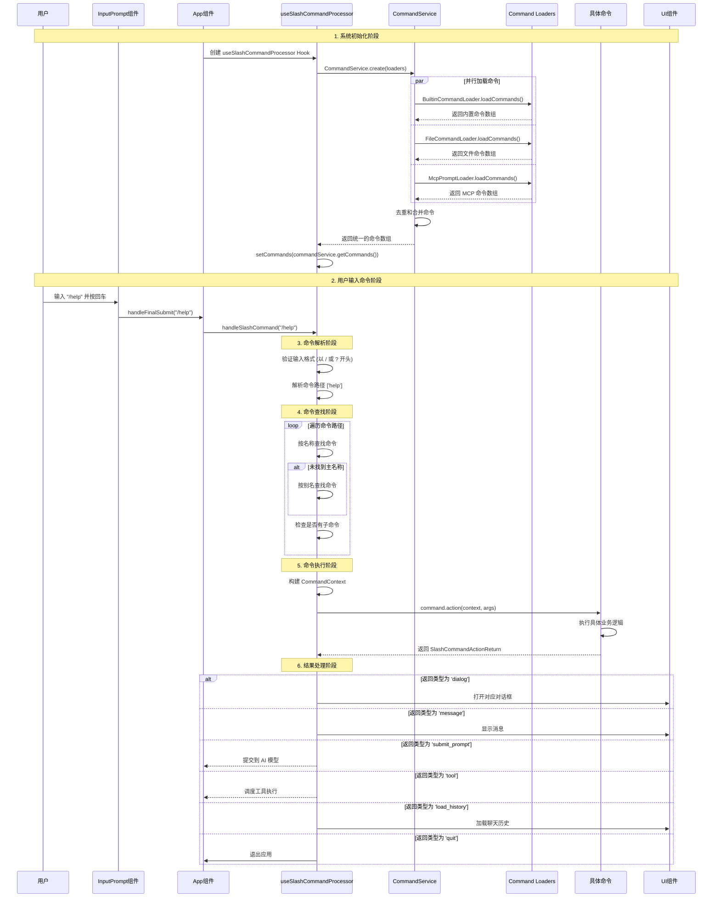

# Gemini CLI Command System 深度架构分析

## 概述

Gemini CLI 实现了一套完整的斜杠命令（Slash Command）系统，为用户提供了丰富的交互功能。该系统采用了模块化的架构设计，支持内置命令、文件命令和 MCP 服务器命令的动态加载和执行。本文档深入分析该命令系统的实现原理、架构设计和工作流程。

## 系统架构概览

### 核心组件关系

- **CommandService**: 命令服务的核心调度器，负责统一管理所有命令
- **Command Loaders**: 三种类型的命令加载器，负责从不同来源加载命令
  - **BuiltinCommandLoader**: 加载内置命令
  - **FileCommandLoader**: 加载本地 TOML 文件定义的命令
  - **McpPromptLoader**: 加载 MCP 服务器提供的命令
- **useSlashCommandProcessor**: React Hook，处理用户输入的斜杠命令
- **SlashCommand Interface**: 标准化的命令接口定义
- **CommandContext**: 命令执行上下文，提供服务和状态访问

### 命令类型分类

1. **内置命令** (Built-in Commands)
   - 系统核心功能命令
   - 硬编码在代码中
   - 如：`/help`, `/auth`, `/chat`, `/memory` 等

2. **文件命令** (File Commands)
   - 用户自定义命令
   - 通过 TOML 文件配置
   - 支持复杂的参数处理和 shell 注入

3. **MCP 命令** (MCP Prompt Commands)
   - 来自 Model Context Protocol 服务器
   - 动态加载的外部命令
   - 支持复杂的参数验证和帮助系统

## 完整命令处理流程



## 详细实现分析

### 1. CommandService - 命令调度核心

#### 1.1 服务架构设计

**位置**: `packages/cli/src/services/CommandService.ts`

```typescript
export class CommandService {
  private constructor(private readonly commands: readonly SlashCommand[]) {}

  static async create(
    loaders: ICommandLoader[],
    signal: AbortSignal,
  ): Promise<CommandService> {
    // 并行加载所有命令源
    const results = await Promise.allSettled(
      loaders.map((loader) => loader.loadCommands(signal)),
    );

    const allCommands: SlashCommand[] = [];
    for (const result of results) {
      if (result.status === 'fulfilled') {
        allCommands.push(...result.value);
      } else {
        console.debug('A command loader failed:', result.reason);
      }
    }

    // 命令去重：后加载的命令覆盖同名的先加载命令
    const commandMap = new Map<string, SlashCommand>();
    for (const cmd of allCommands) {
      commandMap.set(cmd.name, cmd);
    }

    const finalCommands = Object.freeze(Array.from(commandMap.values()));
    return new CommandService(finalCommands);
  }
}
```

**设计特色**:
- **异步工厂模式**: 使用 `create` 静态方法确保完整初始化
- **并行加载**: 同时加载多个命令源，提高性能
- **错误容忍**: 单个加载器失败不影响整体系统
- **命令覆盖**: 后加载的命令可以覆盖同名的先加载命令，实现自定义
- **不可变设计**: 返回只读命令数组，防止外部修改

#### 1.2 命令加载器接口

**位置**: `packages/cli/src/services/types.ts`

```typescript
export interface ICommandLoader {
  loadCommands(signal: AbortSignal): Promise<SlashCommand[]>;
}
```

**统一接口设计**:
- 标准化的加载接口，便于扩展新的命令源
- 支持 AbortSignal，可以取消加载过程
- 异步设计，支持文件 I/O 和网络请求

### 2. 内置命令系统 (BuiltinCommandLoader)

#### 2.1 内置命令注册

**位置**: `packages/cli/src/services/BuiltinCommandLoader.ts`

```typescript
export class BuiltinCommandLoader implements ICommandLoader {
  async loadCommands(_signal: AbortSignal): Promise<SlashCommand[]> {
    const allDefinitions: Array<SlashCommand | null> = [
      aboutCommand,
      authCommand,
      bugCommand,
      chatCommand,
      clearCommand,
      compressCommand,
      copyCommand,
      corgiCommand,
      docsCommand,
      editorCommand,
      extensionsCommand,
      helpCommand,
      ideCommand(this.config),
      memoryCommand,
      privacyCommand,
      mcpCommand,
      quitCommand,
      restoreCommand(this.config),
      statsCommand,
      themeCommand,
      toolsCommand,
      vimCommand,
    ];

    return allDefinitions.filter((cmd): cmd is SlashCommand => cmd !== null);
  }
}
```

**内置命令特点**:
- **静态导入**: 所有命令都是编译时确定的
- **依赖注入**: 某些命令需要 config 参数，如 `ideCommand(this.config)`
- **条件加载**: 返回 null 的命令会被过滤掉，支持条件性启用
- **类型安全**: 使用 TypeScript 确保所有命令符合接口定义

#### 2.2 简单命令示例

**位置**: `packages/cli/src/ui/commands/helpCommand.ts`

```typescript
export const helpCommand: SlashCommand = {
  name: 'help',
  altNames: ['?'],
  description: 'for help on gemini-cli',
  kind: CommandKind.BUILT_IN,
  action: (_context, _args): OpenDialogActionReturn => {
    console.debug('Opening help UI ...');
    return {
      type: 'dialog',
      dialog: 'help',
    };
  },
};
```

**简单命令特征**:
- **声明式定义**: 清晰的配置结构
- **别名支持**: `altNames` 提供命令的替代名称
- **返回类型**: 通过返回对象指示 UI 应该执行的操作

#### 2.3 复杂命令示例 (子命令结构)

**位置**: `packages/cli/src/ui/commands/chatCommand.ts`

```typescript
export const chatCommand: SlashCommand = {
  name: 'chat',
  description: 'Manage conversation checkpoints',
  kind: CommandKind.BUILT_IN,
  subCommands: [
    listCommand,    // /chat list
    saveCommand,    // /chat save <tag>
    resumeCommand,  // /chat resume <tag>
  ],
  completion: async (context: CommandContext, partialArg: string) => {
    // 为 resume 子命令提供保存的对话标签补全
    const chatDetails = await getSavedChatTags(context, true);
    return chatDetails
      .map((chat) => `resume ${chat.name}`)
      .filter((suggestion) => 
        suggestion.toLowerCase().includes(partialArg.toLowerCase())
      );
  },
};
```

**复杂命令特征**:
- **层级结构**: 支持子命令的嵌套结构
- **智能补全**: 动态提供上下文相关的补全建议
- **参数处理**: 子命令可以有各自的参数处理逻辑

### 3. 文件命令系统 (FileCommandLoader)

#### 3.1 文件命令加载机制

**位置**: `packages/cli/src/services/FileCommandLoader.ts`

```typescript
export class FileCommandLoader implements ICommandLoader {
  async loadCommands(signal: AbortSignal): Promise<SlashCommand[]> {
    const commandMap = new Map<string, SlashCommand>();
    
    // 用户级命令目录
    const userDir = getUserCommandsDir();
    const userFiles = await glob('**/*.toml', {
      cwd: userDir,
      nodir: true,
      dot: true,
      signal,
    });
    
    // 项目级命令目录（优先级更高）
    const projectDir = getProjectCommandsDir(this.projectRoot);
    const projectFiles = await glob('**/*.toml', {
      cwd: projectDir,
      nodir: true,
      dot: true, 
      signal,
    });
    
    // 项目命令覆盖用户命令
    for (const cmd of userCommands) {
      commandMap.set(cmd.name, cmd);
    }
    for (const cmd of projectCommands) {
      commandMap.set(cmd.name, cmd); // 覆盖同名的用户命令
    }
    
    return Array.from(commandMap.values());
  }
}
```

**文件命令特点**:
- **双级目录**: 支持用户全局命令和项目特定命令
- **优先级覆盖**: 项目命令可以覆盖用户命令
- **递归扫描**: 支持子目录中的命令文件
- **文件名映射**: 文件路径转换为命令名（如 `tools/git.toml` → `tools:git`）

#### 3.2 TOML 命令文件格式

**TOML 文件示例**:
```toml
prompt = """
Create a git commit with the following changes:

{{args}}

Please write a clear and descriptive commit message.
"""
description = "Generate a git commit with AI assistance"
```

**Zod 验证模式**:
```typescript
const TomlCommandDefSchema = z.object({
  prompt: z.string({
    required_error: "The 'prompt' field is required.",
    invalid_type_error: "The 'prompt' field must be a string.",
  }),
  description: z.string().optional(),
});
```

#### 3.3 参数处理器系统

**默认参数处理器**:
```typescript
// 对于不包含 {{args}} 的简单命令
class DefaultArgumentProcessor implements IPromptProcessor {
  async process(prompt: string, context: CommandContext): Promise<string> {
    // 简单地将用户参数附加到提示末尾
    return `${prompt}\n\n${context.invocation?.args || ''}`;
  }
}
```

**简写参数处理器**:
```typescript
// 对于包含 {{args}} 占位符的命令
class ShorthandArgumentProcessor implements IPromptProcessor {
  async process(prompt: string, context: CommandContext): Promise<string> {
    // 将 {{args}} 替换为用户实际输入的参数
    return prompt.replace(/\{\{args\}\}/g, context.invocation?.args || '');
  }
}
```

**Shell 注入处理器**:
```typescript
class ShellProcessor implements IPromptProcessor {
  async process(prompt: string, context: CommandContext): Promise<string> {
    // 检测并处理 {{shell:command}} 注入
    if (containsShellInjection(prompt)) {
      const commands = extractShellCommands(prompt);
      throw new ConfirmationRequiredError(commands);
    }
    return prompt;
  }
}
```

### 4. MCP 命令系统 (McpPromptLoader)

#### 4.1 MCP 服务器命令发现

**位置**: `packages/cli/src/services/McpPromptLoader.ts`

```typescript
export class McpPromptLoader implements ICommandLoader {
  loadCommands(_signal: AbortSignal): Promise<SlashCommand[]> {
    const promptCommands: SlashCommand[] = [];
    const mcpServers = this.config.getMcpServers() || {};
    
    for (const serverName in mcpServers) {
      const prompts = getMCPServerPrompts(this.config, serverName) || [];
      
      for (const prompt of prompts) {
        const newPromptCommand: SlashCommand = {
          name: prompt.name,
          description: prompt.description || `Invoke prompt ${prompt.name}`,
          kind: CommandKind.MCP_PROMPT,
          subCommands: [
            {
              name: 'help',
              description: 'Show help for this prompt',
              kind: CommandKind.MCP_PROMPT,
              action: async (): Promise<SlashCommandActionReturn> => {
                // 生成参数帮助信息
                return generateHelpMessage(prompt);
              },
            },
          ],
          action: async (context, args) => {
            const promptInputs = this.parseArgs(args, prompt.arguments);
            const result = await prompt.invoke(promptInputs);
            
            return {
              type: 'submit_prompt',
              content: JSON.stringify(result.messages[0].content.text),
            };
          },
        };
        promptCommands.push(newPromptCommand);
      }
    }
    return Promise.resolve(promptCommands);
  }
}
```

#### 4.2 MCP 参数解析

**命名参数解析**:
```typescript
// 支持 --key="value" 或 --key=value 格式
const namedArgRegex = /--([^=]+)=(?:"((?:\\.|[^"\\])*)"|([^ ]*))/g;
```

**位置参数解析**:
```typescript
// 将剩余的位置参数映射到必需的参数
for (let i = 0; i < unfilledArgs.length; i++) {
  if (positionalArgs.length > i && positionalArgs[i]) {
    promptInputs[unfilledArgs[i].name] = positionalArgs[i];
  } else {
    missingArgs.push(unfilledArgs[i].name);
  }
}
```

**自动补全支持**:
```typescript
completion: async (_: CommandContext, partialArg: string) => {
  const suggestions: string[] = [];
  const usedArgNames = new Set(
    (partialArg.match(/--([^=]+)/g) || []).map((s) => s.substring(2)),
  );

  for (const arg of prompt.arguments) {
    if (!usedArgNames.has(arg.name)) {
      suggestions.push(`--${arg.name}=""`);
    }
  }

  return suggestions;
},
```

### 5. 命令处理核心 (useSlashCommandProcessor)

#### 5.1 命令解析算法

**位置**: `packages/cli/src/ui/hooks/slashCommandProcessor.ts`

```typescript
const handleSlashCommand = useCallback(async (rawQuery: PartListUnion) => {
  // 1. 输入验证
  if (typeof rawQuery !== 'string') return false;
  const trimmed = rawQuery.trim();
  if (!trimmed.startsWith('/') && !trimmed.startsWith('?')) return false;

  // 2. 命令路径解析
  const parts = trimmed.substring(1).trim().split(/\s+/);
  const commandPath = parts.filter((p) => p);

  // 3. 命令查找 - 支持嵌套子命令
  let currentCommands = commands;
  let commandToExecute: SlashCommand | undefined;
  let pathIndex = 0;

  for (const part of commandPath) {
    // 双重查找：先按主名称，再按别名
    let foundCommand = currentCommands.find((cmd) => cmd.name === part);
    if (!foundCommand) {
      foundCommand = currentCommands.find((cmd) =>
        cmd.altNames?.includes(part),
      );
    }

    if (foundCommand) {
      commandToExecute = foundCommand;
      pathIndex++;
      if (foundCommand.subCommands) {
        currentCommands = foundCommand.subCommands;
      } else {
        break;
      }
    } else {
      break;
    }
  }

  // 4. 参数提取
  const args = parts.slice(pathIndex).join(' ');
  
  // 5. 命令执行
  if (commandToExecute?.action) {
    const result = await commandToExecute.action(commandContext, args);
    return processCommandResult(result);
  }
});
```

**查找算法特点**:
- **逐级匹配**: 支持多级子命令的递归查找
- **双重查找**: 主名称优先，别名作为备选
- **精确分割**: 正确处理命令名称和参数的边界
- **别名支持**: 完整支持命令别名系统

#### 5.2 命令结果处理

```typescript
const processCommandResult = (result: SlashCommandActionReturn) => {
  switch (result.type) {
    case 'tool':
      return {
        type: 'schedule_tool',
        toolName: result.toolName,
        toolArgs: result.toolArgs,
      };
      
    case 'message':
      addItem({
        type: result.messageType === 'error' ? MessageType.ERROR : MessageType.INFO,
        text: result.content,
      }, Date.now());
      return { type: 'handled' };
      
    case 'dialog':
      switch (result.dialog) {
        case 'help': setShowHelp(true); break;
        case 'auth': openAuthDialog(); break;
        case 'theme': openThemeDialog(); break;
        case 'editor': openEditorDialog(); break;
        case 'privacy': openPrivacyNotice(); break;
      }
      return { type: 'handled' };
      
    case 'load_history':
      await config?.getGeminiClient()?.setHistory(result.clientHistory);
      fullCommandContext.ui.clear();
      result.history.forEach((item, index) => {
        fullCommandContext.ui.addItem(item, index);
      });
      return { type: 'handled' };
      
    case 'quit':
      setQuittingMessages(result.messages);
      setTimeout(() => process.exit(0), 100);
      return { type: 'handled' };
      
    case 'submit_prompt':
      return {
        type: 'submit_prompt',
        content: result.content,
      };
      
    case 'confirm_shell_commands':
      return handleShellConfirmation(result);
  }
};
```

### 6. 命令接口规范 (SlashCommand Interface)

#### 6.1 完整接口定义

**位置**: `packages/cli/src/ui/commands/types.ts`

```typescript
export interface SlashCommand {
  name: string;              // 主命令名称
  altNames?: string[];       // 别名数组
  description: string;       // 命令描述
  kind: CommandKind;        // 命令类型（内置/文件/MCP）
  
  // 可选的执行函数（父命令可以没有 action，只提供子命令）
  action?: (
    context: CommandContext,
    args: string,
  ) => void | SlashCommandActionReturn | Promise<void | SlashCommandActionReturn>;
  
  // 可选的自动补全函数
  completion?: (
    context: CommandContext,
    partialArg: string,
  ) => Promise<string[]>;
  
  // 可选的子命令
  subCommands?: SlashCommand[];
}
```

#### 6.2 命令上下文结构

```typescript
export interface CommandContext {
  // 调用信息
  invocation?: {
    raw: string;        // 原始输入字符串
    name: string;       // 匹配的命令名称
    args: string;       // 参数字符串
  };
  
  // 核心服务
  services: {
    config: Config | null;
    settings: LoadedSettings;
    git: GitService | undefined;
    logger: Logger;
  };
  
  // UI 交互
  ui: {
    addItem: UseHistoryManagerReturn['addItem'];
    clear: () => void;
    setDebugMessage: (message: string) => void;
    pendingItem: HistoryItemWithoutId | null;
    setPendingItem: (item: HistoryItemWithoutId | null) => void;
    loadHistory: UseHistoryManagerReturn['loadHistory'];
    toggleCorgiMode: () => void;
    toggleVimEnabled: () => Promise<boolean>;
  };
  
  // 会话数据
  session: {
    stats: SessionStatsState;
    sessionShellAllowlist: Set<string>;
  };
}
```

#### 6.3 命令返回类型

```typescript
export type SlashCommandActionReturn =
  | ToolActionReturn              // 调度工具执行
  | MessageActionReturn           // 显示信息消息
  | QuitActionReturn             // 退出应用
  | OpenDialogActionReturn       // 打开对话框
  | LoadHistoryActionReturn      // 加载聊天历史
  | SubmitPromptActionReturn     // 提交到 AI 模型
  | ConfirmShellCommandsActionReturn; // 请求 Shell 命令确认
```

### 7. 自动补全系统

#### 7.1 补全触发机制

**位置**: `packages/cli/src/ui/hooks/useCompletion.ts`

```typescript
const isActive = useMemo(() => {
  if (isSlashCommand(buffer.text.trim())) {
    return true;
  }
  
  // 检查游标前是否有 @ 符号（用于文件补全）
  const [row, col] = buffer.cursor;
  const currentLine = buffer.lines[row] || '';
  const codePoints = toCodePoints(currentLine);
  
  for (let i = col - 1; i >= 0; i--) {
    const char = codePoints[i];
    if (char === ' ') {
      // 检查是否为转义的空格
      let backslashCount = 0;
      for (let j = i - 1; j >= 0 && codePoints[j] === '\\'; j--) {
        backslashCount++;
      }
      if (backslashCount % 2 === 0) {
        return false; // 遇到未转义的空格，停止补全
      }
    } else if (char === '@') {
      return true; // 找到 @ 符号，激活补全
    }
  }
  
  return false;
}, [buffer.text, buffer.cursor]);
```

#### 7.2 斜杠命令补全

```typescript
const generateSlashCommandSuggestions = useCallback(async () => {
  const text = buffer.text.trim();
  if (!isSlashCommand(text)) return [];
  
  const input = text.substring(1); // 移除 '/' 前缀
  const parts = input.split(/\s+/);
  
  // 如果只有命令名（没有空格），补全命令名称
  if (parts.length === 1) {
    return slashCommands
      .filter(cmd => 
        cmd.name.startsWith(parts[0]) || 
        cmd.altNames?.some(alias => alias.startsWith(parts[0]))
      )
      .map(cmd => ({
        type: 'command' as const,
        value: cmd.name,
        description: cmd.description,
      }));
  }
  
  // 查找匹配的命令并调用其补全函数
  const command = findCommand(parts[0], slashCommands);
  if (command?.completion) {
    const partialArgs = parts.slice(1).join(' ');
    const completions = await command.completion(commandContext, partialArgs);
    return completions.map(value => ({
      type: 'argument' as const,
      value,
      description: '',
    }));
  }
  
  return [];
}, [buffer.text, slashCommands, commandContext]);
```

#### 7.3 文件路径补全

```typescript
const generateFilePathSuggestions = useCallback(async (trigger: string) => {
  const { directoryPath, filePrefix } = parseFilePath(trigger);
  const absolutePath = path.resolve(cwd, directoryPath);
  
  try {
    const files = await fs.readdir(absolutePath, { withFileTypes: true });
    const suggestions: Suggestion[] = [];
    
    for (const file of files) {
      if (file.name.startsWith(filePrefix)) {
        const fullPath = path.join(directoryPath, file.name);
        const escapedPath = escapePath(fullPath);
        
        suggestions.push({
          type: file.isDirectory() ? 'directory' : 'file',
          value: file.isDirectory() ? `${escapedPath}/` : escapedPath,
          description: file.isDirectory() ? 'Directory' : 'File',
        });
      }
    }
    
    return suggestions;
  } catch (error) {
    console.debug('Error reading directory for completion:', error);
    return [];
  }
}, [cwd]);
```

### 8. Shell 命令确认机制

#### 8.1 确认请求处理

```typescript
case 'confirm_shell_commands': {
  const { outcome, approvedCommands } = await new Promise<{
    outcome: ToolConfirmationOutcome;
    approvedCommands?: string[];
  }>((resolve) => {
    setShellConfirmationRequest({
      commands: result.commandsToConfirm,
      onConfirm: (resolvedOutcome, resolvedApprovedCommands) => {
        setShellConfirmationRequest(null); // 关闭对话框
        resolve({
          outcome: resolvedOutcome,
          approvedCommands: resolvedApprovedCommands,
        });
      },
    });
  });

  // 处理用户决定
  if (outcome === ToolConfirmationOutcome.Cancel || !approvedCommands) {
    return { type: 'handled' };
  }

  if (outcome === ToolConfirmationOutcome.ProceedAlways) {
    // 将命令添加到会话白名单
    setSessionShellAllowlist(
      (prev) => new Set([...prev, ...approvedCommands]),
    );
  }

  // 使用批准的命令重新执行
  return await handleSlashCommand(
    result.originalInvocation.raw,
    new Set(approvedCommands), // 一次性白名单
  );
}
```

#### 8.2 白名单机制

```typescript
// 临时会话白名单增强
if (oneTimeShellAllowlist && oneTimeShellAllowlist.size > 0) {
  fullCommandContext.session = {
    ...fullCommandContext.session,
    sessionShellAllowlist: new Set([
      ...fullCommandContext.session.sessionShellAllowlist,
      ...oneTimeShellAllowlist,
    ]),
  };
}
```

## 命令系统安全机制

### 1. 输入验证

```typescript
// 严格的输入格式验证
if (!trimmed.startsWith('/') && !trimmed.startsWith('?')) {
  return false;
}

// TOML 文件内容验证
const validationResult = TomlCommandDefSchema.safeParse(parsed);
if (!validationResult.success) {
  console.error('Validation errors:', validationResult.error.flatten());
  return null;
}
```

### 2. Shell 注入防护

```typescript
// 检测潜在的 shell 注入
if (validDef.prompt.includes(SHELL_INJECTION_TRIGGER)) {
  processors.push(new ShellProcessor(commandName));
}

// 要求用户明确确认危险操作
class ConfirmationRequiredError extends Error {
  constructor(public readonly commandsToConfirm: string[]) {
    super('Shell commands require user confirmation');
  }
}
```

### 3. 权限控制

```typescript
// 会话级别的命令白名单
sessionShellAllowlist: Set<string>

// 一次性批准机制
oneTimeShellAllowlist?: Set<string>
```

## 性能优化策略

### 1. 命令加载优化

```typescript
// 并行加载所有命令源
const results = await Promise.allSettled(
  loaders.map((loader) => loader.loadCommands(signal)),
);

// 错误隔离，单个失败不影响整体
if (result.status === 'fulfilled') {
  allCommands.push(...result.value);
} else {
  console.debug('A command loader failed:', result.reason);
}
```

### 2. 内存优化

```typescript
// 不可变的命令数组，防止意外修改
const finalCommands = Object.freeze(Array.from(commandMap.values()));

// 延迟初始化，避免启动时过度加载
const gitService = useMemo(() => {
  if (!config?.getProjectRoot()) return;
  return new GitService(config.getProjectRoot());
}, [config]);
```

### 3. 查找优化

```typescript
// TODO: 预计算查找映射，提高查找性能
// 当前实现为双重线性查找，在命令数量增加时可能成为瓶颈
// 建议在 CommandService 中预计算名称和别名的查找表
```

## 扩展性设计

### 1. 新命令类型扩展

```typescript
// 定义新的命令类型
enum CommandKind {
  BUILT_IN = 'built-in',
  FILE = 'file',
  MCP_PROMPT = 'mcp-prompt',
  // 可以添加新类型，如：
  // REMOTE_API = 'remote-api',
  // PLUGIN = 'plugin',
}

// 实现新的加载器
class RemoteApiCommandLoader implements ICommandLoader {
  async loadCommands(signal: AbortSignal): Promise<SlashCommand[]> {
    // 从远程 API 加载命令
  }
}
```

### 2. 参数处理器扩展

```typescript
// 新的参数处理器
class CustomArgumentProcessor implements IPromptProcessor {
  async process(prompt: string, context: CommandContext): Promise<string> {
    // 自定义参数处理逻辑
  }
}

// 注册到处理器链
processors.push(new CustomArgumentProcessor());
```

### 3. 命令返回类型扩展

```typescript
// 添加新的返回类型
export interface CustomActionReturn {
  type: 'custom';
  data: unknown;
}

export type SlashCommandActionReturn =
  | ToolActionReturn
  | MessageActionReturn
  // ... 现有类型
  | CustomActionReturn; // 新类型
```

## 命令系统最佳实践

### 1. 命令定义规范

```typescript
// 良好的命令定义示例
export const myCommand: SlashCommand = {
  name: 'my-command',
  altNames: ['mc', 'cmd'],
  description: 'Clear and specific description of what this command does',
  kind: CommandKind.BUILT_IN,
  
  action: async (context, args): Promise<SlashCommandActionReturn> => {
    // 参数验证
    if (!args.trim()) {
      return {
        type: 'message',
        messageType: 'error',
        content: 'This command requires arguments',
      };
    }
    
    // 业务逻辑
    try {
      const result = await performAction(args);
      return {
        type: 'message',
        messageType: 'info',
        content: `Action completed: ${result}`,
      };
    } catch (error) {
      return {
        type: 'message',
        messageType: 'error',
        content: `Error: ${error.message}`,
      };
    }
  },
  
  completion: async (context, partialArg) => {
    // 提供有意义的补全建议
    return ['option1', 'option2', 'option3']
      .filter(opt => opt.startsWith(partialArg));
  },
};
```

### 2. 错误处理策略

```typescript
// 统一的错误处理模式
try {
  const result = await riskyOperation();
  return { type: 'message', messageType: 'info', content: result };
} catch (error) {
  console.error('Command execution failed:', error);
  return {
    type: 'message',
    messageType: 'error',
    content: `Operation failed: ${getErrorMessage(error)}`,
  };
}
```

### 3. 上下文使用指南

```typescript
// 充分利用命令上下文
action: async (context, args) => {
  // 访问配置
  const projectRoot = context.services.config?.getProjectRoot();
  
  // 记录日志
  await context.services.logger?.logMessage(
    MessageSenderType.USER, 
    `Executing command: ${context.invocation?.name}`
  );
  
  // 更新 UI
  context.ui.setDebugMessage('Processing...');
  
  // 使用会话状态
  const isAllowed = context.session.sessionShellAllowlist.has(command);
  
  return result;
}
```

## 总结

### 系统优势

1. **模块化架构**: 清晰的职责分离，易于维护和扩展
2. **多源支持**: 内置、文件、MCP 三种命令源的统一管理
3. **类型安全**: 完整的 TypeScript 类型系统保障
4. **丰富功能**: 别名、子命令、自动补全、参数处理等
5. **安全机制**: 输入验证、Shell 注入防护、权限控制
6. **性能优化**: 并行加载、错误隔离、内存优化

### 技术创新

1. **统一接口设计**: ICommandLoader 接口支持任意命令源扩展
2. **双重查找算法**: 主名称和别名的完整支持
3. **参数处理器链**: 灵活的参数预处理管道
4. **异步命令系统**: 完整支持异步操作和错误处理
5. **上下文依赖注入**: 丰富的执行上下文支持复杂业务逻辑

### 未来扩展方向

1. **性能优化**: 预计算命令查找表，优化大规模命令查找
2. **远程命令**: 支持从远程 API 动态加载命令
3. **插件系统**: 支持第三方插件提供命令
4. **可视化管理**: 提供命令管理和配置的图形界面
5. **智能补全**: 基于上下文和历史的更智能的补全建议

这个命令系统体现了现代 CLI 应用的最佳实践，提供了强大而灵活的用户交互能力，为 Gemini CLI 的功能扩展奠定了坚实的架构基础。 