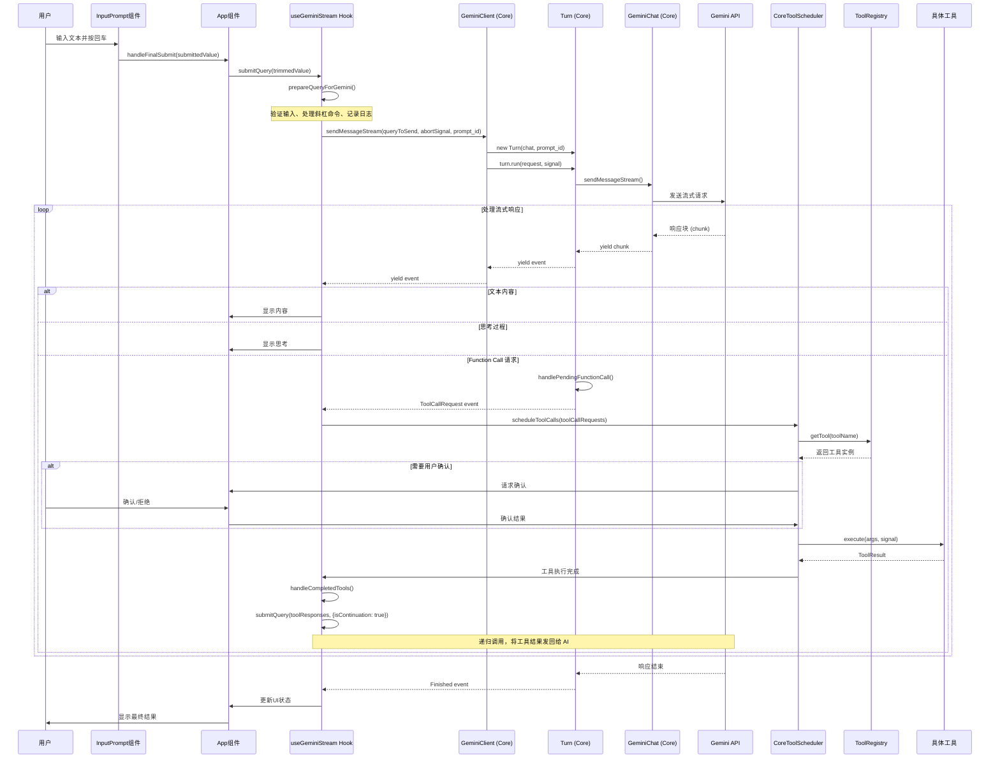
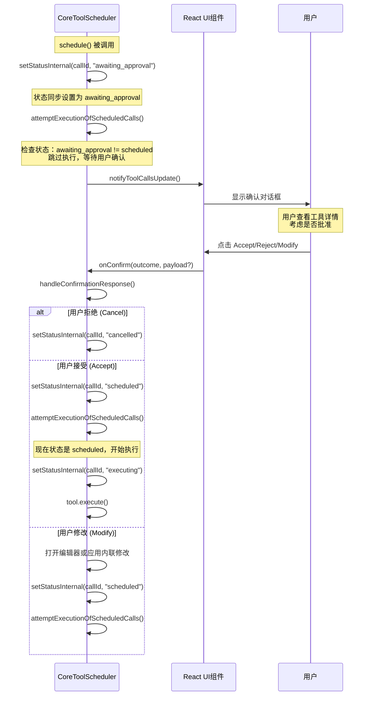
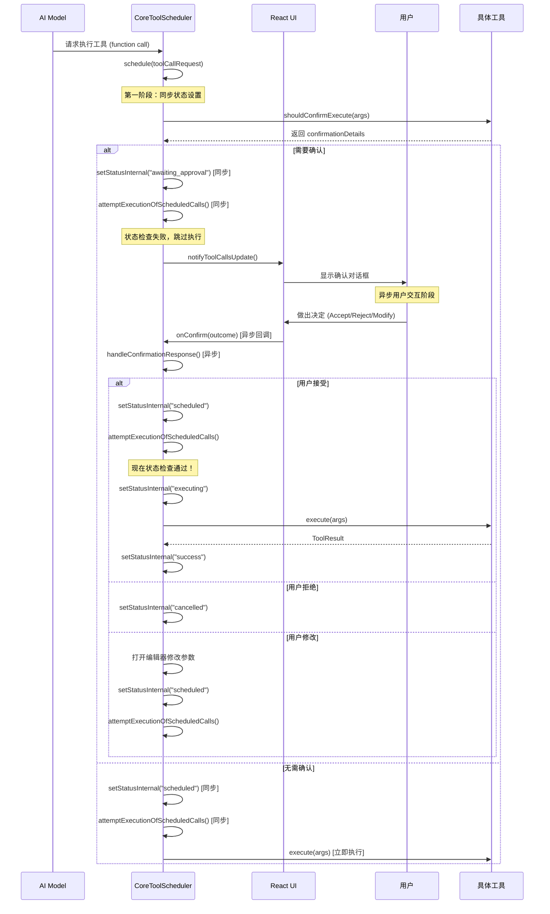

# Gemini CLI 用户交互与大模型对话流程深度分析

## 概述

本文档深入分析用户在 Gemini CLI 中输入内容提交后，系统如何与大模型进行交互，执行 function call，直到最终执行结束的完整流程。该流程涉及 CLI 包的用户界面层和 Core 包的核心业务逻辑层，展现了现代 AI 助手应用的复杂交互架构。

## 技术架构概览

### 核心组件关系

- **CLI 包**: 负责用户界面、输入处理、状态管理
- **Core 包**: 负责 AI 模型通信、工具调度、核心业务逻辑
- **React TUI**: 使用 Ink 构建的终端用户界面
- **Gemini API**: Google 的生成式 AI 服务
- **Tool Registry**: 工具发现和管理系统

## 完整交互流程



## 详细流程分析

### 1. 用户输入处理阶段

#### 1.1 输入组件 (`InputPrompt.tsx`)

**位置**: `packages/cli/src/ui/components/InputPrompt.tsx`

```typescript
const handleSubmitAndClear = useCallback(
  (submittedValue: string) => {
    if (shellModeActive) {
      shellHistory.addCommandToHistory(submittedValue);
    }
    // 清空输入缓冲区并调用提交回调
    buffer.setText('');
    onSubmit(submittedValue);
    resetCompletionState();
  },
  [onSubmit, buffer, resetCompletionState, shellModeActive, shellHistory],
);
```

**关键功能**:
- 处理用户输入提交
- 管理输入历史记录
- 支持自动补全功能
- 清空输入缓冲区

#### 1.2 应用主组件 (`App.tsx`)

**位置**: `packages/cli/src/ui/App.tsx`

```typescript
const handleFinalSubmit = useCallback(
  (submittedValue: string) => {
    const trimmedValue = submittedValue.trim();
    if (trimmedValue.length > 0) {
      submitQuery(trimmedValue);
    }
  },
  [submitQuery],
);
```

**职责**:
- 验证输入内容非空
- 调用 `submitQuery` 函数开始 AI 交互流程

### 2. 查询预处理阶段

#### 2.1 查询提交 (`useGeminiStream.ts`)

**位置**: `packages/cli/src/ui/hooks/useGeminiStream.ts`

```typescript
const submitQuery = useCallback(
  async (
    query: PartListUnion,
    options?: { isContinuation: boolean },
    prompt_id?: string,
  ) => {
    // 防止重复提交
    if (
      (streamingState === StreamingState.Responding ||
        streamingState === StreamingState.WaitingForConfirmation) &&
      !options?.isContinuation
    )
      return;

    const userMessageTimestamp = Date.now();
    setShowHelp(false);

    // 创建取消控制器
    abortControllerRef.current = new AbortController();
    const abortSignal = abortControllerRef.current.signal;
    turnCancelledRef.current = false;

    // 生成 prompt ID
    if (!prompt_id) {
      prompt_id = config.getSessionId() + '########' + getPromptCount();
    }

    // 预处理查询
    const { queryToSend, shouldProceed } = await prepareQueryForGemini(
      query,
      userMessageTimestamp,
      abortSignal,
      prompt_id!,
    );

    if (!shouldProceed || queryToSend === null) {
      return;
    }
```

#### 2.2 查询预处理 (`prepareQueryForGemini`)

```typescript
const prepareQueryForGemini = useCallback(
  async (
    query: PartListUnion,
    userMessageTimestamp: number,
    abortSignal: AbortSignal,
    prompt_id: string,
  ) => {
    // 验证输入
    if (turnCancelledRef.current) {
      return { queryToSend: null, shouldProceed: false };
    }
    if (typeof query === 'string' && query.trim().length === 0) {
      return { queryToSend: null, shouldProceed: false };
    }

    let localQueryToSendToGemini: PartListUnion | null = null;

    if (typeof query === 'string') {
      const trimmedQuery = query.trim();
      
      // 记录用户提示
      logUserPrompt(
        config,
        new UserPromptEvent(
          trimmedQuery.length,
          prompt_id,
          config.getContentGeneratorConfig()?.authType,
          trimmedQuery,
        ),
      );
      
      onDebugMessage(`User query: '${trimmedQuery}'`);
      await logger?.logMessage(MessageSenderType.USER, trimmedQuery);

      // 处理斜杠命令
      const slashCommandResult = await handleSlashCommand(trimmedQuery);
```

**关键处理**:
- 输入验证和清理
- 用户行为遥测记录
- 斜杠命令处理
- 会话状态管理

### 3. AI 模型通信阶段

#### 3.1 客户端流式通信 (`GeminiClient`)

**位置**: `packages/core/src/core/client.ts`

```typescript
async *sendMessageStream(
  request: PartListUnion,
  signal: AbortSignal,
  prompt_id: string,
  turns: number = this.MAX_TURNS,
  originalModel?: string,
): AsyncGenerator<ServerGeminiStreamEvent, Turn> {
  // 重置循环检测器
  if (this.lastPromptId !== prompt_id) {
    this.loopDetector.reset();
    this.lastPromptId = prompt_id;
  }
  
  this.sessionTurnCount++;
  
  // 检查最大对话轮次
  if (
    this.config.getMaxSessionTurns() > 0 &&
    this.sessionTurnCount > this.config.getMaxSessionTurns()
  ) {
    yield { type: GeminiEventType.MaxSessionTurns };
    return new Turn(this.getChat(), prompt_id);
  }

  // 压缩聊天历史
  const compressed = await this.tryCompressChat(prompt_id);
  if (compressed) {
    yield { type: GeminiEventType.ChatCompressed, value: compressed };
  }

  // IDE 上下文集成
  if (this.config.getIdeMode()) {
    const openFiles = ideContext.getOpenFilesContext();
    if (openFiles) {
      // 添加当前打开文件的上下文信息
      request = [
        { text: contextParts.join('\n') },
        ...(Array.isArray(request) ? request : [request]),
      ];
    }
  }

  const turn = new Turn(this.getChat(), prompt_id);
  
  // 循环检测
  const loopDetected = await this.loopDetector.turnStarted(signal);
  if (loopDetected) {
    yield { type: GeminiEventType.LoopDetected };
    return turn;
  }

  // 执行对话轮次
  const resultStream = turn.run(request, signal);
  for await (const event of resultStream) {
    if (this.loopDetector.addAndCheck(event)) {
      yield { type: GeminiEventType.LoopDetected };
      return turn;
    }
    yield event;
  }
```

**核心功能**:
- 会话轮次管理
- 聊天历史压缩
- IDE 上下文集成
- 循环检测保护
- 流式事件转发

#### 3.2 对话轮次处理 (`Turn`)

**位置**: `packages/core/src/core/turn.ts`

```typescript
async *run(
  req: PartListUnion,
  signal: AbortSignal,
): AsyncGenerator<ServerGeminiStreamEvent> {
  try {
    const responseStream = await this.chat.sendMessageStream(
      {
        message: req,
        config: {
          abortSignal: signal,
        },
      },
      this.prompt_id,
    );

    for await (const resp of responseStream) {
      if (signal?.aborted) {
        yield { type: GeminiEventType.UserCancelled };
        return;
      }
      
      this.debugResponses.push(resp);

      // 处理思考过程
      const thoughtPart = resp.candidates?.[0]?.content?.parts?.[0];
      if (thoughtPart?.thought) {
        const rawText = thoughtPart.text ?? '';
        const subjectStringMatches = rawText.match(/\*\*(.*?)\*\*/s);
        const subject = subjectStringMatches ? subjectStringMatches[1].trim() : '';
        const description = rawText.replace(/\*\*(.*?)\*\*/s, '').trim();
        
        yield {
          type: GeminiEventType.Thought,
          value: { subject, description },
        };
        continue;
      }

      // 处理文本内容
      const text = getResponseText(resp);
      if (text) {
        yield { type: GeminiEventType.Content, value: text };
      }

      // 处理函数调用
      const functionCalls = resp.functionCalls ?? [];
      for (const fnCall of functionCalls) {
        const event = this.handlePendingFunctionCall(fnCall);
        if (event) {
          yield event;
        }
      }

      // 处理完成状态
      const finishReason = resp.candidates?.[0]?.finishReason;
      if (finishReason) {
        yield {
          type: GeminiEventType.Finished,
          value: finishReason as FinishReason,
        };
      }
    }
  } catch (e) {
    // 错误处理
    const error = toFriendlyError(e);
    if (error instanceof UnauthorizedError) {
      throw error;
    }
    if (signal.aborted) {
      yield { type: GeminiEventType.UserCancelled };
    } else {
      yield { type: GeminiEventType.Error, value: { error } };
    }
  }
}
```

**事件类型处理**:
- **Thought**: AI 的思考过程
- **Content**: 文本响应内容  
- **ToolCallRequest**: 函数调用请求
- **Finished**: 响应完成
- **Error**: 错误处理

### 4. Function Call 执行阶段

#### 4.1 工具调用调度 (`CoreToolScheduler`)

**位置**: `packages/core/src/core/coreToolScheduler.ts`

```typescript
async schedule(
  request: ToolCallRequestInfo | ToolCallRequestInfo[],
  signal: AbortSignal,
): Promise<void> {
  if (this.isRunning()) {
    throw new Error(
      'Cannot schedule new tool calls while other tool calls are actively running',
    );
  }
  
  const requestsToProcess = Array.isArray(request) ? request : [request];
  const toolRegistry = await this.toolRegistry;

  // 创建工具调用对象
  const newToolCalls: ToolCall[] = requestsToProcess.map(
    (reqInfo): ToolCall => {
      const toolInstance = toolRegistry.getTool(reqInfo.name);
      if (!toolInstance) {
        return {
          status: 'error',
          request: reqInfo,
          response: createErrorResponse(
            reqInfo,
            new Error(`Tool "${reqInfo.name}" not found in registry.`),
          ),
          durationMs: 0,
        };
      }
      return {
        status: 'validating',
        request: reqInfo,
        tool: toolInstance,
        startTime: Date.now(),
      };
    },
  );

  this.toolCalls = this.toolCalls.concat(newToolCalls);
  this.notifyToolCallsUpdate();

  // 处理确认逻辑
  for (const toolCall of newToolCalls) {
    if (toolCall.status !== 'validating') {
      continue;
    }

    const { request: reqInfo, tool: toolInstance } = toolCall;
    try {
      if (this.approvalMode === ApprovalMode.YOLO) {
        this.setStatusInternal(reqInfo.callId, 'scheduled');
      } else {
        const confirmationDetails = await toolInstance.shouldConfirmExecute(
          reqInfo.args,
          signal,
        );

        if (confirmationDetails) {
          // 需要用户确认
          const wrappedConfirmationDetails: ToolCallConfirmationDetails = {
            ...confirmationDetails,
            onConfirm: (outcome, payload?) =>
              this.handleConfirmationResponse(
                reqInfo.callId,
                originalOnConfirm,
                outcome,
                signal,
                payload,
              ),
          };
          this.setStatusInternal(
            reqInfo.callId,
            'awaiting_approval',
            wrappedConfirmationDetails,
          );
        } else {
          this.setStatusInternal(reqInfo.callId, 'scheduled');
        }
      }
    } catch (error) {
      this.setStatusInternal(
        reqInfo.callId,
        'error',
        createErrorResponse(reqInfo, error),
      );
    }
  }
  
  this.attemptExecutionOfScheduledCalls(signal);
  this.checkAndNotifyCompletion();
}
```

#### 4.2 用户确认机制的异步处理

**关键发现**: `setStatusInternal("awaiting_approval")` 是**同步**的，但用户确认过程是**异步**的。

```typescript
// schedule 方法中的确认逻辑
if (confirmationDetails) {
  const wrappedConfirmationDetails: ToolCallConfirmationDetails = {
    ...confirmationDetails,
    onConfirm: (outcome, payload?) =>
      this.handleConfirmationResponse(
        reqInfo.callId,
        originalOnConfirm,
        outcome,
        signal,
        payload,
      ),
  };
  // 同步设置为等待确认状态
  this.setStatusInternal(
    reqInfo.callId,
    'awaiting_approval',
    wrappedConfirmationDetails,
  );
} else {
  this.setStatusInternal(reqInfo.callId, 'scheduled');
}

// 同步调用，但只会执行 scheduled 状态的工具
this.attemptExecutionOfScheduledCalls(signal);
```

**用户确认流程时序图**:



#### 4.3 工具执行 (`attemptExecutionOfScheduledCalls`)

```typescript
private attemptExecutionOfScheduledCalls(signal: AbortSignal): void {
  // 关键检查：只有当所有工具都不是 awaiting_approval 状态时才执行
  const allCallsFinalOrScheduled = this.toolCalls.every(
    (call) =>
      call.status === 'scheduled' ||
      call.status === 'cancelled' ||
      call.status === 'success' ||
      call.status === 'error',
  );

  // 如果有任何工具处于 awaiting_approval 状态，此条件为 false
  if (allCallsFinalOrScheduled) {
    const callsToExecute = this.toolCalls.filter(
      (call) => call.status === 'scheduled',
    );

    callsToExecute.forEach((toolCall) => {
      if (toolCall.status !== 'scheduled') return;

      const scheduledCall = toolCall;
      const { callId, name: toolName } = scheduledCall.request;
      this.setStatusInternal(callId, 'executing');

      // 实时输出回调
      const liveOutputCallback =
        scheduledCall.tool.canUpdateOutput && this.outputUpdateHandler
          ? (outputChunk: string) => {
              if (this.outputUpdateHandler) {
                this.outputUpdateHandler(callId, outputChunk);
              }
              this.toolCalls = this.toolCalls.map((tc) =>
                tc.request.callId === callId && tc.status === 'executing'
                  ? { ...tc, liveOutput: outputChunk }
                  : tc,
              );
              this.notifyToolCallsUpdate();
            }
          : undefined;

      // 执行工具
      scheduledCall.tool
        .execute(scheduledCall.request.args, signal, liveOutputCallback)
        .then(async (toolResult: ToolResult) => {
          if (signal.aborted) {
            this.setStatusInternal(
              callId,
              'cancelled',
              'User cancelled tool execution.',
            );
            return;
          }

          const response = convertToFunctionResponse(
            toolName,
            callId,
            toolResult.llmContent,
          );
          const successResponse: ToolCallResponseInfo = {
            callId,
            responseParts: response,
            resultDisplay: toolResult.returnDisplay,
            error: undefined,
          };

          this.setStatusInternal(callId, 'success', successResponse);
        })
        .catch((executionError: Error) => {
          this.setStatusInternal(
            callId,
            'error',
            createErrorResponse(scheduledCall.request, executionError),
          );
        });
    });
  }
}
```

**关键设计原理**:

1. **状态门控机制**: `attemptExecutionOfScheduledCalls` 使用状态检查作为门控，只有当没有工具处于 `awaiting_approval` 状态时才执行
2. **异步确认处理**: 用户确认是通过回调函数异步处理的，不会阻塞 `schedule` 方法
3. **重新触发执行**: 在 `handleConfirmationResponse` 中，用户确认后会再次调用 `attemptExecutionOfScheduledCalls`
4. **批量处理**: 系统可以处理多个工具的确认，但必须等所有确认完成后才开始执行

**工具执行状态机**:
1. **validating**: 验证工具存在性
2. **awaiting_approval**: 等待用户确认 (阻塞执行)
3. **scheduled**: 已调度等待执行
4. **executing**: 正在执行
5. **success**: 执行成功
6. **error**: 执行失败
7. **cancelled**: 用户取消

### 5. 响应处理阶段

#### 5.1 工具完成处理 (`handleCompletedTools`)

**位置**: `packages/cli/src/ui/hooks/useGeminiStream.ts`

```typescript
const handleCompletedTools = useCallback(
  async (completedToolCallsFromScheduler: TrackedToolCall[]) => {
    if (isResponding) {
      return;
    }

    const completedAndReadyToSubmitTools =
      completedToolCallsFromScheduler.filter(
        (tc: TrackedToolCall): tc is TrackedCompletedToolCall | TrackedCancelledToolCall => {
          const isTerminalState =
            tc.status === 'success' ||
            tc.status === 'error' ||
            tc.status === 'cancelled';

          if (isTerminalState) {
            const completedOrCancelledCall = tc as
              | TrackedCompletedToolCall
              | TrackedCancelledToolCall;
            return (
              completedOrCancelledCall.response?.responseParts !== undefined
            );
          }
          return false;
        },
      );

    // 处理客户端发起的工具调用
    const clientTools = completedAndReadyToSubmitTools.filter(
      (t) => t.request.isClientInitiated,
    );
    if (clientTools.length > 0) {
      markToolsAsSubmitted(clientTools.map((t) => t.request.callId));
    }

    // 处理内存保存工具的刷新
    const newSuccessfulMemorySaves = completedAndReadyToSubmitTools.filter(
      (t) =>
        t.request.name === 'save_memory' &&
        t.status === 'success' &&
        !processedMemoryToolsRef.current.has(t.request.callId),
    );

    if (newSuccessfulMemorySaves.length > 0) {
      void performMemoryRefresh();
      newSuccessfulMemorySaves.forEach((t) =>
        processedMemoryToolsRef.current.add(t.request.callId),
      );
    }

    // 获取需要发送给 Gemini 的工具响应
    const geminiTools = completedAndReadyToSubmitTools.filter(
      (t) => !t.request.isClientInitiated,
    );

    if (geminiTools.length === 0) {
      return;
    }

    // 检查是否所有工具都被取消
    const allToolsCancelled = geminiTools.every(
      (tc) => tc.status === 'cancelled',
    );

    if (allToolsCancelled) {
      // 手动添加取消响应到历史记录
      if (geminiClient) {
        const responsesToAdd = geminiTools.flatMap(
          (toolCall) => toolCall.response.responseParts,
        );
        const combinedParts: Part[] = [];
        for (const response of responsesToAdd) {
          if (Array.isArray(response)) {
            combinedParts.push(...response);
          } else if (typeof response === 'string') {
            combinedParts.push({ text: response });
          } else {
            combinedParts.push(response);
          }
        }
        geminiClient.addHistory({
          role: 'user',
          parts: combinedParts,
        });
      }

      const callIdsToMarkAsSubmitted = geminiTools.map(
        (toolCall) => toolCall.request.callId,
      );
      markToolsAsSubmitted(callIdsToMarkAsSubmitted);
      return;
    }

    // 收集工具响应并继续对话
    const responsesToSend: PartListUnion[] = geminiTools.map(
      (toolCall) => toolCall.response.responseParts,
    );
    const callIdsToMarkAsSubmitted = geminiTools.map(
      (toolCall) => toolCall.request.callId,
    );

    const prompt_ids = geminiTools.map(
      (toolCall) => toolCall.request.prompt_id,
    );

    markToolsAsSubmitted(callIdsToMarkAsSubmitted);

    // 递归调用 submitQuery，将工具响应发送回 AI
    submitQuery(
      mergePartListUnions(responsesToSend),
      {
        isContinuation: true,
      },
      prompt_ids[0],
    );
  },
  [
    isResponding,
    submitQuery,
    markToolsAsSubmitted,
    geminiClient,
    performMemoryRefresh,
    modelSwitchedFromQuotaError,
  ],
);
```

**响应处理逻辑**:
1. **客户端工具**: 直接标记为已提交，不发送给 AI
2. **内存工具**: 触发内存刷新操作
3. **Gemini 工具**: 收集响应并递归调用 `submitQuery`
4. **取消工具**: 添加到聊天历史但不继续对话

#### 5.2 流式事件处理 (`processGeminiStreamEvents`)

```typescript
const processGeminiStreamEvents = async (
  stream: AsyncIterable<GeminiEvent>,
  userMessageTimestamp: number,
  signal: AbortSignal,
): Promise<StreamProcessingStatus> => {
  const toolCallRequests: ToolCallRequestInfo[] = [];

  for await (const event of stream) {
    if (signal.aborted) {
      return StreamProcessingStatus.UserCancelled;
    }

    switch (event.type) {
      case GeminiEventType.Content: {
        await handleContentEvent(event.value, userMessageTimestamp);
        break;
      }
      case GeminiEventType.Thought: {
        setThought(event.value);
        break;
      }
      case GeminiEventType.ToolCallRequest: {
        toolCallRequests.push(event.value);
        break;
      }
      case GeminiEventType.Finished: {
        await handleFinishedEvent(event.value, userMessageTimestamp);
        break;
      }
      case GeminiEventType.Error: {
        await handleErrorEvent(event.value.error, userMessageTimestamp);
        break;
      }
      case GeminiEventType.UserCancelled: {
        handleUserCancelledEvent();
        return StreamProcessingStatus.UserCancelled;
      }
      case GeminiEventType.ChatCompressed: {
        handleChatCompressionEvent(event.value);
        break;
      }
      case GeminiEventType.LoopDetected: {
        loopDetectedRef.current = true;
        break;
      }
      case GeminiEventType.MaxSessionTurns: {
        handleMaxSessionTurnsEvent();
        return StreamProcessingStatus.Completed;
      }
    }
  }
  
  if (toolCallRequests.length > 0) {
    scheduleToolCalls(toolCallRequests, signal);
  }
  return StreamProcessingStatus.Completed;
}
```

## 用户确认机制深度分析

### 同步 vs 异步的设计哲学

CoreToolScheduler 采用了一种巧妙的**同步状态设置 + 异步用户交互**的设计模式：

#### 1. 同步状态设置阶段

```typescript
// schedule() 方法中 - 这是同步的
for (const toolCall of newToolCalls) {
  const confirmationDetails = await toolInstance.shouldConfirmExecute(
    reqInfo.args,
    signal,
  );

  if (confirmationDetails) {
    // 立即同步设置状态为 awaiting_approval
    this.setStatusInternal(
      reqInfo.callId,
      'awaiting_approval',
      wrappedConfirmationDetails,
    );
  } else {
    this.setStatusInternal(reqInfo.callId, 'scheduled');
  }
}

// 立即尝试执行，但会被状态门控阻止
this.attemptExecutionOfScheduledCalls(signal);
```

#### 2. 异步用户交互阶段

用户确认通过回调机制异步处理：

```typescript
const wrappedConfirmationDetails: ToolCallConfirmationDetails = {
  ...confirmationDetails,
  onConfirm: (outcome, payload?) =>
    // 这个回调会在用户做出决定时被异步调用
    this.handleConfirmationResponse(
      reqInfo.callId,
      originalOnConfirm,
      outcome,
      signal,
      payload,
    ),
};
```

#### 3. 状态门控机制

```typescript
private attemptExecutionOfScheduledCalls(signal: AbortSignal): void {
  // 关键门控：检查是否有工具仍在等待确认
  const allCallsFinalOrScheduled = this.toolCalls.every(
    (call) =>
      call.status === 'scheduled' ||      // 可以执行
      call.status === 'cancelled' ||      // 已完成
      call.status === 'success' ||        // 已完成
      call.status === 'error',            // 已完成
      // 注意：awaiting_approval 不在这个列表中！
  );

  // 只有当没有工具处于 awaiting_approval 状态时才执行
  if (allCallsFinalOrScheduled) {
    // 执行所有 scheduled 状态的工具
  }
}
```

### 确认机制的完整生命周期



### 设计优势分析

#### 1. **非阻塞架构**
- `schedule()` 方法不会因为用户确认而阻塞
- UI 保持响应性，用户可以继续其他操作
- 支持多个工具同时等待确认

#### 2. **状态一致性**
- 所有状态变更都通过 `setStatusInternal` 统一管理
- 每次状态变更都会触发 UI 更新通知
- 状态机确保不会出现无效的状态转换

#### 3. **批量处理能力**
```typescript
// 可以同时处理多个工具的确认
const allCallsFinalOrScheduled = this.toolCalls.every((call) => 
  call.status !== 'awaiting_approval'
);
```

#### 4. **错误隔离**
- 单个工具的确认失败不会影响其他工具
- 取消操作会保留有用的上下文信息（如 diff）

### 确认类型与处理策略

#### 1. **文件编辑确认**
```typescript
if (waitingCall.confirmationDetails.type === 'edit') {
  resultDisplay = {
    fileDiff: waitingCall.confirmationDetails.fileDiff,
    fileName: waitingCall.confirmationDetails.fileName,
    originalContent: waitingCall.confirmationDetails.originalContent,
    newContent: waitingCall.confirmationDetails.newContent,
  };
}
```

#### 2. **命令执行确认**
- 显示即将执行的命令
- 用户可以修改参数
- 支持危险命令的特殊警告

#### 3. **网络请求确认**
- 显示目标 URL 和请求参数
- 隐私保护和安全验证
- 支持域名白名单机制

### 性能考虑

#### 1. **内存效率**
```typescript
// 完成后立即清理工具调用记录
if (this.toolCalls.length > 0 && allCallsAreTerminal) {
  const completedCalls = [...this.toolCalls] as CompletedToolCall[];
  this.toolCalls = []; // 清空数组
}
```

#### 2. **并发控制**
```typescript
if (this.isRunning()) {
  throw new Error(
    'Cannot schedule new tool calls while other tool calls are actively running',
  );
}
```

#### 3. **取消机制**
- 支持 AbortSignal 的标准取消模式
- 用户可以随时取消正在等待确认的操作
- 取消操作会保留上下文信息供调试

## 工具类型与执行模式

### 工具分类

#### 1. AI 发起的工具 (`isClientInitiated: false`)
- **触发方式**: AI 模型主动调用
- **响应处理**: 执行结果发送回 AI 继续对话
- **示例工具**: `read_file`, `write_file`, `shell`, `web_fetch`

#### 2. 客户端发起的工具 (`isClientInitiated: true`)
- **触发方式**: 用户通过斜杠命令调用
- **响应处理**: 本地处理，不发送给 AI
- **示例工具**: `/save` (save_memory), `/mcp status`

### 执行模式

#### 1. YOLO 模式 (`ApprovalMode.YOLO`)
- **特点**: 自动执行所有工具，不需要用户确认
- **适用场景**: 可信环境、开发调试

#### 2. 确认模式 (`ApprovalMode.CONFIRM`)
- **特点**: 危险操作需要用户明确确认
- **确认类型**:
  - **修改文件**: 显示 diff，用户可以修改
  - **执行命令**: 显示命令内容，用户确认
  - **网络请求**: 显示 URL，用户批准

## 错误处理与容错机制

### 1. 网络错误处理
- **连接失败**: 自动重试机制
- **授权错误**: 触发重新登录流程
- **配额错误**: 模型降级处理

### 2. 工具执行错误
- **工具未找到**: 返回错误响应给 AI
- **执行超时**: 用户可取消操作
- **权限错误**: 提示用户检查权限

### 3. 循环检测
- **无限循环**: 检测重复的工具调用模式
- **最大轮次**: 限制单次会话的对话轮数
- **资源保护**: 防止资源耗尽

## 性能优化策略

### 1. 流式处理
- **增量显示**: 实时显示 AI 响应内容
- **并发执行**: 多个工具可以并行执行
- **取消机制**: 用户可随时中断操作

### 2. 内存管理
- **聊天压缩**: 自动压缩长对话历史
- **工具状态**: 及时清理完成的工具调用
- **缓存策略**: 智能缓存常用数据

### 3. 用户体验
- **实时反馈**: 显示执行进度和状态
- **错误提示**: 友好的错误信息显示
- **历史管理**: 保存和恢复会话状态

## 安全性考虑

### 1. 工具执行安全
- **沙箱隔离**: 危险操作在容器中执行
- **权限控制**: 最小权限原则
- **用户确认**: 关键操作需要明确授权

### 2. 数据安全
- **敏感信息**: 自动检测和保护敏感数据
- **传输加密**: 所有网络通信使用 HTTPS
- **本地存储**: 安全存储用户配置和历史

### 3. 代码执行
- **静态分析**: 检查潜在的安全风险
- **动态监控**: 运行时监控异常行为
- **访问控制**: 限制文件系统访问范围

## 总结

Gemini CLI 的交互流程体现了现代 AI 助手应用的复杂性和精巧设计：

1. **分层架构**: CLI 和 Core 包的清晰职责分离
2. **流式处理**: 实时响应用户交互，提供流畅体验
3. **工具生态**: 丰富的工具系统支持复杂任务自动化
4. **安全机制**: 多层安全保护确保系统稳定性
5. **错误容忍**: 完善的错误处理和恢复机制
6. **性能优化**: 并发执行和资源管理提升效率

这种架构不仅支持基本的对话功能，更重要的是创建了一个可扩展的 AI 工具执行平台，为未来的功能扩展奠定了坚实基础。通过深入理解这个流程，开发者可以更好地维护、扩展和优化 Gemini CLI 系统。 