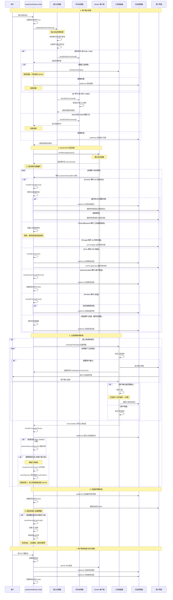
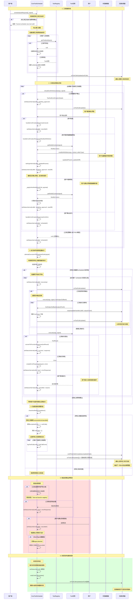

# Gemini Sequence Diagram

## useGeminiStream

```mermaid
sequenceDiagram
    participant User as 用户
    participant Hook as useGeminiStream Hook
    participant InputHandler as 输入处理器
    participant CmdProcessor as 命令处理器
    participant GeminiClient as Gemini 客户端
    participant ToolScheduler as 工具调度器
    participant HistoryManager as 历史管理器
    participant UI as 用户界面

    Note over User, UI: 1. 用户输入阶段
    User->>Hook: 输入查询文本
    Hook->>Hook: 设置响应状态为 true
    Hook->>InputHandler: prepareQueryForGemini()

    Note over InputHandler: 输入验证和预处理
    InputHandler->>InputHandler: 检查是否为空或已取消
    InputHandler->>InputHandler: 记录用户提示到日志

    alt 斜杠命令 (如 /help, /exit)
        InputHandler->>CmdProcessor: handleSlashCommand()
        CmdProcessor-->>Hook: 返回处理结果
        alt 需要工具调用
            Hook->>ToolScheduler: scheduleToolCalls()
            Note over Hook: 结束流程，不发送给 Gemini
        else 直接处理
            Hook->>HistoryManager: addItem() 添加结果
            Note over Hook: 结束流程
        end
    else @ 命令 (如 @file, @git)
        InputHandler->>CmdProcessor: handleAtCommand()
        CmdProcessor->>CmdProcessor: 处理文件或 Git 操作
        CmdProcessor-->>InputHandler: 返回处理后的查询
    else Shell 命令 (Shell 模式下)
        InputHandler->>CmdProcessor: handleShellCommand()
        CmdProcessor-->>Hook: 执行系统命令
        Note over Hook: 结束流程
    else 普通查询
        InputHandler->>HistoryManager: addItem() 添加用户消息
    end

    InputHandler-->>Hook: 返回处理后的查询

    Note over Hook, GeminiClient: 2. Gemini API 交互阶段
    Hook->>GeminiClient: sendMessageStream()
    activate GeminiClient

    Note over GeminiClient: 建立流式连接
    GeminiClient-->>Hook: 返回事件流 AsyncIterable

    Note over Hook: 3. 流式事件处理循环
    loop 处理每个流式事件
        GeminiClient->>Hook: 事件 (Content/ToolCall/Error等)

        alt Content 事件 (AI 生成文本)
            Hook->>Hook: handleContentEvent()
            Hook->>Hook: 累积文本到缓冲区

            alt 缓冲区过大需要分割
                Hook->>HistoryManager: addItem() 添加完成部分
                Hook->>UI: 更新待处理消息 (剩余部分)
            else 继续累积
                Hook->>UI: 更新待处理消息 (全部内容)
            end

        else ToolCallRequest 事件 (工具调用请求)
            Hook->>Hook: 收集工具调用请求
            Note over Hook: 暂存，等待流结束后批处理

        else Thought 事件 (AI 思考过程)
            Hook->>UI: setThought() 显示思考内容

        else Error 事件 (API 错误)
            Hook->>Hook: handleErrorEvent()
            Hook->>HistoryManager: addItem() 添加错误消息
            Hook->>UI: setThought(null) 清除思考状态

        else UserCancelled 事件 (用户取消)
            Hook->>Hook: handleUserCancelledEvent()
            Hook->>HistoryManager: addItem() 添加取消消息
            Hook->>Hook: 设置响应状态为 false

        else Finished 事件 (完成)
            Hook->>Hook: handleFinishedEvent()
            alt 有完成原因消息
                Hook->>HistoryManager: addItem() 添加完成消息
            end

        else 其他事件 (压缩、循环检测等)
            Hook->>Hook: 相应的处理函数
            Hook->>HistoryManager: addItem() 添加信息消息
        end
    end

    deactivate GeminiClient

    Note over Hook, ToolScheduler: 4. 工具调用处理阶段
    alt 有工具调用请求
        Hook->>ToolScheduler: scheduleToolCalls() 批量调度
        activate ToolScheduler

        loop 处理每个工具调用
            ToolScheduler->>ToolScheduler: 验证工具调用

            alt 需要用户确认
                ToolScheduler->>UI: 显示确认界面
                ToolScheduler->>Hook: 设置状态为 WaitingForConfirmation
                UI->>User: 显示工具调用详情
                User->>ToolScheduler: 用户确认/拒绝
            end

            alt 用户确认或无需确认
                ToolScheduler->>ToolScheduler: 执行工具
                Note over ToolScheduler: 工具执行 (文件操作、Git等)
                ToolScheduler->>HistoryManager: 更新工具状态显示
            else 用户拒绝
                ToolScheduler->>ToolScheduler: 标记为已取消
            end
        end

        ToolScheduler-->>Hook: onComplete() 所有工具完成
        deactivate ToolScheduler

        Hook->>Hook: handleCompletedTools()
        Hook->>HistoryManager: addItem() 添加工具结果显示

        alt 有成功的 save_memory 工具
            Hook->>Hook: performMemoryRefresh() 刷新内存
        end

        alt 需要继续对话 (非客户端工具)
            Note over Hook: 准备工具响应
            Hook->>Hook: mergePartListUnions() 合并响应
            Hook->>Hook: submitQuery() 递归调用 (continuation)
            Note over Hook: 回到步骤 2，将工具结果发送给 Gemini
        end
    end

    Note over Hook, UI: 5. 完成和清理阶段
    Hook->>HistoryManager: addItem() 添加最终待处理项
    Hook->>Hook: 设置响应状态为 false
    Hook->>UI: 更新流状态为 Idle

    Note over Hook: 6. 检查点保存 (如果需要)
    alt 有需要批准的文件操作工具
        Hook->>Hook: saveRestorableToolCalls()
        Hook->>Hook: 创建 Git 快照
        Hook->>Hook: 保存检查点文件
        Note over Hook: 包含历史、工具调用、提交哈希等
    end

    Note over User, UI: 7. 用户取消处理 (并行流程)
    User->>Hook: 按 ESC 键取消
    Hook->>Hook: 设置取消标志
    Hook->>GeminiClient: abort() 中止请求
    Hook->>HistoryManager: addItem() 添加待处理项
    Hook->>HistoryManager: addItem() 添加取消消息
    Hook->>Hook: 设置响应状态为 false
```

## CoreToolScheduler

```mermaid
sequenceDiagram
    participant Client as 客户端
    participant Scheduler as CoreToolScheduler
    participant Registry as ToolRegistry
    participant Tool as Tool实例
    participant User as 用户
    participant Editor as 外部编辑器
    participant Callbacks as 回调处理器

    Note over Client, Callbacks: 1. 工具调度阶段
    Client->>Scheduler: schedule(toolRequests[], signal)

    Note over Scheduler: 检查是否有工具正在运行
    alt 有工具正在执行或等待确认
        Scheduler-->>Client: 抛错: "Cannot schedule new tool calls"
        Note over Scheduler: 防止重入调度
    end

    Note over Scheduler: 批量创建工具调用初始状态
    loop 为每个工具请求
        Scheduler->>Registry: getTool(toolName)
        alt 工具不存在
            Registry-->>Scheduler: null
            Scheduler->>Scheduler: 创建错误状态工具调用
        else 工具存在
            Registry-->>Scheduler: Tool实例
            Scheduler->>Scheduler: 创建 validating 状态工具调用
        end
    end

    Scheduler->>Callbacks: onToolCallsUpdate(toolCalls)
    Note over Callbacks: 通知UI更新工具状态显示

    Note over Scheduler, Tool: 2. 工具验证和确认阶段
    loop 处理每个有效的工具调用
        Scheduler->>Tool: shouldConfirmExecute(args, signal)

        alt 工具需要用户确认
            Tool-->>Scheduler: ToolCallConfirmationDetails
            Scheduler->>Scheduler: setStatusInternal(callId, 'awaiting_approval')
            Scheduler->>Callbacks: onToolCallsUpdate()

            Note over User: 用户看到确认界面
            User->>Scheduler: 用户做出选择

            alt 用户取消
                Scheduler->>Scheduler: handleConfirmationResponse(Cancel)
                Scheduler->>Scheduler: setStatusInternal(callId, 'cancelled')

            else 用户要求用编辑器修改
                Scheduler->>Scheduler: handleConfirmationResponse(ModifyWithEditor)
                Scheduler->>Tool: getModifyContext(signal)
                Tool-->>Scheduler: ModifyContext

                Scheduler->>Editor: modifyWithEditor(args, context, editorType)
                Note over Editor: 用户在编辑器中修改参数
                Editor-->>Scheduler: {updatedParams, updatedDiff}

                Scheduler->>Scheduler: setArgsInternal(callId, updatedParams)
                Scheduler->>Scheduler: setStatusInternal(callId, 'awaiting_approval', newDiff)
                Note over Scheduler: 重新显示确认界面，显示新的差异

            else 用户内联修改
                Note over User: 用户在确认界面直接编辑内容
                Scheduler->>Scheduler: _applyInlineModify(toolCall, payload)
                Scheduler->>Tool: getModifyContext(signal)
                Tool-->>Scheduler: ModifyContext
                Scheduler->>Scheduler: 计算新的差异和参数
                Scheduler->>Scheduler: setStatusInternal(callId, 'awaiting_approval', newDiff)

            else 用户确认执行
                Scheduler->>Scheduler: handleConfirmationResponse(Confirm)
                Scheduler->>Scheduler: setStatusInternal(callId, 'scheduled')
            end

        else 工具无需确认 或 YOLO模式
            Tool-->>Scheduler: null (无需确认)
            Scheduler->>Scheduler: setStatusInternal(callId, 'scheduled')
        end
    end

    Note over Scheduler: 3. 执行条件检查和批量执行
    Scheduler->>Scheduler: attemptExecutionOfScheduledCalls(signal)

    Note over Scheduler: 检查是否所有工具都准备好执行
    Scheduler->>Scheduler: 检查所有工具状态

    alt 所有工具都是 scheduled 或 终态
        Note over Scheduler: 批量原子性执行开始

        loop 执行每个 scheduled 状态的工具
            Scheduler->>Scheduler: setStatusInternal(callId, 'executing')
            Scheduler->>Callbacks: onToolCallsUpdate()

            alt 工具支持实时输出
                Note over Scheduler: 设置实时输出回调
                Scheduler->>Tool: execute(args, signal, liveOutputCallback)

                loop 工具执行过程中
                    Tool->>Scheduler: liveOutputCallback(outputChunk)
                    Scheduler->>Callbacks: outputUpdateHandler(callId, outputChunk)
                    Scheduler->>Scheduler: 更新 liveOutput 字段
                    Scheduler->>Callbacks: onToolCallsUpdate()
                    Note over Callbacks: UI实时显示执行进度
                end

            else 普通工具执行
                Scheduler->>Tool: execute(args, signal)
            end

            alt 工具执行成功
                Tool-->>Scheduler: ToolResult
                Scheduler->>Scheduler: convertToFunctionResponse(toolResult)
                Scheduler->>Scheduler: setStatusInternal(callId, 'success', response)

            else 工具执行失败
                Tool-->>Scheduler: Error
                Scheduler->>Scheduler: createErrorResponse(request, error)
                Scheduler->>Scheduler: setStatusInternal(callId, 'error', errorResponse)

            else 用户取消执行
                Note over User: 用户按ESC或其他取消操作
                Tool-->>Scheduler: 执行被中断
                Scheduler->>Scheduler: setStatusInternal(callId, 'cancelled', reason)
            end
        end
    else 仍有工具等待确认
        Note over Scheduler: 等待用户完成所有确认后再执行
    end

    Note over Scheduler: 4. 完成检查和清理阶段
    Scheduler->>Scheduler: checkAndNotifyCompletion()

    alt 所有工具都达到终态
        Note over Scheduler: 所有工具都是 success/error/cancelled

        Scheduler->>Scheduler: 复制completedCalls = [...toolCalls]
        Scheduler->>Scheduler: 清空 toolCalls = []

        Note over Scheduler: 记录所有工具调用到日志
        loop 为每个完成的工具调用
            Scheduler->>Scheduler: logToolCall(config, ToolCallEvent)
        end

        Scheduler->>Callbacks: onAllToolCallsComplete(completedCalls)
        Scheduler->>Callbacks: onToolCallsUpdate([]) // 空数组表示清理完成

        Note over Callbacks: 通知上层所有工具已完成
        Note over Callbacks: 触发下一轮AI对话(如果需要)

    else 仍有工具未完成
        Note over Scheduler: 继续等待剩余工具完成
    end

    Note over Client, Callbacks: 5. 错误处理和边界情况

    rect rgb(255, 220, 220)
        Note over Scheduler: 错误处理场景

        alt 工具注册表中找不到工具
            Scheduler->>Scheduler: 立即创建错误状态工具调用
            Note over Scheduler: 错误消息: "Tool not found in registry"
        end

        alt 工具验证阶段出错
            Tool-->>Scheduler: 抛出验证错误
            Scheduler->>Scheduler: setStatusInternal(callId, 'error', errorResponse)
        end

        alt 用户在确认阶段取消
            User->>Scheduler: 选择取消
            Scheduler->>Scheduler: setStatusInternal(callId, 'cancelled')
            Note over Scheduler: 保留确认详情用于显示
        end

        alt AbortSignal被触发
            Note over Scheduler: 检查signal.aborted
            Scheduler->>Scheduler: 将相关工具标记为cancelled
        end
    end

    Note over Client, Callbacks: 6. 状态同步和通知机制

    rect rgb(220, 255, 220)
        Note over Scheduler: 状态同步保证

        Note over Scheduler: 每次状态变更都会触发通知
        Scheduler->>Scheduler: setStatusInternal() 调用后
        Scheduler->>Scheduler: notifyToolCallsUpdate()
        Scheduler->>Callbacks: onToolCallsUpdate(toolCalls副本)

        Note over Scheduler: 确保UI始终反映最新状态
        Note over Callbacks: 回调接收到不可变的状态副本
    end
```
