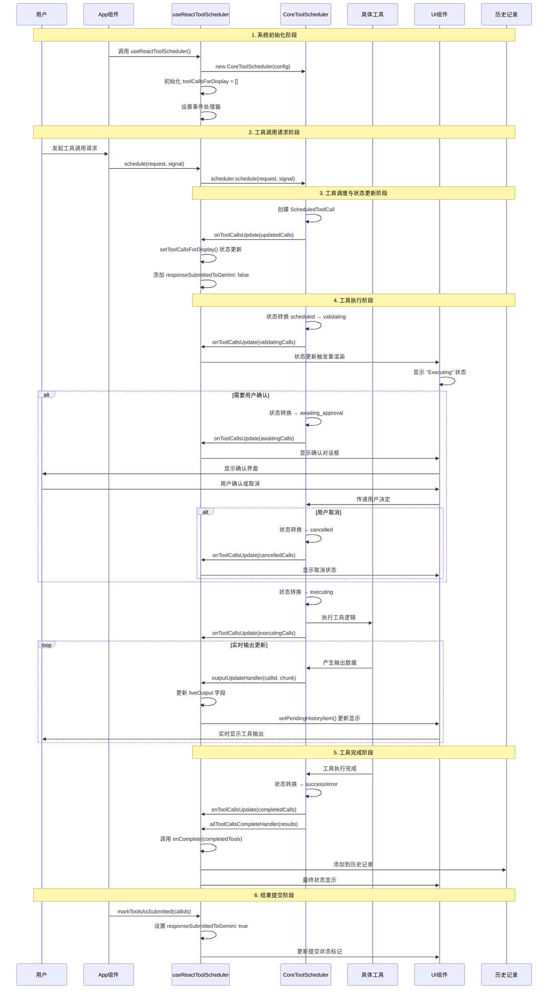
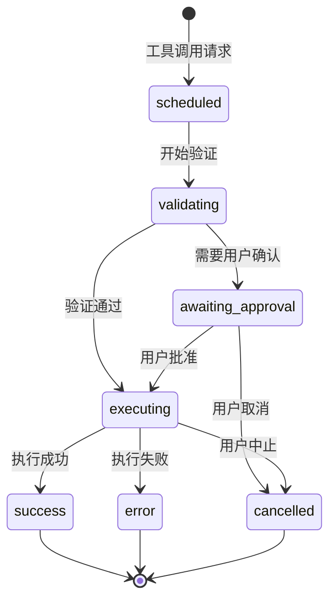

# Gemini CLI React 工具调度器深度分析

## 概述

`useReactToolScheduler` 是 Gemini CLI 中的核心 React Hook，负责工具调用的调度、执行、状态管理和 UI 展示。它作为 `CoreToolScheduler` 的 React 适配器，将底层的工具调度逻辑与 React 组件系统无缝集成，提供了完整的工具执行生命周期管理和用户交互支持。

## 系统架构概览

### 核心组件关系

- **useReactToolScheduler**: React Hook，核心调度器的 React 封装
- **CoreToolScheduler**: 底层工具调度器，处理实际的工具执行逻辑
- **TrackedToolCall**: 扩展的工具调用对象，增加了 React 状态跟踪能力
- **ToolCallStatus**: UI 层工具调用状态枚举
- **HistoryItemToolGroup**: 历史记录中的工具组展示格式
- **IndividualToolCallDisplay**: 单个工具调用的 UI 展示对象

### 工具调用状态流转

工具调用在系统中经历以下状态：
1. **scheduled** → 已调度，等待执行
2. **validating** → 验证中，检查参数和权限
3. **awaiting_approval** → 等待用户确认
4. **executing** → 执行中，显示实时输出
5. **success** → 执行成功
6. **error** → 执行失败
7. **cancelled** → 用户取消

## 完整工具调度流程



## 详细实现分析

### 1. Hook 架构设计

#### 1.1 函数签名与参数

**位置**: `packages/cli/src/ui/hooks/useReactToolScheduler.ts`

```typescript
export function useReactToolScheduler(
  onComplete: (tools: CompletedToolCall[]) => void,
  config: Config,
  setPendingHistoryItem: React.Dispatch<
    React.SetStateAction<HistoryItemWithoutId | null>
  >,
  getPreferredEditor: () => EditorType | undefined,
): [TrackedToolCall[], ScheduleFn, MarkToolsAsSubmittedFn]
```

**参数设计原理**:
- **onComplete**: 回调函数，工具执行完成后的处理逻辑
- **config**: 系统配置对象，提供工具注册表和设置
- **setPendingHistoryItem**: React 状态设置器，用于实时更新 UI
- **getPreferredEditor**: 编辑器偏好获取函数，用于工具执行决策

**返回值设计**:
- **TrackedToolCall[]**: 增强的工具调用数组，包含 UI 状态信息
- **ScheduleFn**: 工具调度函数，支持单个或批量调度
- **MarkToolsAsSubmittedFn**: 标记工具结果已提交的函数

#### 1.2 状态管理架构

```typescript
const [toolCallsForDisplay, setToolCallsForDisplay] = useState<
  TrackedToolCall[]
>([]);
```

**状态设计特点**:
- **单一状态源**: 所有工具调用状态集中管理
- **不可变更新**: 通过 `useState` 确保状态更新的可预测性
- **扩展性**: `TrackedToolCall` 类型扩展了核心类型，增加 UI 特定字段

### 2. 事件处理器系统

#### 2.1 输出更新处理器

```typescript
const outputUpdateHandler: OutputUpdateHandler = useCallback(
  (toolCallId, outputChunk) => {
    // 更新待处理历史项
    setPendingHistoryItem((prevItem) => {
      if (prevItem?.type === 'tool_group') {
        return {
          ...prevItem,
          tools: prevItem.tools.map((toolDisplay) =>
            toolDisplay.callId === toolCallId &&
            toolDisplay.status === ToolCallStatus.Executing
              ? { ...toolDisplay, resultDisplay: outputChunk }
              : toolDisplay,
          ),
        };
      }
      return prevItem;
    });

    // 更新工具调用显示状态
    setToolCallsForDisplay((prevCalls) =>
      prevCalls.map((tc) => {
        if (tc.request.callId === toolCallId && tc.status === 'executing') {
          const executingTc = tc as TrackedExecutingToolCall;
          return { ...executingTc, liveOutput: outputChunk };
        }
        return tc;
      }),
    );
  },
  [setPendingHistoryItem],
);
```

**设计亮点**:
- **双重更新**: 同时更新历史项和工具调用状态，确保 UI 一致性
- **条件更新**: 只更新特定 ID 和状态的工具调用
- **类型安全**: 使用类型断言确保 `liveOutput` 字段的正确访问
- **性能优化**: 使用 `useCallback` 避免不必要的重新创建

#### 2.2 工具调用更新处理器

```typescript
const toolCallsUpdateHandler: ToolCallsUpdateHandler = useCallback(
  (updatedCoreToolCalls: ToolCall[]) => {
    setToolCallsForDisplay((prevTrackedCalls) =>
      updatedCoreToolCalls.map((coreTc) => {
        const existingTrackedCall = prevTrackedCalls.find(
          (ptc) => ptc.request.callId === coreTc.request.callId,
        );
        const newTrackedCall: TrackedToolCall = {
          ...coreTc,
          responseSubmittedToGemini:
            existingTrackedCall?.responseSubmittedToGemini ?? false,
        } as TrackedToolCall;
        return newTrackedCall;
      }),
    );
  },
  [setToolCallsForDisplay],
);
```

**状态同步策略**:
- **状态保持**: 保留现有的 `responseSubmittedToGemini` 标记
- **完整替换**: 使用核心调度器的最新状态完全替换
- **ID 映射**: 通过 `callId` 建立新旧状态的对应关系

#### 2.3 完成处理器

```typescript
const allToolCallsCompleteHandler: AllToolCallsCompleteHandler = useCallback(
  (completedToolCalls) => {
    onComplete(completedToolCalls);
  },
  [onComplete],
);
```

**回调转发设计**:
- **简单转发**: 直接调用外部提供的完成回调
- **依赖优化**: 仅依赖 `onComplete`，避免不必要的重新创建

### 3. CoreToolScheduler 集成

#### 3.1 调度器初始化

```typescript
const scheduler = useMemo(
  () =>
    new CoreToolScheduler({
      toolRegistry: config.getToolRegistry(),
      outputUpdateHandler,
      onAllToolCallsComplete: allToolCallsCompleteHandler,
      onToolCallsUpdate: toolCallsUpdateHandler,
      getPreferredEditor,
      config,
    }),
  [
    config,
    outputUpdateHandler,
    allToolCallsCompleteHandler,
    toolCallsUpdateHandler,
    getPreferredEditor,
  ],
);
```

**初始化设计**:
- **记忆化**: 使用 `useMemo` 避免不必要的重新创建
- **依赖管理**: 精确的依赖数组确保正确的更新时机
- **配置注入**: 将 React 特定的处理器注入到核心调度器

#### 3.2 调度函数封装

```typescript
const schedule: ScheduleFn = useCallback(
  (
    request: ToolCallRequestInfo | ToolCallRequestInfo[],
    signal: AbortSignal,
  ) => {
    scheduler.schedule(request, signal);
  },
  [scheduler],
);
```

**接口适配设计**:
- **类型安全**: 完整的 TypeScript 类型支持
- **批量支持**: 支持单个或多个工具调用的调度
- **取消支持**: 通过 `AbortSignal` 支持取消操作

### 4. TrackedToolCall 类型系统

#### 4.1 类型扩展设计

```typescript
export type TrackedScheduledToolCall = ScheduledToolCall & {
  responseSubmittedToGemini?: boolean;
};
export type TrackedValidatingToolCall = ValidatingToolCall & {
  responseSubmittedToGemini?: boolean;
};
export type TrackedWaitingToolCall = WaitingToolCall & {
  responseSubmittedToGemini?: boolean;
};
export type TrackedExecutingToolCall = ExecutingToolCall & {
  responseSubmittedToGemini?: boolean;
};
export type TrackedCompletedToolCall = CompletedToolCall & {
  responseSubmittedToGemini?: boolean;
};
export type TrackedCancelledToolCall = CancelledToolCall & {
  responseSubmittedToGemini?: boolean;
};
```

**扩展策略**:
- **一致性扩展**: 为所有状态类型添加相同的扩展字段
- **可选字段**: `responseSubmittedToGemini` 为可选，保持向后兼容
- **状态特定**: 保持原有的状态特定字段和方法

#### 4.2 联合类型定义

```typescript
export type TrackedToolCall =
  | TrackedScheduledToolCall
  | TrackedValidatingToolCall
  | TrackedWaitingToolCall
  | TrackedExecutingToolCall
  | TrackedCompletedToolCall
  | TrackedCancelledToolCall;
```

### 5. 状态映射系统

#### 5.1 核心状态到显示状态映射

```typescript
function mapCoreStatusToDisplayStatus(coreStatus: CoreStatus): ToolCallStatus {
  switch (coreStatus) {
    case 'validating':
      return ToolCallStatus.Executing;
    case 'awaiting_approval':
      return ToolCallStatus.Confirming;
    case 'executing':
      return ToolCallStatus.Executing;
    case 'success':
      return ToolCallStatus.Success;
    case 'cancelled':
      return ToolCallStatus.Canceled;
    case 'error':
      return ToolCallStatus.Error;
    case 'scheduled':
      return ToolCallStatus.Pending;
    default: {
      const exhaustiveCheck: never = coreStatus;
      console.warn(`Unknown core status encountered: ${exhaustiveCheck}`);
      return ToolCallStatus.Error;
    }
  }
}
```

**映射设计原理**:
- **状态归并**: 将 `validating` 和 `executing` 都映射为 `Executing`
- **用户友好**: UI 状态更注重用户理解，而非技术细节
- **错误处理**: 使用 TypeScript 的 `never` 类型确保完整性检查
- **降级处理**: 未知状态默认映射为错误状态

#### 5.2 显示对象转换

```typescript
export function mapToDisplay(
  toolOrTools: TrackedToolCall[] | TrackedToolCall,
): HistoryItemToolGroup {
  const toolCalls = Array.isArray(toolOrTools) ? toolOrTools : [toolOrTools];

  const toolDisplays = toolCalls.map(
    (trackedCall): IndividualToolCallDisplay => {
      let displayName = trackedCall.request.name;
      let description = '';
      let renderOutputAsMarkdown = false;

      // 获取工具实例信息
      const currentToolInstance =
        'tool' in trackedCall && trackedCall.tool
          ? (trackedCall as { tool: Tool }).tool
          : undefined;

      if (currentToolInstance) {
        displayName = currentToolInstance.displayName;
        description = currentToolInstance.getDescription(
          trackedCall.request.args,
        );
        renderOutputAsMarkdown = currentToolInstance.isOutputMarkdown;
      } else if ('request' in trackedCall && 'args' in trackedCall.request) {
        description = JSON.stringify(trackedCall.request.args);
      }

      // 基础显示属性
      const baseDisplayProperties: Omit<
        IndividualToolCallDisplay,
        'status' | 'resultDisplay' | 'confirmationDetails'
      > = {
        callId: trackedCall.request.callId,
        name: displayName,
        description,
        renderOutputAsMarkdown,
      };

      // 根据状态返回不同的显示对象
      switch (trackedCall.status) {
        case 'success':
          return {
            ...baseDisplayProperties,
            status: mapCoreStatusToDisplayStatus(trackedCall.status),
            resultDisplay: trackedCall.response.resultDisplay,
            confirmationDetails: undefined,
          };
        case 'error':
          return {
            ...baseDisplayProperties,
            name: currentToolInstance?.displayName ?? trackedCall.request.name,
            status: mapCoreStatusToDisplayStatus(trackedCall.status),
            resultDisplay: trackedCall.response.resultDisplay,
            confirmationDetails: undefined,
          };
        case 'cancelled':
          return {
            ...baseDisplayProperties,
            status: mapCoreStatusToDisplayStatus(trackedCall.status),
            resultDisplay: trackedCall.response.resultDisplay,
            confirmationDetails: undefined,
          };
        case 'awaiting_approval':
          return {
            ...baseDisplayProperties,
            status: mapCoreStatusToDisplayStatus(trackedCall.status),
            resultDisplay: undefined,
            confirmationDetails: trackedCall.confirmationDetails,
          };
        case 'executing':
          return {
            ...baseDisplayProperties,
            status: mapCoreStatusToDisplayStatus(trackedCall.status),
            resultDisplay:
              (trackedCall as TrackedExecutingToolCall).liveOutput ?? undefined,
            confirmationDetails: undefined,
          };
        case 'validating': // Fallthrough
        case 'scheduled':
          return {
            ...baseDisplayProperties,
            status: mapCoreStatusToDisplayStatus(trackedCall.status),
            resultDisplay: undefined,
            confirmationDetails: undefined,
          };
        default: {
          const exhaustiveCheck: never = trackedCall;
          return {
            callId: (exhaustiveCheck as TrackedToolCall).request.callId,
            name: 'Unknown Tool',
            description: 'Encountered an unknown tool call state.',
            status: ToolCallStatus.Error,
            resultDisplay: 'Unknown tool call state',
            confirmationDetails: undefined,
            renderOutputAsMarkdown: false,
          };
        }
      }
    },
  );

  return {
    type: 'tool_group',
    tools: toolDisplays,
  };
}
```

**转换设计特色**:
- **智能信息提取**: 优先使用工具实例的元信息
- **状态特定处理**: 不同状态返回不同的显示内容
- **实时输出支持**: 执行状态显示 `liveOutput`
- **错误降级**: 未知状态的安全处理

### 6. 提交状态管理

#### 6.1 提交标记函数

```typescript
const markToolsAsSubmitted: MarkToolsAsSubmittedFn = useCallback(
  (callIdsToMark: string[]) => {
    setToolCallsForDisplay((prevCalls) =>
      prevCalls.map((tc) =>
        callIdsToMark.includes(tc.request.callId)
          ? { ...tc, responseSubmittedToGemini: true }
          : tc,
      ),
    );
  },
  [],
);
```

**提交管理设计**:
- **批量标记**: 支持同时标记多个工具调用
- **不可变更新**: 创建新对象而非修改现有对象
- **状态保持**: 仅更新指定的工具调用

#### 6.2 提交状态的意义

```typescript
export type TrackedToolCall = BaseToolCall & {
  responseSubmittedToGemini?: boolean;
};
```

**设计意图**:
- **重复执行防护**: 避免将相同结果多次发送给 AI 模型
- **用户体验**: 提供视觉反馈，显示哪些结果已经提交
- **系统完整性**: 确保工具调用生命周期的完整跟踪

## 在 Gemini CLI 中的使用方式

### 1. 主应用集成

**位置**: `packages/cli/src/ui/App.tsx`

```typescript
function App() {
  // 历史记录管理
  const { addItem, pendingItem, setPendingItem } = useHistoryManager();
  
  // 工具调度器初始化
  const [toolCallsForDisplay, schedule, markToolsAsSubmitted] = 
    useReactToolScheduler(
      handleToolsComplete,     // 工具完成回调
      config,                  // 系统配置
      setPendingItem,          // 待处理项设置器
      getPreferredEditor,      // 编辑器偏好
    );

  // 工具完成处理
  const handleToolsComplete = useCallback(
    (completedTools: CompletedToolCall[]) => {
      // 1. 将完成的工具添加到历史记录
      const toolGroup = mapToDisplay(completedTools);
      addItem(toolGroup, Date.now());
      
      // 2. 清理待处理项
      setPendingItem(null);
      
      // 3. 准备结果提交给 AI
      const toolCallIds = completedTools.map(tool => tool.request.callId);
      const toolResults = completedTools.map(tool => ({
        call_id: tool.request.callId,
        content: tool.response.resultDisplay,
      }));
      
      // 4. 提交到 AI 模型
      submitToolResultsToAI(toolResults);
      
      // 5. 标记为已提交
      markToolsAsSubmitted(toolCallIds);
    },
    [addItem, setPendingItem, markToolsAsSubmitted],
  );
}
```

### 2. AI 消息处理集成

```typescript
// 处理 AI 返回的工具调用请求
const handleAIResponse = useCallback(
  async (aiMessage: AiMessage) => {
    if (aiMessage.toolCalls && aiMessage.toolCalls.length > 0) {
      // 将 AI 工具调用请求转换为调度器格式
      const toolRequests: ToolCallRequestInfo[] = aiMessage.toolCalls.map(
        (call) => ({
          callId: call.id,
          name: call.function.name,
          args: JSON.parse(call.function.arguments),
        })
      );
      
      // 创建中断信号
      const abortController = new AbortController();
      
      // 调度工具执行
      schedule(toolRequests, abortController.signal);
    }
  },
  [schedule],
);
```

### 3. UI 展示集成

```typescript
// 在 UI 中显示工具调用状态
function ToolExecutionDisplay() {
  return (
    <Box>
      {/* 显示待处理的工具 */}
      {pendingItem?.type === 'tool_group' && (
        <ToolGroupDisplay 
          toolGroup={pendingItem} 
          isExecuting={true}
        />
      )}
      
      {/* 显示工具调用的实时状态 */}
      {toolCallsForDisplay.map((toolCall) => (
        <ToolCallStatusDisplay
          key={toolCall.request.callId}
          toolCall={toolCall}
          isSubmitted={toolCall.responseSubmittedToGemini}
        />
      ))}
    </Box>
  );
}
```

### 4. 错误处理和用户交互

```typescript
// 处理工具执行中的用户交互
const handleUserInteraction = useCallback(
  (interaction: UserInteraction) => {
    switch (interaction.type) {
      case 'approve_tool':
        // 用户批准工具执行
        approveToolExecution(interaction.toolCallId);
        break;
        
      case 'cancel_tool':
        // 用户取消工具执行
        cancelToolExecution(interaction.toolCallId);
        break;
        
      case 'retry_tool':
        // 重试失败的工具
        retryToolExecution(interaction.toolCallId);
        break;
    }
  },
  [],
);
```

## 性能优化策略

### 1. React 性能优化

```typescript
// 使用 useCallback 防止不必要的重新渲染
const outputUpdateHandler = useCallback((toolCallId, outputChunk) => {
  // 处理逻辑
}, [setPendingHistoryItem]);

// 使用 useMemo 缓存调度器实例
const scheduler = useMemo(() => {
  return new CoreToolScheduler(config);
}, [config, outputUpdateHandler, /* 其他依赖 */]);
```

### 2. 状态更新优化

```typescript
// 避免频繁的状态更新
setToolCallsForDisplay((prevCalls) =>
  prevCalls.map((tc) => {
    // 只更新必要的工具调用
    if (tc.request.callId === targetCallId) {
      return { ...tc, /* 更新字段 */ };
    }
    return tc; // 返回原对象，避免不必要的重新创建
  }),
);
```

### 3. 内存管理

```typescript
// 清理完成的工具调用
useEffect(() => {
  return () => {
    // 组件卸载时清理资源
    scheduler.cleanup();
  };
}, [scheduler]);
```

## 设计模式和架构原则

### 1. 适配器模式

`useReactToolScheduler` 作为 `CoreToolScheduler` 的 React 适配器：
- **接口转换**: 将核心调度器的回调接口转换为 React Hook 接口
- **状态桥接**: 在核心状态和 React 状态之间建立桥梁
- **事件转换**: 将底层事件转换为 React 状态更新

### 2. 观察者模式

通过事件处理器实现观察者模式：
- **松耦合**: 核心调度器无需了解 React 特定逻辑
- **可扩展**: 可以轻松添加新的事件监听器
- **实时更新**: 状态变化立即反映到 UI

### 3. 状态机模式

工具调用的状态流转遵循状态机模式：



**状态机特点**:
- **明确的状态转换**: 每个状态只能转换到特定的下一个状态
- **不可逆性**: 一旦到达终态（success/error/cancelled），无法回退
- **用户控制**: 在 `awaiting_approval` 状态下，用户拥有决定权

### 4. 单一职责原则

Hook 内部职责明确分离：
- **状态管理**: 管理 `toolCallsForDisplay` 状态
- **事件处理**: 处理来自核心调度器的事件
- **接口适配**: 提供 React 友好的调度接口
- **类型转换**: 在核心类型和显示类型之间转换

### 5. 依赖注入模式

通过构造函数注入依赖：
```typescript
const scheduler = useMemo(
  () =>
    new CoreToolScheduler({
      toolRegistry: config.getToolRegistry(),      // 工具注册表
      outputUpdateHandler,                         // 输出处理器
      onAllToolCallsComplete: allToolCallsCompleteHandler, // 完成处理器
      onToolCallsUpdate: toolCallsUpdateHandler,   // 更新处理器
      getPreferredEditor,                          // 编辑器偏好
      config,                                      // 配置对象
    }),
  [/* 依赖数组 */],
);
```

## 扩展性和可维护性分析

### 1. 类型系统扩展性

**新增工具状态**:
```typescript
// 可以轻松添加新的工具调用状态
export type TrackedPausedToolCall = PausedToolCall & {
  responseSubmittedToGemini?: boolean;
  pauseReason?: string;
};

// 扩展联合类型
export type TrackedToolCall =
  | TrackedScheduledToolCall
  | TrackedValidatingToolCall
  | TrackedWaitingToolCall
  | TrackedExecutingToolCall
  | TrackedCompletedToolCall
  | TrackedCancelledToolCall
  | TrackedPausedToolCall; // 新增状态
```

**新增显示字段**:
```typescript
// 可以扩展 TrackedToolCall 以支持更多 UI 特定字段
export type EnhancedTrackedToolCall = TrackedToolCall & {
  priority?: 'high' | 'medium' | 'low';
  estimatedDuration?: number;
  userNotes?: string;
};
```

### 2. 事件处理扩展性

**新增事件处理器**:
```typescript
// 可以添加新的事件处理器
const toolProgressHandler = useCallback(
  (toolCallId: string, progress: number) => {
    setToolCallsForDisplay((prevCalls) =>
      prevCalls.map((tc) => 
        tc.request.callId === toolCallId 
          ? { ...tc, progress } 
          : tc
      ),
    );
  },
  [],
);

// 在调度器中注册
const scheduler = useMemo(
  () =>
    new CoreToolScheduler({
      // ... 现有配置
      onToolProgress: toolProgressHandler, // 新增处理器
    }),
  [/* 更新依赖数组 */],
);
```

### 3. 功能模块扩展

**批量操作支持**:
```typescript
// 扩展 Hook 返回值以支持批量操作
export function useReactToolScheduler(/* 参数 */) {
  // ... 现有实现

  const cancelAllTools = useCallback(() => {
    toolCallsForDisplay
      .filter(tc => tc.status === 'executing' || tc.status === 'awaiting_approval')
      .forEach(tc => scheduler.cancel(tc.request.callId));
  }, [toolCallsForDisplay, scheduler]);

  const retryFailedTools = useCallback(() => {
    const failedTools = toolCallsForDisplay.filter(tc => tc.status === 'error');
    failedTools.forEach(tc => {
      schedule(tc.request, new AbortController().signal);
    });
  }, [toolCallsForDisplay, schedule]);

  return [
    toolCallsForDisplay, 
    schedule, 
    markToolsAsSubmitted,
    cancelAllTools,      // 新增功能
    retryFailedTools,    // 新增功能
  ];
}
```

## 错误处理和恢复机制

### 1. 错误边界处理

```typescript
// 在工具调用过程中的错误处理
const handleToolError = useCallback(
  (error: Error, toolCallId: string) => {
    console.error(`Tool execution failed for ${toolCallId}:`, error);
    
    // 更新错误状态
    setToolCallsForDisplay((prevCalls) =>
      prevCalls.map((tc) =>
        tc.request.callId === toolCallId
          ? {
              ...tc,
              status: 'error' as const,
              response: {
                resultDisplay: `Error: ${error.message}`,
                error: error.message,
              },
            }
          : tc,
      ),
    );
    
    // 可选：触发错误报告
    reportError(error, { context: 'tool-execution', toolCallId });
  },
  [],
);
```

### 2. 网络错误恢复

```typescript
// 处理网络中断后的恢复
const handleNetworkRecovery = useCallback(() => {
  const interruptedTools = toolCallsForDisplay.filter(
    tc => tc.status === 'executing' && !tc.responseSubmittedToGemini
  );
  
  // 重新调度被中断的工具
  interruptedTools.forEach(tc => {
    schedule(tc.request, new AbortController().signal);
  });
}, [toolCallsForDisplay, schedule]);
```

### 3. 资源清理

```typescript
// 确保资源正确清理
useEffect(() => {
  return () => {
    // 取消所有进行中的工具调用
    toolCallsForDisplay
      .filter(tc => tc.status === 'executing' || tc.status === 'validating')
      .forEach(tc => {
        scheduler.cancel(tc.request.callId);
      });
    
    // 清理调度器资源
    scheduler.dispose?.();
  };
}, []);
```

## 测试策略和可测试性

### 1. 单元测试结构

```typescript
describe('useReactToolScheduler', () => {
  let mockConfig: jest.Mocked<Config>;
  let mockSetPendingItem: jest.Mock;
  let mockOnComplete: jest.Mock;
  let mockGetPreferredEditor: jest.Mock;

  beforeEach(() => {
    mockConfig = createMockConfig();
    mockSetPendingItem = jest.fn();
    mockOnComplete = jest.fn();
    mockGetPreferredEditor = jest.fn();
  });

  it('should initialize with empty tool calls', () => {
    const { result } = renderHook(() =>
      useReactToolScheduler(
        mockOnComplete,
        mockConfig,
        mockSetPendingItem,
        mockGetPreferredEditor,
      ),
    );

    const [toolCalls] = result.current;
    expect(toolCalls).toEqual([]);
  });

  it('should schedule tool calls correctly', async () => {
    const { result } = renderHook(() =>
      useReactToolScheduler(/* ... */),
    );

    const [, schedule] = result.current;
    const mockRequest: ToolCallRequestInfo = {
      callId: 'test-id',
      name: 'test-tool',
      args: { param: 'value' },
    };

    act(() => {
      schedule(mockRequest, new AbortController().signal);
    });

    // 验证工具调用被正确调度
    await waitFor(() => {
      const [toolCalls] = result.current;
      expect(toolCalls).toHaveLength(1);
      expect(toolCalls[0].request.callId).toBe('test-id');
    });
  });
});
```

### 2. 集成测试

```typescript
describe('useReactToolScheduler Integration', () => {
  it('should handle complete tool execution flow', async () => {
    const mockTool = createMockTool();
    const mockConfig = createMockConfigWithTool(mockTool);
    
    const { result } = renderHook(() =>
      useReactToolScheduler(/* ... */),
    );

    // 1. 调度工具
    act(() => {
      const [, schedule] = result.current;
      schedule(createTestRequest(), new AbortController().signal);
    });

    // 2. 验证调度状态
    await waitFor(() => {
      const [toolCalls] = result.current;
      expect(toolCalls[0].status).toBe('scheduled');
    });

    // 3. 等待执行完成
    await waitFor(() => {
      const [toolCalls] = result.current;
      expect(toolCalls[0].status).toBe('success');
    });

    // 4. 验证完成回调被调用
    expect(mockOnComplete).toHaveBeenCalledWith(
      expect.arrayContaining([
        expect.objectContaining({
          request: expect.objectContaining({ callId: 'test-id' }),
          status: 'success',
        }),
      ]),
    );
  });
});
```

### 3. Mock 策略

```typescript
// 创建可控的 CoreToolScheduler Mock
const createMockCoreScheduler = () => ({
  schedule: jest.fn(),
  cancel: jest.fn(),
  dispose: jest.fn(),
  // 模拟事件触发
  triggerUpdate: (toolCalls: ToolCall[]) => {
    // 触发 onToolCallsUpdate 回调
  },
  triggerComplete: (completedCalls: CompletedToolCall[]) => {
    // 触发 onAllToolCallsComplete 回调
  },
});
```

## 最佳实践和使用建议

### 1. 性能最佳实践

```typescript
// ✅ 正确：使用 useCallback 优化回调
const handleComplete = useCallback(
  (tools: CompletedToolCall[]) => {
    // 处理逻辑
  },
  [/* 最小依赖数组 */],
);

// ❌ 错误：每次渲染都创建新函数
const handleComplete = (tools: CompletedToolCall[]) => {
  // 处理逻辑
};
```

```typescript
// ✅ 正确：精确的依赖数组
const scheduler = useMemo(() => {
  return new CoreToolScheduler(config);
}, [config, outputHandler, completeHandler]); // 明确列出所有依赖

// ❌ 错误：缺少依赖或过多依赖
const scheduler = useMemo(() => {
  return new CoreToolScheduler(config);
}, []); // 缺少依赖，可能导致闭包问题
```

### 2. 状态管理最佳实践

```typescript
// ✅ 正确：不可变更新
setToolCallsForDisplay((prevCalls) =>
  prevCalls.map((tc) =>
    tc.request.callId === targetId
      ? { ...tc, newField: newValue }
      : tc,
  ),
);

// ❌ 错误：直接修改状态
setToolCallsForDisplay((prevCalls) => {
  const targetCall = prevCalls.find(tc => tc.request.callId === targetId);
  if (targetCall) {
    targetCall.newField = newValue; // 直接修改，违反不可变性
  }
  return prevCalls;
});
```

### 3. 错误处理最佳实践

```typescript
// ✅ 正确：完整的错误处理
const schedule = useCallback((request, signal) => {
  try {
    scheduler.schedule(request, signal);
  } catch (error) {
    console.error('Failed to schedule tool:', error);
    // 可选：显示用户友好的错误消息
    showErrorToast(`Failed to execute ${request.name}: ${error.message}`);
  }
}, [scheduler]);

// ✅ 正确：取消信号处理
useEffect(() => {
  const abortController = new AbortController();
  
  return () => {
    abortController.abort(); // 清理时取消所有请求
  };
}, []);
```

### 4. 类型安全最佳实践

```typescript
// ✅ 正确：使用类型守卫
function isExecutingCall(call: TrackedToolCall): call is TrackedExecutingToolCall {
  return call.status === 'executing';
}

// 使用类型守卫
if (isExecutingCall(toolCall)) {
  // TypeScript 现在知道这是 TrackedExecutingToolCall 类型
  console.log(toolCall.liveOutput); // 安全访问
}

// ✅ 正确：明确的类型断言
const executingCall = toolCall as TrackedExecutingToolCall;
if (toolCall.status === 'executing') {
  console.log(executingCall.liveOutput);
}
```

## 总结

### 系统优势

1. **架构清晰**: 清晰的分层架构，职责分离明确
2. **类型安全**: 完整的 TypeScript 类型系统保障
3. **响应式设计**: 实时的状态更新和 UI 反馈
4. **可扩展性**: 模块化设计支持功能扩展
5. **性能优化**: 使用 React 性能最佳实践
6. **错误恢复**: 完善的错误处理和恢复机制

### 技术创新

1. **状态桥接**: 在核心逻辑和 React 状态之间建立了完美的桥梁
2. **事件驱动**: 通过事件处理器实现松耦合的架构
3. **类型扩展**: 巧妙的类型扩展设计保持了核心类型的纯净性
4. **实时更新**: 提供了流畅的实时工具执行体验
5. **状态管理**: 复杂的工具调用状态得到了优雅的管理

### 在 Gemini CLI 中的地位

`useReactToolScheduler` 是 Gemini CLI 工具系统的核心枢纽：

- **工具执行入口**: 所有工具调用都通过这个 Hook 进行调度
- **状态管理中心**: 管理整个应用的工具调用状态
- **用户交互桥梁**: 连接用户操作和底层工具执行
- **AI 集成接口**: 处理 AI 模型的工具调用请求
- **UI 数据源**: 为所有工具相关的 UI 组件提供数据

### 未来发展方向

1. **性能优化**: 
   - 实现工具调用结果的缓存机制
   - 优化大量工具调用时的渲染性能
   - 支持工具调用的延迟加载

2. **功能增强**:
   - 支持工具调用的优先级管理
   - 实现工具调用的依赖关系处理
   - 添加工具调用的撤销/重做功能

3. **可观测性**:
   - 增强工具调用的日志记录
   - 实现性能指标收集
   - 支持工具调用的调试模式

4. **用户体验**:
   - 提供更丰富的进度指示
   - 支持工具调用的预览模式
   - 实现智能的错误恢复建议

这个 Hook 体现了现代 React 应用开发的最佳实践，为复杂的工具调度系统提供了简洁而强大的接口，是 Gemini CLI 架构设计的杰出代表。