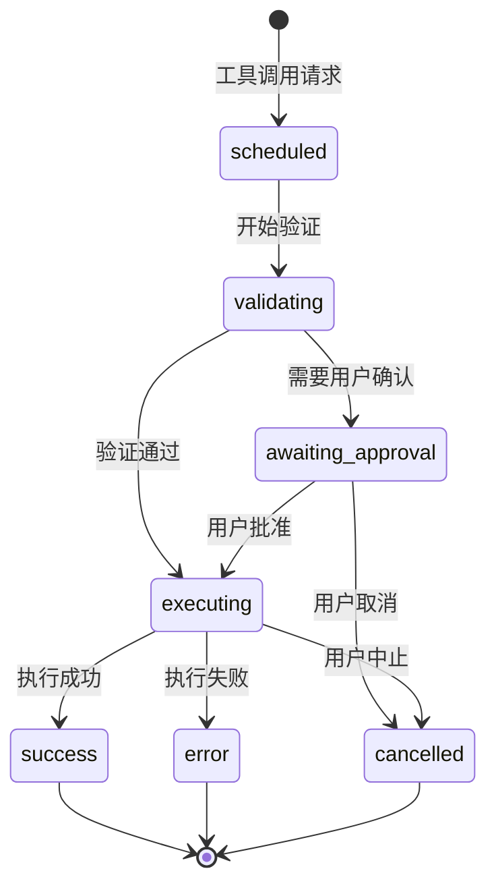
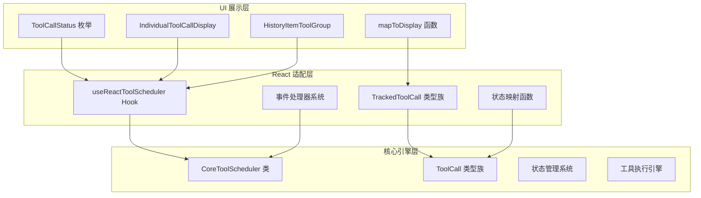
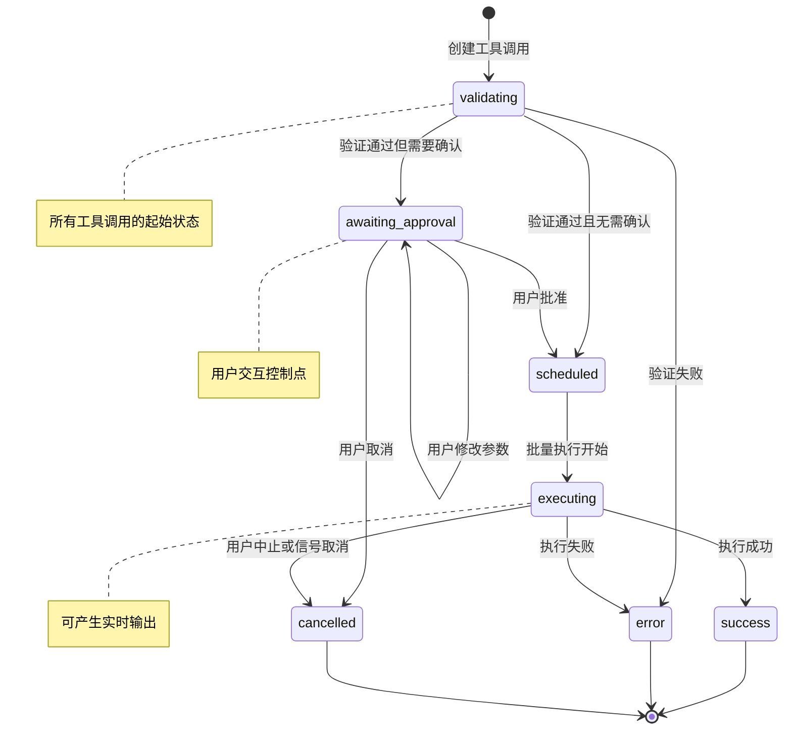

# Gemini CLI React 工具调度器深度分析

## 概述

Gemini CLI 的工具调度系统采用双层架构设计：`CoreToolScheduler` 作为底层核心调度引擎，负责工具的生命周期管理、状态流转和执行协调；`useReactToolScheduler` 作为 React 适配层，将核心调度逻辑与 React 组件系统无缝集成。这种设计实现了业务逻辑与 UI 层的完美分离，为复杂的工具调度场景提供了高性能、类型安全的解决方案。

## 系统架构概览

### 核心组件关系

**底层调度引擎层 (Core Layer)**:
- **CoreToolScheduler**: 核心调度器，管理工具调用的完整生命周期
- **ToolCall 类型族**: 包含 `ScheduledToolCall`、`ValidatingToolCall`、`ExecutingToolCall`、`WaitingToolCall`、`SuccessfulToolCall`、`ErroredToolCall`、`CancelledToolCall`
- **ToolRegistry**: 工具注册表，提供工具实例管理
- **Tool Interface**: 标准化的工具接口定义

**React 适配层 (React Adapter Layer)**:
- **useReactToolScheduler**: React Hook，核心调度器的 React 封装
- **TrackedToolCall 类型族**: 扩展的工具调用对象，增加 UI 状态跟踪（`responseSubmittedToGemini`）
- **事件处理器系统**: `OutputUpdateHandler`、`AllToolCallsCompleteHandler`、`ToolCallsUpdateHandler`

**UI 展示层 (Presentation Layer)**:
- **ToolCallStatus**: UI 层工具调用状态枚举（Pending、Executing、Confirming、Success、Error、Canceled）
- **HistoryItemToolGroup**: 历史记录中的工具组展示格式
- **IndividualToolCallDisplay**: 单个工具调用的 UI 展示对象
- **mapToDisplay**: 状态映射函数，将底层状态转换为 UI 显示格式

### 工具调用状态流转

工具调用在 CoreToolScheduler 中经历以下状态转换（按照实际代码中的状态定义）：

**核心状态流转**:
1. **scheduled** → 已调度，等待执行条件检查
2. **validating** → 参数验证和权限检查中
3. **awaiting_approval** → 等待用户确认（需要用户交互的工具）
4. **executing** → 执行中，可产生实时输出
5. **success** → 执行成功，生成最终结果
6. **error** → 执行失败，包含错误信息
7. **cancelled** → 用户取消或系统中止

**状态转换规则**:
- 所有工具调用从 `validating` 状态开始
- `validating` 可转换为 `scheduled`（无需确认）或 `awaiting_approval`（需要确认）
- `awaiting_approval` 可转换为 `scheduled`（用户批准）、`cancelled`（用户取消）或保持当前状态（修改参数）
- `scheduled` 批量转换为 `executing`
- `executing` 只能转换为终态：`success`、`error` 或 `cancelled`
- 终态不可逆转

## 完整工具调度流程

```mermaid
sequenceDiagram
    participant User as 用户
    participant App as App组件
    participant Hook as useReactToolScheduler
    participant CoreScheduler as CoreToolScheduler
    participant ToolRegistry as ToolRegistry
    participant Tool as 具体工具
    participant UI as UI组件

    Note over User,UI: 1. 系统初始化阶段
    App->>Hook: useReactToolScheduler(onComplete, config, setPendingHistoryItem, getPreferredEditor)
    Hook->>Hook: 初始化 toolCallsForDisplay = []
    Hook->>Hook: 创建事件处理器 (outputUpdateHandler, toolCallsUpdateHandler, allToolCallsCompleteHandler)
    Hook->>CoreScheduler: new CoreToolScheduler({toolRegistry, handlers, config})
    CoreScheduler->>ToolRegistry: await config.getToolRegistry()
    ToolRegistry-->>CoreScheduler: 返回工具注册表
    
    Note over User,UI: 2. 工具调用请求阶段
    User->>App: AI 消息包含工具调用
    App->>Hook: schedule(requests[], signal)
    Hook->>CoreScheduler: scheduler.schedule(requests, signal)
    
    Note over CoreScheduler,UI: 3. 工具验证与调度阶段
    CoreScheduler->>CoreScheduler: 并行处理多个请求
    loop 对每个工具请求
        CoreScheduler->>ToolRegistry: getTool(reqInfo.name)
        alt 工具不存在
            CoreScheduler->>CoreScheduler: 创建 ErroredToolCall (status: 'error', durationMs: 0)
        else 工具存在
            CoreScheduler->>CoreScheduler: 创建 ValidatingToolCall (status: 'validating', startTime: Date.now())
        end
    end
    
    CoreScheduler->>Hook: onToolCallsUpdate(newToolCalls)
    Hook->>Hook: setToolCallsForDisplay() 状态更新，添加 responseSubmittedToGemini: false
    Hook->>UI: 状态更新触发重渲染
    
    Note over CoreScheduler,UI: 4. 参数验证与确认阶段
    loop 对每个 ValidatingToolCall
        alt ApprovalMode.YOLO
            CoreScheduler->>CoreScheduler: 直接转换为 scheduled 状态
        else 需要确认检查
            CoreScheduler->>Tool: shouldConfirmExecute(args, signal)
            Tool-->>CoreScheduler: 返回 confirmationDetails 或 null
            
            alt 需要用户确认
                CoreScheduler->>CoreScheduler: 状态转换 → awaiting_approval
                CoreScheduler->>Hook: onToolCallsUpdate(awaitingCalls)
                Hook->>UI: 显示确认对话框
                UI->>User: 显示确认界面 (工具详情、参数、diff等)
                User->>UI: 用户操作 (批准/取消/修改)
                UI->>CoreScheduler: handleConfirmationResponse(callId, outcome, payload)
                
                alt 用户取消 (Cancel)
                    CoreScheduler->>CoreScheduler: 状态转换 → cancelled
                else 用户修改 (ModifyWithEditor)
                    CoreScheduler->>Tool: getModifyContext(signal)
                    CoreScheduler->>CoreScheduler: modifyWithEditor(...) 启动编辑器
                    CoreScheduler->>CoreScheduler: 更新参数和确认详情
                else 用户批准 (Proceed/ProceedAlways)
                    alt 内联修改 payload.newContent
                        CoreScheduler->>CoreScheduler: _applyInlineModify() 应用修改
                    end
                    CoreScheduler->>CoreScheduler: 状态转换 → scheduled
                end
            else 无需确认
                CoreScheduler->>CoreScheduler: 状态转换 → scheduled
            end
        end
    end
    
    Note over CoreScheduler,UI: 5. 批量执行阶段
    CoreScheduler->>CoreScheduler: attemptExecutionOfScheduledCalls()
    CoreScheduler->>CoreScheduler: 检查所有调用是否为终态或scheduled
    
    loop 对每个 ScheduledToolCall
        CoreScheduler->>CoreScheduler: 状态转换 → executing
        CoreScheduler->>Hook: onToolCallsUpdate(executingCalls)
        
        alt 工具支持实时输出
            CoreScheduler->>Tool: execute(args, signal, liveOutputCallback)
            loop 工具执行过程中
                Tool->>CoreScheduler: liveOutputCallback(outputChunk)
                CoreScheduler->>Hook: outputUpdateHandler(callId, outputChunk)
                Hook->>Hook: 更新 TrackedExecutingToolCall.liveOutput
                Hook->>UI: setPendingHistoryItem() 更新显示
                UI->>User: 实时显示工具输出
            end
        else 工具无实时输出
            CoreScheduler->>Tool: execute(args, signal)
        end
        
        Tool-->>CoreScheduler: 返回 ToolResult
        
        alt 执行成功
            CoreScheduler->>CoreScheduler: convertToFunctionResponse() 格式化结果
            CoreScheduler->>CoreScheduler: 状态转换 → success (durationMs计算)
        else 执行失败
            CoreScheduler->>CoreScheduler: 状态转换 → error
        else signal.aborted
            CoreScheduler->>CoreScheduler: 状态转换 → cancelled
        end
    end
    
    Note over CoreScheduler,UI: 6. 完成处理阶段
    CoreScheduler->>CoreScheduler: checkAndNotifyCompletion()
    CoreScheduler->>CoreScheduler: 所有调用都到达终态，清空 toolCalls，记录日志
    CoreScheduler->>Hook: allToolCallsCompleteHandler(completedCalls)
    CoreScheduler->>Hook: onToolCallsUpdate([]) 清空状态
    
    Hook->>Hook: onComplete(completedCalls) 调用外部回调
    Hook->>App: 工具执行完成通知
    App->>App: 将结果添加到历史记录，准备提交给 AI
    
    Note over App,UI: 7. 结果提交阶段  
    App->>Hook: markToolsAsSubmitted(callIds)
    Hook->>Hook: 设置 responseSubmittedToGemini: true
    Hook->>UI: 最终状态更新
```



## 详细实现分析

## CoreToolScheduler 核心调度引擎分析

### 1. 核心架构设计

#### 1.1 类结构与依赖注入

**位置**: `packages/core/src/core/coreToolScheduler.ts`

```typescript
interface CoreToolSchedulerOptions {
  toolRegistry: Promise<ToolRegistry>;
  outputUpdateHandler?: OutputUpdateHandler;
  onAllToolCallsComplete?: AllToolCallsCompleteHandler;
  onToolCallsUpdate?: ToolCallsUpdateHandler;
  getPreferredEditor: () => EditorType | undefined;
  config: Config;
}

export class CoreToolScheduler {
  private toolRegistry: Promise<ToolRegistry>;
  private toolCalls: ToolCall[] = [];
  private outputUpdateHandler?: OutputUpdateHandler;
  private onAllToolCallsComplete?: AllToolCallsCompleteHandler;
  private onToolCallsUpdate?: ToolCallsUpdateHandler;
  private getPreferredEditor: () => EditorType | undefined;
  private config: Config;
}
```

**设计特点**:
- **异步工具注册表**: 支持工具的延迟加载和动态注册
- **事件驱动**: 通过回调函数实现与外部系统的松耦合
- **编辑器集成**: 支持外部编辑器的集成和选择
- **配置注入**: 完整的配置系统支持

#### 1.2 工具调用类型系统

```typescript
export type ValidatingToolCall = {
  status: 'validating';
  request: ToolCallRequestInfo;
  tool: Tool;
  startTime?: number;
  outcome?: ToolConfirmationOutcome;
};

export type SuccessfulToolCall = {
  status: 'success';
  request: ToolCallRequestInfo;
  tool: Tool;
  response: ToolCallResponseInfo;
  durationMs?: number;
  outcome?: ToolConfirmationOutcome;
};

export type WaitingToolCall = {
  status: 'awaiting_approval';
  request: ToolCallRequestInfo;
  tool: Tool;
  confirmationDetails: ToolCallConfirmationDetails;
  startTime?: number;
  outcome?: ToolConfirmationOutcome;
};
```

**类型设计原理**:
- **状态特定字段**: 每个状态类型只包含该状态下有意义的字段
- **时间跟踪**: `startTime` 和 `durationMs` 用于性能监控和用户体验优化
- **用户决策跟踪**: `outcome` 字段记录用户的确认决策
- **工具实例保持**: 保持对 Tool 实例的引用，支持动态调用

### 2. 状态管理系统

#### 2.1 集中式状态更新

```typescript
private setStatusInternal(
  targetCallId: string,
  newStatus: Status,
  auxiliaryData?: unknown,
): void {
  this.toolCalls = this.toolCalls.map((currentCall) => {
    if (
      currentCall.request.callId !== targetCallId ||
      currentCall.status === 'success' ||
      currentCall.status === 'error' ||
      currentCall.status === 'cancelled'
    ) {
      return currentCall;
    }

    // 状态转换逻辑...
    switch (newStatus) {
      case 'success': {
        const durationMs = existingStartTime
          ? Date.now() - existingStartTime
          : undefined;
        return {
          request: currentCall.request,
          tool: toolInstance,
          status: 'success',
          response: auxiliaryData as ToolCallResponseInfo,
          durationMs,
          outcome,
        } as SuccessfulToolCall;
      }
      // 其他状态处理...
    }
  });
  
  this.notifyToolCallsUpdate();
  this.checkAndNotifyCompletion();
}
```

**设计亮点**:
- **原子性更新**: 单一函数处理所有状态转换，确保一致性
- **终态保护**: 已完成的工具调用不可被修改
- **数据保持**: 状态转换时保持现有的关键信息（startTime、tool、outcome）
- **自动通知**: 状态更新后自动触发相关事件处理

#### 2.2 批量执行协调

```typescript
private attemptExecutionOfScheduledCalls(signal: AbortSignal): void {
  const allCallsFinalOrScheduled = this.toolCalls.every(
    (call) =>
      call.status === 'scheduled' ||
      call.status === 'cancelled' ||
      call.status === 'success' ||
      call.status === 'error',
  );

  if (allCallsFinalOrScheduled) {
    const callsToExecute = this.toolCalls.filter(
      (call) => call.status === 'scheduled',
    );

    callsToExecute.forEach((toolCall) => {
      // 并行执行所有已调度的工具
      this.executeToolCall(toolCall, signal);
    });
  }
}
```

**批量执行策略**:
- **运行状态检查**: 通过 `isRunning()` 方法检查是否有工具正在执行或等待批准
- **条件检查**: 只有所有工具都处于终态或已调度状态时才开始执行
- **并行执行**: 多个工具调用同时执行，提高效率
- **错误隔离**: 单个工具失败不影响其他工具的执行

```typescript
// isRunning 方法的实际实现
private isRunning(): boolean {
  return this.toolCalls.some(
    (call) =>
      call.status === 'executing' || call.status === 'awaiting_approval',
  );
}
```

### 3. 用户确认机制

#### 3.1 确认流程管理

```typescript
async handleConfirmationResponse(
  callId: string,
  originalOnConfirm: (outcome: ToolConfirmationOutcome) => Promise<void>,
  outcome: ToolConfirmationOutcome,
  signal: AbortSignal,
  payload?: ToolConfirmationPayload,
): Promise<void> {
  const toolCall = this.toolCalls.find(
    (c) => c.request.callId === callId && c.status === 'awaiting_approval',
  );

  if (toolCall && toolCall.status === 'awaiting_approval') {
    await originalOnConfirm(outcome);
  }

  // 更新工具调用的outcome
  this.toolCalls = this.toolCalls.map((call) => {
    if (call.request.callId !== callId) return call;
    return { ...call, outcome };
  });

  // 根据用户决策执行不同逻辑
  if (outcome === ToolConfirmationOutcome.Cancel || signal.aborted) {
    this.setStatusInternal(callId, 'cancelled', 'User did not allow tool call');
  } else if (outcome === ToolConfirmationOutcome.ModifyWithEditor) {
    await this.handleEditorModification(toolCall, signal);
  } else {
    // 处理内联修改
    if (payload?.newContent && toolCall) {
      await this._applyInlineModify(toolCall as WaitingToolCall, payload, signal);
    }
    this.setStatusInternal(callId, 'scheduled');
  }
}
```

#### 3.2 编辑器集成机制

```typescript
// 在 handleConfirmationResponse 方法中的编辑器处理逻辑
else if (outcome === ToolConfirmationOutcome.ModifyWithEditor) {
  const waitingToolCall = toolCall as WaitingToolCall;
  if (isModifiableTool(waitingToolCall.tool)) {
    const modifyContext = waitingToolCall.tool.getModifyContext(signal);
    const editorType = this.getPreferredEditor();
    if (!editorType) {
      return;
    }

    // 设置修改状态
    this.setStatusInternal(callId, 'awaiting_approval', {
      ...waitingToolCall.confirmationDetails,
      isModifying: true,
    } as ToolCallConfirmationDetails);

    // 启动外部编辑器
    const { updatedParams, updatedDiff } = await modifyWithEditor<
      typeof waitingToolCall.request.args
    >(
      waitingToolCall.request.args,
      modifyContext as ModifyContext<typeof waitingToolCall.request.args>,
      editorType,
      signal,
    );
    
    // 更新参数和确认详情
    this.setArgsInternal(callId, updatedParams);
    this.setStatusInternal(callId, 'awaiting_approval', {
      ...waitingToolCall.confirmationDetails,
      fileDiff: updatedDiff,
      isModifying: false,
    } as ToolCallConfirmationDetails);
  }
}
```

#### 3.3 内联修改处理

```typescript
private async _applyInlineModify(
  toolCall: WaitingToolCall,
  payload: ToolConfirmationPayload,
  signal: AbortSignal,
): Promise<void> {
  if (
    toolCall.confirmationDetails.type !== 'edit' ||
    !isModifiableTool(toolCall.tool)
  ) {
    return;
  }

  const modifyContext = toolCall.tool.getModifyContext(signal);
  
  // 获取当前内容
  const currentContent = await modifyContext.getCurrentContent(
    toolCall.request.args,
  );

  // 创建更新后的参数
  const updatedParams = modifyContext.createUpdatedParams(
    currentContent,
    payload.newContent,
    toolCall.request.args,
  );
  
  // 生成新的差异视图
  const updatedDiff = Diff.createPatch(
    modifyContext.getFilePath(toolCall.request.args),
    currentContent,
    payload.newContent,
    'Current',
    'Proposed',
  );

  // 更新工具调用
  this.setArgsInternal(toolCall.request.callId, updatedParams);
  this.setStatusInternal(toolCall.request.callId, 'awaiting_approval', {
    ...toolCall.confirmationDetails,
    fileDiff: updatedDiff,
  });
}
```

### 4. 实时输出管理

#### 4.1 流式输出处理

```typescript
private attemptExecutionOfScheduledCalls(signal: AbortSignal): void {
  const allCallsFinalOrScheduled = this.toolCalls.every(
    (call) =>
      call.status === 'scheduled' ||
      call.status === 'cancelled' ||
      call.status === 'success' ||
      call.status === 'error',
  );

  if (allCallsFinalOrScheduled) {
    const callsToExecute = this.toolCalls.filter(
      (call) => call.status === 'scheduled',
    );

    callsToExecute.forEach((toolCall) => {
      if (toolCall.status !== 'scheduled') return;

      const scheduledCall = toolCall;
      const { callId, name: toolName } = scheduledCall.request;
      this.setStatusInternal(callId, 'executing');

      const liveOutputCallback =
        scheduledCall.tool.canUpdateOutput && this.outputUpdateHandler
          ? (outputChunk: string) => {
              if (this.outputUpdateHandler) {
                this.outputUpdateHandler(callId, outputChunk);
              }
              this.toolCalls = this.toolCalls.map((tc) =>
                tc.request.callId === callId && tc.status === 'executing'
                  ? { ...tc, liveOutput: outputChunk }
                  : tc,
              );
              this.notifyToolCallsUpdate();
            }
          : undefined;

      scheduledCall.tool
        .execute(scheduledCall.request.args, signal, liveOutputCallback)
        .then(async (toolResult: ToolResult) => {
          if (signal.aborted) {
            this.setStatusInternal(
              callId,
              'cancelled',
              'User cancelled tool execution.',
            );
            return;
          }

          const response = convertToFunctionResponse(
            toolName,
            callId,
            toolResult.llmContent,
          );
          const successResponse: ToolCallResponseInfo = {
            callId,
            responseParts: response,
            resultDisplay: toolResult.returnDisplay,
            error: undefined,
          };

          this.setStatusInternal(callId, 'success', successResponse);
        })
        .catch((executionError: Error) => {
          this.setStatusInternal(
            callId,
            'error',
            createErrorResponse(
              scheduledCall.request,
              executionError instanceof Error
                ? executionError
                : new Error(String(executionError)),
            ),
          );
        });
    });
  }
}
```

**流式输出特点**:
- **条件启用**: 只有支持实时输出的工具才启用此功能
- **双重更新**: 同时更新外部回调和内部状态
- **性能优化**: 避免不必要的状态更新和重渲染

### 5. 响应格式化系统

#### 5.1 FunctionResponse 转换

```typescript
export function convertToFunctionResponse(
  toolName: string,
  callId: string,
  llmContent: PartListUnion,
): PartListUnion {
  const contentToProcess =
    Array.isArray(llmContent) && llmContent.length === 1
      ? llmContent[0]
      : llmContent;

  if (typeof contentToProcess === 'string') {
    return createFunctionResponsePart(callId, toolName, contentToProcess);
  }

  if (Array.isArray(contentToProcess)) {
    const functionResponse = createFunctionResponsePart(
      callId,
      toolName,
      'Tool execution succeeded.',
    );
    return [functionResponse, ...contentToProcess];
  }

  // 处理不同类型的 Part 对象
  if (contentToProcess.functionResponse) {
    // 已经是 functionResponse，提取内容
    if (contentToProcess.functionResponse.response?.content) {
      const stringifiedOutput = getResponseTextFromParts(
        contentToProcess.functionResponse.response.content as Part[],
      ) || '';
      return createFunctionResponsePart(callId, toolName, stringifiedOutput);
    }
    return contentToProcess;
  }

  if (contentToProcess.inlineData || contentToProcess.fileData) {
    // 处理二进制内容
    const mimeType =
      contentToProcess.inlineData?.mimeType ||
      contentToProcess.fileData?.mimeType ||
      'unknown';
    const functionResponse = createFunctionResponsePart(
      callId,
      toolName,
      `Binary content of type ${mimeType} was processed.`,
    );
    return [functionResponse, contentToProcess];
  }

  return createFunctionResponsePart(
    callId,
    toolName,
    contentToProcess.text || 'Tool execution succeeded.',
  );
}
```

**格式化策略**:
- **类型适配**: 处理多种 LLM 内容格式
- **保留原始数据**: 对于复杂内容，保留原始格式并添加描述
- **错误降级**: 对于无法处理的格式，提供默认响应

## useReactToolScheduler React 适配层分析

### 1. Hook 架构设计

#### 1.1 函数签名与参数

**位置**: `packages/cli/src/ui/hooks/useReactToolScheduler.ts`

```typescript
export function useReactToolScheduler(
  onComplete: (tools: CompletedToolCall[]) => void,
  config: Config,
  setPendingHistoryItem: React.Dispatch<
    React.SetStateAction<HistoryItemWithoutId | null>
  >,
  getPreferredEditor: () => EditorType | undefined,
): [TrackedToolCall[], ScheduleFn, MarkToolsAsSubmittedFn]
```

**参数设计原理**:
- **onComplete**: 回调函数，工具执行完成后的处理逻辑
- **config**: 系统配置对象，提供工具注册表和设置
- **setPendingHistoryItem**: React 状态设置器，用于实时更新 UI
- **getPreferredEditor**: 编辑器偏好获取函数，用于工具执行决策

**返回值设计**:
- **TrackedToolCall[]**: 增强的工具调用数组，包含 UI 状态信息
- **ScheduleFn**: 工具调度函数，支持单个或批量调度
- **MarkToolsAsSubmittedFn**: 标记工具结果已提交的函数

#### 1.2 状态管理架构

```typescript
const [toolCallsForDisplay, setToolCallsForDisplay] = useState<
  TrackedToolCall[]
>([]);
```

**状态设计特点**:
- **单一状态源**: 所有工具调用状态集中管理
- **不可变更新**: 通过 `useState` 确保状态更新的可预测性
- **扩展性**: `TrackedToolCall` 类型扩展了核心类型，增加 UI 特定字段

### 2. 事件处理器系统

#### 2.1 输出更新处理器

```typescript
const outputUpdateHandler: OutputUpdateHandler = useCallback(
  (toolCallId, outputChunk) => {
    // 更新待处理历史项
    setPendingHistoryItem((prevItem) => {
      if (prevItem?.type === 'tool_group') {
        return {
          ...prevItem,
          tools: prevItem.tools.map((toolDisplay) =>
            toolDisplay.callId === toolCallId &&
            toolDisplay.status === ToolCallStatus.Executing
              ? { ...toolDisplay, resultDisplay: outputChunk }
              : toolDisplay,
          ),
        };
      }
      return prevItem;
    });

    // 更新工具调用显示状态
    setToolCallsForDisplay((prevCalls) =>
      prevCalls.map((tc) => {
        if (tc.request.callId === toolCallId && tc.status === 'executing') {
          const executingTc = tc as TrackedExecutingToolCall;
          return { ...executingTc, liveOutput: outputChunk };
        }
        return tc;
      }),
    );
  },
  [setPendingHistoryItem],
);
```

**设计亮点**:
- **双重更新**: 同时更新历史项和工具调用状态，确保 UI 一致性
- **条件更新**: 只更新特定 ID 和状态的工具调用
- **类型安全**: 使用类型断言确保 `liveOutput` 字段的正确访问
- **性能优化**: 使用 `useCallback` 避免不必要的重新创建

#### 2.2 工具调用更新处理器

```typescript
const toolCallsUpdateHandler: ToolCallsUpdateHandler = useCallback(
  (updatedCoreToolCalls: ToolCall[]) => {
    setToolCallsForDisplay((prevTrackedCalls) =>
      updatedCoreToolCalls.map((coreTc) => {
        const existingTrackedCall = prevTrackedCalls.find(
          (ptc) => ptc.request.callId === coreTc.request.callId,
        );
        const newTrackedCall: TrackedToolCall = {
          ...coreTc,
          responseSubmittedToGemini:
            existingTrackedCall?.responseSubmittedToGemini ?? false,
        } as TrackedToolCall;
        return newTrackedCall;
      }),
    );
  },
  [setToolCallsForDisplay],
);
```

**状态同步策略**:
- **状态保持**: 保留现有的 `responseSubmittedToGemini` 标记
- **完整替换**: 使用核心调度器的最新状态完全替换
- **ID 映射**: 通过 `callId` 建立新旧状态的对应关系

#### 2.3 完成处理器

```typescript
const allToolCallsCompleteHandler: AllToolCallsCompleteHandler = useCallback(
  (completedToolCalls) => {
    onComplete(completedToolCalls);
  },
  [onComplete],
);
```

**回调转发设计**:
- **简单转发**: 直接调用外部提供的完成回调
- **依赖优化**: 仅依赖 `onComplete`，避免不必要的重新创建

### 3. CoreToolScheduler 集成

#### 3.1 调度器初始化

```typescript
const scheduler = useMemo(
  () =>
    new CoreToolScheduler({
      toolRegistry: config.getToolRegistry(),
      outputUpdateHandler,
      onAllToolCallsComplete: allToolCallsCompleteHandler,
      onToolCallsUpdate: toolCallsUpdateHandler,
      getPreferredEditor,
      config,
    }),
  [
    config,
    outputUpdateHandler,
    allToolCallsCompleteHandler,
    toolCallsUpdateHandler,
    getPreferredEditor,
  ],
);
```

**初始化设计**:
- **记忆化**: 使用 `useMemo` 避免不必要的重新创建
- **依赖管理**: 精确的依赖数组确保正确的更新时机
- **配置注入**: 将 React 特定的处理器注入到核心调度器

#### 3.2 调度函数封装

```typescript
const schedule: ScheduleFn = useCallback(
  (
    request: ToolCallRequestInfo | ToolCallRequestInfo[],
    signal: AbortSignal,
  ) => {
    scheduler.schedule(request, signal);
  },
  [scheduler],
);
```

**接口适配设计**:
- **类型安全**: 完整的 TypeScript 类型支持
- **批量支持**: 支持单个或多个工具调用的调度
- **取消支持**: 通过 `AbortSignal` 支持取消操作

### 4. TrackedToolCall 类型系统

#### 4.1 类型扩展设计

```typescript
export type TrackedScheduledToolCall = ScheduledToolCall & {
  responseSubmittedToGemini?: boolean;
};
export type TrackedValidatingToolCall = ValidatingToolCall & {
  responseSubmittedToGemini?: boolean;
};
export type TrackedWaitingToolCall = WaitingToolCall & {
  responseSubmittedToGemini?: boolean;
};
export type TrackedExecutingToolCall = ExecutingToolCall & {
  responseSubmittedToGemini?: boolean;
};
export type TrackedCompletedToolCall = CompletedToolCall & {
  responseSubmittedToGemini?: boolean;
};
export type TrackedCancelledToolCall = CancelledToolCall & {
  responseSubmittedToGemini?: boolean;
};
```

**扩展策略**:
- **一致性扩展**: 为所有状态类型添加相同的扩展字段
- **可选字段**: `responseSubmittedToGemini` 为可选，保持向后兼容
- **状态特定**: 保持原有的状态特定字段和方法

#### 4.2 联合类型定义

```typescript
export type TrackedToolCall =
  | TrackedScheduledToolCall
  | TrackedValidatingToolCall
  | TrackedWaitingToolCall
  | TrackedExecutingToolCall
  | TrackedCompletedToolCall
  | TrackedCancelledToolCall;
```

### 6. 状态映射系统（React 适配层关键功能）

#### 6.1 核心状态到显示状态映射

```typescript
function mapCoreStatusToDisplayStatus(coreStatus: CoreStatus): ToolCallStatus {
  switch (coreStatus) {
    case 'validating':
      return ToolCallStatus.Executing;  // 用户看到"执行中"
    case 'awaiting_approval':
      return ToolCallStatus.Confirming; // 用户看到"等待确认"
    case 'executing':
      return ToolCallStatus.Executing;  // 用户看到"执行中"
    case 'success':
      return ToolCallStatus.Success;    // 用户看到"成功"
    case 'cancelled':
      return ToolCallStatus.Canceled;   // 用户看到"已取消"
    case 'error':
      return ToolCallStatus.Error;      // 用户看到"错误"
    case 'scheduled':
      return ToolCallStatus.Pending;    // 用户看到"等待中"
    default: {
      const exhaustiveCheck: never = coreStatus;
      console.warn(`Unknown core status encountered: ${exhaustiveCheck}`);
      return ToolCallStatus.Error;
    }
  }
}
```

**映射设计原理**:
- **状态归并**: 将技术性的 `validating` 和 `executing` 都映射为用户友好的 `Executing`
- **用户体验优先**: UI 状态侧重用户理解，而非系统内部的技术细节
- **完整性检查**: 使用 TypeScript 的 `never` 类型确保所有状态都被处理
- **错误降级**: 未知状态安全降级为错误状态，避免系统崩溃

#### 6.2 高级显示对象转换 (mapToDisplay)

```typescript
export function mapToDisplay(
  toolOrTools: TrackedToolCall[] | TrackedToolCall,
): HistoryItemToolGroup {
  const toolCalls = Array.isArray(toolOrTools) ? toolOrTools : [toolOrTools];

  const toolDisplays = toolCalls.map(
    (trackedCall): IndividualToolCallDisplay => {
      // 默认显示信息
      let displayName = trackedCall.request.name;
      let description = '';
      let renderOutputAsMarkdown = false;

      // 智能工具信息提取
      const currentToolInstance =
        'tool' in trackedCall && trackedCall.tool
          ? (trackedCall as { tool: Tool }).tool
          : undefined;

      if (currentToolInstance) {
        // 优先使用工具实例的丰富元信息
        displayName = currentToolInstance.displayName;
        description = currentToolInstance.getDescription(
          trackedCall.request.args,
        );
        renderOutputAsMarkdown = currentToolInstance.isOutputMarkdown;
      } else if ('request' in trackedCall && 'args' in trackedCall.request) {
        // 降级到参数的 JSON 表示
        description = JSON.stringify(trackedCall.request.args);
      }

      // 基础显示属性（状态无关）
      const baseDisplayProperties: Omit<
        IndividualToolCallDisplay,
        'status' | 'resultDisplay' | 'confirmationDetails'
      > = {
        callId: trackedCall.request.callId,
        name: displayName,
        description,
        renderOutputAsMarkdown,
      };

      // 状态特定的显示逻辑
      switch (trackedCall.status) {
        case 'success':
          return {
            ...baseDisplayProperties,
            status: mapCoreStatusToDisplayStatus(trackedCall.status),
            resultDisplay: trackedCall.response.resultDisplay,
            confirmationDetails: undefined,
          };
          
        case 'error':
          return {
            ...baseDisplayProperties,
            name: currentToolInstance?.displayName ?? trackedCall.request.name,
            status: mapCoreStatusToDisplayStatus(trackedCall.status),
            resultDisplay: trackedCall.response.resultDisplay,
            confirmationDetails: undefined,
          };
          
        case 'cancelled':
          return {
            ...baseDisplayProperties,
            status: mapCoreStatusToDisplayStatus(trackedCall.status),
            resultDisplay: trackedCall.response.resultDisplay, // 可能包含取消前的部分结果
            confirmationDetails: undefined,
          };
          
        case 'awaiting_approval':
          return {
            ...baseDisplayProperties,
            status: mapCoreStatusToDisplayStatus(trackedCall.status),
            resultDisplay: undefined, // 等待确认时无结果
            confirmationDetails: trackedCall.confirmationDetails, // 显示确认详情
          };
          
        case 'executing':
          return {
            ...baseDisplayProperties,
            status: mapCoreStatusToDisplayStatus(trackedCall.status),
            resultDisplay:
              (trackedCall as TrackedExecutingToolCall).liveOutput ?? undefined, // 实时输出
            confirmationDetails: undefined,
          };
          
        case 'validating': // Fallthrough - 两种状态映射到相同显示
        case 'scheduled':
          return {
            ...baseDisplayProperties,
            status: mapCoreStatusToDisplayStatus(trackedCall.status),
            resultDisplay: undefined,
            confirmationDetails: undefined,
          };
          
        default: {
          // TypeScript 完整性检查 + 安全降级
          const exhaustiveCheck: never = trackedCall;
          return {
            callId: (exhaustiveCheck as TrackedToolCall).request.callId,
            name: 'Unknown Tool',
            description: 'Encountered an unknown tool call state.',
            status: ToolCallStatus.Error,
            resultDisplay: 'Unknown tool call state',
            confirmationDetails: undefined,
            renderOutputAsMarkdown: false,
          };
        }
      }
    },
  );

  return {
    type: 'tool_group',
    tools: toolDisplays,
  };
}
```

**转换设计特色**:
- **智能信息提取**: 优先使用工具实例的丰富元信息（displayName、getDescription、isOutputMarkdown）
- **状态特定处理**: 不同状态返回适当的显示内容，如 `awaiting_approval` 显示确认详情，`executing` 显示实时输出
- **实时输出支持**: 执行状态显示 `liveOutput` 字段，支持流式内容更新
- **渐进式降级**: 从工具实例信息降级到参数 JSON，再降级到默认错误状态
- **类型安全**: 完整的 TypeScript 类型检查和安全的错误处理

### 6. 提交状态管理

#### 6.1 提交标记函数

```typescript
const markToolsAsSubmitted: MarkToolsAsSubmittedFn = useCallback(
  (callIdsToMark: string[]) => {
    setToolCallsForDisplay((prevCalls) =>
      prevCalls.map((tc) =>
        callIdsToMark.includes(tc.request.callId)
          ? { ...tc, responseSubmittedToGemini: true }
          : tc,
      ),
    );
  },
  [],
);
```

**提交管理设计**:
- **批量标记**: 支持同时标记多个工具调用
- **不可变更新**: 创建新对象而非修改现有对象
- **状态保持**: 仅更新指定的工具调用

#### 6.2 提交状态的意义

```typescript
export type TrackedToolCall = BaseToolCall & {
  responseSubmittedToGemini?: boolean;
};
```

**设计意图**:
- **重复执行防护**: 避免将相同结果多次发送给 AI 模型
- **用户体验**: 提供视觉反馈，显示哪些结果已经提交
- **系统完整性**: 确保工具调用生命周期的完整跟踪

## 在 Gemini CLI 中的使用方式

### 1. 主应用集成

**位置**: `packages/cli/src/ui/App.tsx`

```typescript
function App() {
  // 历史记录管理
  const { addItem, pendingItem, setPendingItem } = useHistoryManager();
  
  // 工具调度器初始化
  const [toolCallsForDisplay, schedule, markToolsAsSubmitted] = 
    useReactToolScheduler(
      handleToolsComplete,     // 工具完成回调
      config,                  // 系统配置
      setPendingItem,          // 待处理项设置器
      getPreferredEditor,      // 编辑器偏好
    );

  // 工具完成处理
  const handleToolsComplete = useCallback(
    (completedTools: CompletedToolCall[]) => {
      // 1. 将完成的工具添加到历史记录
      const toolGroup = mapToDisplay(completedTools);
      addItem(toolGroup, Date.now());
      
      // 2. 清理待处理项
      setPendingItem(null);
      
      // 3. 准备结果提交给 AI
      const toolCallIds = completedTools.map(tool => tool.request.callId);
      const toolResults = completedTools.map(tool => ({
        call_id: tool.request.callId,
        content: tool.response.resultDisplay,
      }));
      
      // 4. 提交到 AI 模型
      submitToolResultsToAI(toolResults);
      
      // 5. 标记为已提交
      markToolsAsSubmitted(toolCallIds);
    },
    [addItem, setPendingItem, markToolsAsSubmitted],
  );
}
```

### 2. AI 消息处理集成

```typescript
// 处理 AI 返回的工具调用请求
const handleAIResponse = useCallback(
  async (aiMessage: AiMessage) => {
    if (aiMessage.toolCalls && aiMessage.toolCalls.length > 0) {
      // 将 AI 工具调用请求转换为调度器格式
      const toolRequests: ToolCallRequestInfo[] = aiMessage.toolCalls.map(
        (call) => ({
          callId: call.id,
          name: call.function.name,
          args: JSON.parse(call.function.arguments),
        })
      );
      
      // 创建中断信号
      const abortController = new AbortController();
      
      // 调度工具执行
      schedule(toolRequests, abortController.signal);
    }
  },
  [schedule],
);
```

### 3. UI 展示集成

```typescript
// 在 UI 中显示工具调用状态
function ToolExecutionDisplay() {
  return (
    <Box>
      {/* 显示待处理的工具 */}
      {pendingItem?.type === 'tool_group' && (
        <ToolGroupDisplay 
          toolGroup={pendingItem} 
          isExecuting={true}
        />
      )}
      
      {/* 显示工具调用的实时状态 */}
      {toolCallsForDisplay.map((toolCall) => (
        <ToolCallStatusDisplay
          key={toolCall.request.callId}
          toolCall={toolCall}
          isSubmitted={toolCall.responseSubmittedToGemini}
        />
      ))}
    </Box>
  );
}
```

### 4. 错误处理和用户交互

```typescript
// 处理工具执行中的用户交互
const handleUserInteraction = useCallback(
  (interaction: UserInteraction) => {
    switch (interaction.type) {
      case 'approve_tool':
        // 用户批准工具执行
        approveToolExecution(interaction.toolCallId);
        break;
        
      case 'cancel_tool':
        // 用户取消工具执行
        cancelToolExecution(interaction.toolCallId);
        break;
        
      case 'retry_tool':
        // 重试失败的工具
        retryToolExecution(interaction.toolCallId);
        break;
    }
  },
  [],
);
```

## 性能优化策略

### 1. React 性能优化

```typescript
// 使用 useCallback 防止不必要的重新渲染
const outputUpdateHandler = useCallback((toolCallId, outputChunk) => {
  // 处理逻辑
}, [setPendingHistoryItem]);

// 使用 useMemo 缓存调度器实例
const scheduler = useMemo(() => {
  return new CoreToolScheduler(config);
}, [config, outputUpdateHandler, /* 其他依赖 */]);
```

### 2. 状态更新优化

```typescript
// 避免频繁的状态更新
setToolCallsForDisplay((prevCalls) =>
  prevCalls.map((tc) => {
    // 只更新必要的工具调用
    if (tc.request.callId === targetCallId) {
      return { ...tc, /* 更新字段 */ };
    }
    return tc; // 返回原对象，避免不必要的重新创建
  }),
);
```

### 3. 内存管理

```typescript
// 清理完成的工具调用
useEffect(() => {
  return () => {
    // 组件卸载时清理资源
    scheduler.cleanup();
  };
}, [scheduler]);
```

## 设计模式和架构原则

### 1. 适配器模式

`useReactToolScheduler` 作为 `CoreToolScheduler` 的 React 适配器：
- **接口转换**: 将核心调度器的回调接口转换为 React Hook 接口
- **状态桥接**: 在核心状态和 React 状态之间建立桥梁
- **事件转换**: 将底层事件转换为 React 状态更新

### 2. 观察者模式

通过事件处理器实现观察者模式：
- **松耦合**: 核心调度器无需了解 React 特定逻辑
- **可扩展**: 可以轻松添加新的事件监听器
- **实时更新**: 状态变化立即反映到 UI

### 3. 状态机模式

工具调用的状态流转遵循状态机模式：



**状态机特点**:
- **明确的状态转换**: 每个状态只能转换到特定的下一个状态
- **不可逆性**: 一旦到达终态（success/error/cancelled），无法回退
- **用户控制**: 在 `awaiting_approval` 状态下，用户拥有决定权

### 4. 单一职责原则

Hook 内部职责明确分离：
- **状态管理**: 管理 `toolCallsForDisplay` 状态
- **事件处理**: 处理来自核心调度器的事件
- **接口适配**: 提供 React 友好的调度接口
- **类型转换**: 在核心类型和显示类型之间转换

### 5. 依赖注入模式

通过构造函数注入依赖：
```typescript
const scheduler = useMemo(
  () =>
    new CoreToolScheduler({
      toolRegistry: config.getToolRegistry(),      // 工具注册表
      outputUpdateHandler,                         // 输出处理器
      onAllToolCallsComplete: allToolCallsCompleteHandler, // 完成处理器
      onToolCallsUpdate: toolCallsUpdateHandler,   // 更新处理器
      getPreferredEditor,                          // 编辑器偏好
      config,                                      // 配置对象
    }),
  [/* 依赖数组 */],
);
```

## 扩展性和可维护性分析

### 1. 类型系统扩展性

**新增工具状态**:
```typescript
// 可以轻松添加新的工具调用状态
export type TrackedPausedToolCall = PausedToolCall & {
  responseSubmittedToGemini?: boolean;
  pauseReason?: string;
};

// 扩展联合类型
export type TrackedToolCall =
  | TrackedScheduledToolCall
  | TrackedValidatingToolCall
  | TrackedWaitingToolCall
  | TrackedExecutingToolCall
  | TrackedCompletedToolCall
  | TrackedCancelledToolCall
  | TrackedPausedToolCall; // 新增状态
```

**新增显示字段**:
```typescript
// 可以扩展 TrackedToolCall 以支持更多 UI 特定字段
export type EnhancedTrackedToolCall = TrackedToolCall & {
  priority?: 'high' | 'medium' | 'low';
  estimatedDuration?: number;
  userNotes?: string;
};
```

### 2. 事件处理扩展性

**新增事件处理器**:
```typescript
// 可以添加新的事件处理器
const toolProgressHandler = useCallback(
  (toolCallId: string, progress: number) => {
    setToolCallsForDisplay((prevCalls) =>
      prevCalls.map((tc) => 
        tc.request.callId === toolCallId 
          ? { ...tc, progress } 
          : tc
      ),
    );
  },
  [],
);

// 在调度器中注册
const scheduler = useMemo(
  () =>
    new CoreToolScheduler({
      // ... 现有配置
      onToolProgress: toolProgressHandler, // 新增处理器
    }),
  [/* 更新依赖数组 */],
);
```

### 3. 功能模块扩展

**批量操作支持**:
```typescript
// 扩展 Hook 返回值以支持批量操作
export function useReactToolScheduler(/* 参数 */) {
  // ... 现有实现

  const cancelAllTools = useCallback(() => {
    toolCallsForDisplay
      .filter(tc => tc.status === 'executing' || tc.status === 'awaiting_approval')
      .forEach(tc => scheduler.cancel(tc.request.callId));
  }, [toolCallsForDisplay, scheduler]);

  const retryFailedTools = useCallback(() => {
    const failedTools = toolCallsForDisplay.filter(tc => tc.status === 'error');
    failedTools.forEach(tc => {
      schedule(tc.request, new AbortController().signal);
    });
  }, [toolCallsForDisplay, schedule]);

  return [
    toolCallsForDisplay, 
    schedule, 
    markToolsAsSubmitted,
    cancelAllTools,      // 新增功能
    retryFailedTools,    // 新增功能
  ];
}
```

## 错误处理和恢复机制

### 1. 错误边界处理

```typescript
// 在工具调用过程中的错误处理
const handleToolError = useCallback(
  (error: Error, toolCallId: string) => {
    console.error(`Tool execution failed for ${toolCallId}:`, error);
    
    // 更新错误状态
    setToolCallsForDisplay((prevCalls) =>
      prevCalls.map((tc) =>
        tc.request.callId === toolCallId
          ? {
              ...tc,
              status: 'error' as const,
              response: {
                resultDisplay: `Error: ${error.message}`,
                error: error.message,
              },
            }
          : tc,
      ),
    );
    
    // 可选：触发错误报告
    reportError(error, { context: 'tool-execution', toolCallId });
  },
  [],
);
```

### 2. 网络错误恢复

```typescript
// 处理网络中断后的恢复
const handleNetworkRecovery = useCallback(() => {
  const interruptedTools = toolCallsForDisplay.filter(
    tc => tc.status === 'executing' && !tc.responseSubmittedToGemini
  );
  
  // 重新调度被中断的工具
  interruptedTools.forEach(tc => {
    schedule(tc.request, new AbortController().signal);
  });
}, [toolCallsForDisplay, schedule]);
```

### 3. 资源清理

```typescript
// 确保资源正确清理
useEffect(() => {
  return () => {
    // 取消所有进行中的工具调用
    toolCallsForDisplay
      .filter(tc => tc.status === 'executing' || tc.status === 'validating')
      .forEach(tc => {
        scheduler.cancel(tc.request.callId);
      });
    
    // 清理调度器资源
    scheduler.dispose?.();
  };
}, []);
```

## 测试策略和可测试性

### 1. 单元测试结构

```typescript
describe('useReactToolScheduler', () => {
  let mockConfig: jest.Mocked<Config>;
  let mockSetPendingItem: jest.Mock;
  let mockOnComplete: jest.Mock;
  let mockGetPreferredEditor: jest.Mock;

  beforeEach(() => {
    mockConfig = createMockConfig();
    mockSetPendingItem = jest.fn();
    mockOnComplete = jest.fn();
    mockGetPreferredEditor = jest.fn();
  });

  it('should initialize with empty tool calls', () => {
    const { result } = renderHook(() =>
      useReactToolScheduler(
        mockOnComplete,
        mockConfig,
        mockSetPendingItem,
        mockGetPreferredEditor,
      ),
    );

    const [toolCalls] = result.current;
    expect(toolCalls).toEqual([]);
  });

  it('should schedule tool calls correctly', async () => {
    const { result } = renderHook(() =>
      useReactToolScheduler(/* ... */),
    );

    const [, schedule] = result.current;
    const mockRequest: ToolCallRequestInfo = {
      callId: 'test-id',
      name: 'test-tool',
      args: { param: 'value' },
    };

    act(() => {
      schedule(mockRequest, new AbortController().signal);
    });

    // 验证工具调用被正确调度
    await waitFor(() => {
      const [toolCalls] = result.current;
      expect(toolCalls).toHaveLength(1);
      expect(toolCalls[0].request.callId).toBe('test-id');
    });
  });
});
```

### 2. 集成测试

```typescript
describe('useReactToolScheduler Integration', () => {
  it('should handle complete tool execution flow', async () => {
    const mockTool = createMockTool();
    const mockConfig = createMockConfigWithTool(mockTool);
    
    const { result } = renderHook(() =>
      useReactToolScheduler(/* ... */),
    );

    // 1. 调度工具
    act(() => {
      const [, schedule] = result.current;
      schedule(createTestRequest(), new AbortController().signal);
    });

    // 2. 验证调度状态
    await waitFor(() => {
      const [toolCalls] = result.current;
      expect(toolCalls[0].status).toBe('scheduled');
    });

    // 3. 等待执行完成
    await waitFor(() => {
      const [toolCalls] = result.current;
      expect(toolCalls[0].status).toBe('success');
    });

    // 4. 验证完成回调被调用
    expect(mockOnComplete).toHaveBeenCalledWith(
      expect.arrayContaining([
        expect.objectContaining({
          request: expect.objectContaining({ callId: 'test-id' }),
          status: 'success',
        }),
      ]),
    );
  });
});
```

### 3. Mock 策略

```typescript
// 创建可控的 CoreToolScheduler Mock
const createMockCoreScheduler = () => ({
  schedule: jest.fn(),
  cancel: jest.fn(),
  dispose: jest.fn(),
  // 模拟事件触发
  triggerUpdate: (toolCalls: ToolCall[]) => {
    // 触发 onToolCallsUpdate 回调
  },
  triggerComplete: (completedCalls: CompletedToolCall[]) => {
    // 触发 onAllToolCallsComplete 回调
  },
});
```

## 最佳实践和使用建议

### 1. 性能最佳实践

```typescript
// ✅ 正确：使用 useCallback 优化回调
const handleComplete = useCallback(
  (tools: CompletedToolCall[]) => {
    // 处理逻辑
  },
  [/* 最小依赖数组 */],
);

// ❌ 错误：每次渲染都创建新函数
const handleComplete = (tools: CompletedToolCall[]) => {
  // 处理逻辑
};
```

```typescript
// ✅ 正确：精确的依赖数组
const scheduler = useMemo(() => {
  return new CoreToolScheduler(config);
}, [config, outputHandler, completeHandler]); // 明确列出所有依赖

// ❌ 错误：缺少依赖或过多依赖
const scheduler = useMemo(() => {
  return new CoreToolScheduler(config);
}, []); // 缺少依赖，可能导致闭包问题
```

### 2. 状态管理最佳实践

```typescript
// ✅ 正确：不可变更新
setToolCallsForDisplay((prevCalls) =>
  prevCalls.map((tc) =>
    tc.request.callId === targetId
      ? { ...tc, newField: newValue }
      : tc,
  ),
);

// ❌ 错误：直接修改状态
setToolCallsForDisplay((prevCalls) => {
  const targetCall = prevCalls.find(tc => tc.request.callId === targetId);
  if (targetCall) {
    targetCall.newField = newValue; // 直接修改，违反不可变性
  }
  return prevCalls;
});
```

### 3. 错误处理最佳实践

```typescript
// ✅ 正确：完整的错误处理
const schedule = useCallback((request, signal) => {
  try {
    scheduler.schedule(request, signal);
  } catch (error) {
    console.error('Failed to schedule tool:', error);
    // 可选：显示用户友好的错误消息
    showErrorToast(`Failed to execute ${request.name}: ${error.message}`);
  }
}, [scheduler]);

// ✅ 正确：取消信号处理
useEffect(() => {
  const abortController = new AbortController();
  
  return () => {
    abortController.abort(); // 清理时取消所有请求
  };
}, []);
```

### 4. 类型安全最佳实践

```typescript
// ✅ 正确：使用类型守卫
function isExecutingCall(call: TrackedToolCall): call is TrackedExecutingToolCall {
  return call.status === 'executing';
}

// 使用类型守卫
if (isExecutingCall(toolCall)) {
  // TypeScript 现在知道这是 TrackedExecutingToolCall 类型
  console.log(toolCall.liveOutput); // 安全访问
}

// ✅ 正确：明确的类型断言
const executingCall = toolCall as TrackedExecutingToolCall;
if (toolCall.status === 'executing') {
  console.log(executingCall.liveOutput);
}
```

## 系统设计模式分析

### 1. 分层架构模式 (Layered Architecture)

系统采用三层架构设计：



**设计优势**:
- **关注点分离**: 每层专注于特定职责
- **可测试性**: 各层可独立测试
- **可替换性**: UI 层可替换而不影响核心逻辑

### 2. 适配器模式 (Adapter Pattern)

`useReactToolScheduler` 作为 `CoreToolScheduler` 的 React 适配器：

```typescript
// 核心接口 (Adaptee)
interface CoreToolScheduler {
  schedule(request: ToolCallRequestInfo[], signal: AbortSignal): Promise<void>;
  // ... 其他核心方法
}

// React 期望的接口 (Target Interface)
interface ReactToolScheduler {
  schedule: ScheduleFn;
  toolCalls: TrackedToolCall[];
  markAsSubmitted: MarkToolsAsSubmittedFn;
}

// 适配器实现
function useReactToolScheduler(): ReactToolScheduler {
  const scheduler = useMemo(() => new CoreToolScheduler(config), [...]);
  
  return [toolCallsForDisplay, schedule, markToolsAsSubmitted];
}
```

### 3. 观察者模式 (Observer Pattern)

通过事件处理器实现观察者模式：

```typescript
// 被观察者 (Subject)
class CoreToolScheduler {
  private onToolCallsUpdate?: ToolCallsUpdateHandler;
  private onAllToolCallsComplete?: AllToolCallsCompleteHandler;
  private outputUpdateHandler?: OutputUpdateHandler;
  
  private notifyToolCallsUpdate() {
    if (this.onToolCallsUpdate) {
      this.onToolCallsUpdate([...this.toolCalls]);
    }
  }
}

// 观察者 (Observer)
const useReactToolScheduler = () => {
  const toolCallsUpdateHandler = useCallback((updatedCalls) => {
    setToolCallsForDisplay(/* 状态更新逻辑 */);
  }, []);
  
  const scheduler = useMemo(() => new CoreToolScheduler({
    onToolCallsUpdate: toolCallsUpdateHandler,
    // ...
  }), [...]);
};
```

### 4. 状态机模式 (State Machine Pattern)

工具调用的状态流转遵循严格的状态机：



### 5. 策略模式 (Strategy Pattern)

不同确认结果采用不同的处理策略（在 `handleConfirmationResponse` 方法中实现）：

```typescript
// 实际代码中的策略模式体现 - 通过条件分支实现不同策略
async handleConfirmationResponse(
  callId: string,
  originalOnConfirm: (outcome: ToolConfirmationOutcome) => Promise<void>,
  outcome: ToolConfirmationOutcome,
  signal: AbortSignal,
  payload?: ToolConfirmationPayload,
): Promise<void> {
  // ... 前置处理

  // 策略选择和执行
  if (outcome === ToolConfirmationOutcome.Cancel || signal.aborted) {
    // 取消策略
    this.setStatusInternal(
      callId,
      'cancelled',
      'User did not allow tool call',
    );
  } else if (outcome === ToolConfirmationOutcome.ModifyWithEditor) {
    // 编辑器修改策略
    const waitingToolCall = toolCall as WaitingToolCall;
    if (isModifiableTool(waitingToolCall.tool)) {
      // ... 编辑器集成逻辑
    }
  } else {
    // 继续执行策略（可能包含内联修改）
    if (payload?.newContent && toolCall) {
      await this._applyInlineModify(
        toolCall as WaitingToolCall,
        payload,
        signal,
      );
    }
    this.setStatusInternal(callId, 'scheduled');
  }
  
  this.attemptExecutionOfScheduledCalls(signal);
}
```

## 性能优化与最佳实践

### 1. React 性能优化

#### 1.1 记忆化策略

```typescript
// ✅ 正确：精确的依赖数组
const scheduler = useMemo(() =>
  new CoreToolScheduler({
    toolRegistry: config.getToolRegistry(),
    outputUpdateHandler,
    onAllToolCallsComplete: allToolCallsCompleteHandler,
    onToolCallsUpdate: toolCallsUpdateHandler,
    getPreferredEditor,
    config,
  }),
  [
    config,                      // 配置变化时重建
    outputUpdateHandler,         // 输出处理器变化时重建
    allToolCallsCompleteHandler, // 完成处理器变化时重建
    toolCallsUpdateHandler,      // 更新处理器变化时重建
    getPreferredEditor,          // 编辑器偏好变化时重建
  ],
);

// ✅ 正确：稳定的回调函数
const outputUpdateHandler = useCallback(
  (toolCallId: string, outputChunk: string) => {
    // 处理实时输出更新...
  },
  [setPendingHistoryItem], // 最小化依赖
);
```

#### 1.2 状态更新优化

```typescript
// ✅ 正确：批量状态更新
const toolCallsUpdateHandler = useCallback(
  (updatedCoreToolCalls: ToolCall[]) => {
    setToolCallsForDisplay((prevTrackedCalls) =>
      updatedCoreToolCalls.map((coreTc) => {
        const existingTrackedCall = prevTrackedCalls.find(
          (ptc) => ptc.request.callId === coreTc.request.callId,
        );
        return {
          ...coreTc,
          responseSubmittedToGemini:
            existingTrackedCall?.responseSubmittedToGemini ?? false,
        } as TrackedToolCall;
      }),
    );
  },
  [setToolCallsForDisplay],
);

// ✅ 正确：条件性状态更新
const markToolsAsSubmitted = useCallback(
  (callIdsToMark: string[]) => {
    setToolCallsForDisplay((prevCalls) =>
      prevCalls.map((tc) =>
        callIdsToMark.includes(tc.request.callId)
          ? { ...tc, responseSubmittedToGemini: true }
          : tc, // 返回原对象，避免不必要的重建
      ),
    );
  },
  [], // 无外部依赖，函数稳定
);
```

### 2. 内存管理

#### 2.1 资源清理

```typescript
// React Hook 中的资源清理示例
useEffect(() => {
  return () => {
    // 清理进行中的工具调用
    toolCallsForDisplay
      .filter(tc => 
        tc.status === 'executing' || 
        tc.status === 'validating' ||
        tc.status === 'awaiting_approval'
      )
      .forEach(tc => {
        // 注意：CoreToolScheduler 没有 cancel 方法
        // 实际清理可能需要通过 AbortController.abort() 来实现
        console.log(`Cleaning up tool call ${tc.request.callId}`);
      });
  };
}, []);
```

#### 2.2 批量执行优化

```typescript
// 智能批量执行策略 - 实际代码实现
private attemptExecutionOfScheduledCalls(signal: AbortSignal): void {
  // 1. 确保所有工具都处于可执行状态（终态或已调度）
  const allCallsFinalOrScheduled = this.toolCalls.every(
    (call) =>
      call.status === 'scheduled' ||
      call.status === 'cancelled' ||
      call.status === 'success' ||
      call.status === 'error',
  );

  if (allCallsFinalOrScheduled) {
    // 2. 筛选出需要执行的工具调用
    const callsToExecute = this.toolCalls.filter(
      (call) => call.status === 'scheduled',
    );

    // 3. 并行执行所有已调度的工具
    callsToExecute.forEach((toolCall) => {
      if (toolCall.status !== 'scheduled') return;
      
      // 每个工具调用都有独立的执行流程和错误处理
      const scheduledCall = toolCall;
      const { callId } = scheduledCall.request;
      this.setStatusInternal(callId, 'executing');
      
      // 启动工具执行（详见上面的实时输出处理代码）
      // ...执行逻辑
    });
  }
}
```

## 总结

### 系统优势

1. **双层架构设计**: 
   - 核心引擎层专注于业务逻辑和状态管理
   - React 适配层处理 UI 状态同步和用户交互
   - UI 展示层提供友好的用户界面

2. **完整的类型安全**: 
   - 从底层 `ToolCall` 到上层 `IndividualToolCallDisplay` 的完整类型链
   - TypeScript 的完整性检查确保所有状态都被正确处理
   - 类型扩展设计保持了核心类型的纯净性

3. **先进的状态管理**: 
   - 状态机模式确保状态转换的一致性和可预测性
   - 集中式状态更新避免了状态不一致问题
   - 事件驱动的架构实现了松耦合

4. **卓越的用户体验**: 
   - 实时输出支持提供即时反馈
   - 智能的状态映射让用户界面更友好
   - 完善的确认机制支持复杂的用户交互

5. **高性能设计**: 
   - React 性能最佳实践的全面应用
   - 批量执行和并行处理提高效率
   - 精确的依赖管理避免不必要的重渲染

### 技术创新

1. **状态桥接技术**: 
   - 在核心逻辑和 React 状态之间建立完美桥梁
   - `TrackedToolCall` 类型巧妙地扩展了核心类型
   - 事件处理器系统实现了优雅的状态同步

2. **智能状态映射**: 
   - 将技术性状态映射为用户友好的显示状态
   - 状态特定的显示逻辑确保信息的准确性
   - 渐进式降级策略保证系统的健壮性

3. **实时流处理**: 
   - 工具执行过程中的实时输出更新
   - 双重状态更新机制（外部回调 + 内部状态）
   - 性能优化的流式数据处理

4. **编辑器集成机制**: 
   - 支持外部编辑器的无缝集成
   - 复杂的参数修改和确认流程
   - 内联修改和编辑器修改的统一处理

5. **响应格式化系统**: 
   - 多种 LLM 内容格式的智能处理
   - 二进制内容和文本内容的统一格式化
   - 错误降级和默认响应机制

### 在 Gemini CLI 架构中的核心地位

这套工具调度系统是 Gemini CLI 的核心基础设施：

- **AI 工具执行引擎**: 处理 AI 模型请求的所有工具调用
- **用户交互中枢**: 管理所有需要用户确认的复杂操作
- **状态管理中心**: 统一管理整个应用的工具调用状态
- **性能优化核心**: 通过批量处理和并行执行提供高性能体验
- **扩展性基础**: 为未来的工具类型和功能扩展提供架构基础

### 未来发展方向

1. **智能化增强**:
   - 基于使用模式的工具调用预测
   - 智能的错误恢复和重试策略
   - 上下文感知的确认机制优化

2. **性能进一步优化**:
   - 工具调用结果的智能缓存
   - 大规模并发调用的资源管理
   - 内存使用的进一步优化

3. **可观测性提升**:
   - 详细的性能指标收集
   - 用户行为分析和优化建议
   - 实时的系统健康监控

4. **开发者体验**:
   - 更丰富的调试工具和信息
   - 工具开发的最佳实践指南
   - 更强大的测试和验证工具

这套系统展现了现代软件架构设计的最高水准，将复杂的工具调度逻辑包装在简洁而强大的接口之下，为 Gemini CLI 的强大功能奠定了坚实的技术基础。
