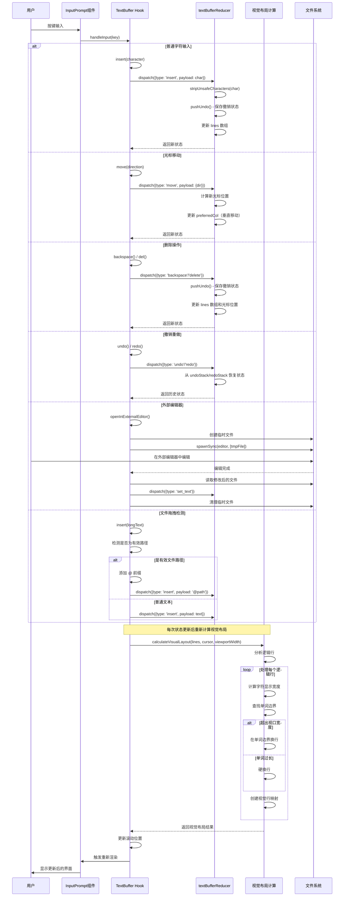

# Gemini CLI Text Buffer 组件深度分析

## 概述

`text-buffer.ts` 是 Gemini CLI 中一个核心的文本编辑组件，它为终端用户界面提供了类似现代代码编辑器的文本编辑功能。该组件使用 React hooks 和 reducer 模式，实现了完整的文本编辑、光标管理、撤销重做、视觉换行等功能，是整个 CLI 应用用户输入系统的基础。

## 核心架构设计

### 技术栈选择

- **React Hooks**: 使用 `useReducer` 进行状态管理，`useMemo` 进行性能优化
- **Unicode 支持**: 全面支持 Unicode 字符，包括 Emoji 和多字节字符
- **终端优化**: 专门针对终端环境的字符宽度计算和渲染优化
- **外部编辑器集成**: 支持调用系统默认编辑器进行复杂编辑

### 主要功能模块

```typescript
export type Direction =
  | 'left'
  | 'right'
  | 'up'
  | 'down'
  | 'wordLeft'
  | 'wordRight'
  | 'home'
  | 'end';

export interface Viewport {
  height: number;
  width: number;
}

interface UseTextBufferProps {
  initialText?: string;
  initialCursorOffset?: number;
  viewport: Viewport; // Viewport dimensions needed for scrolling
  stdin?: NodeJS.ReadStream | null; // For external editor
  setRawMode?: (mode: boolean) => void; // For external editor
  onChange?: (text: string) => void; // Callback for when text changes
  isValidPath: (path: string) => boolean;
  shellModeActive?: boolean; // Whether the text buffer is in shell mode
}
```

这些类型定义构成了 Text Buffer 的核心接口：

- **Direction**: 枚举了所有支持的光标移动方向，包括基本方向（left/right/up/down）和高级导航（wordLeft/wordRight/home/end）
- **Viewport**: 定义了视口尺寸接口，height 和 width 决定了可视区域的大小，这对于文本换行和滚动计算至关重要
- **UseTextBufferProps**: 配置接口，支持丰富的初始化选项：
  - `initialText` 和 `initialCursorOffset` 允许预设文本内容和光标位置
  - `viewport` 提供渲染区域约束
  - `stdin` 和 `setRawMode` 用于外部编辑器集成时的终端模式控制
  - `onChange` 回调函数实现文本变化的外部监听
  - `isValidPath` 函数用于智能文件路径检测
  - `shellModeActive` 标志控制是否启用 Shell 模式的特殊行为

## 核心组件详细分析

### 1. 逻辑位置与视觉位置映射系统

Text Buffer 的一个核心创新是区分了**逻辑位置**和**视觉位置**：

```typescript
function calculateVisualLayout(
  logicalLines: string[],
  logicalCursor: [number, number],
  viewportWidth: number,
): {
  visualLines: string[];
  visualCursor: [number, number];
  logicalToVisualMap: Array<Array<[number, number]>>;
  visualToLogicalMap: Array<[number, number]>;
}
```

这个函数是 Text Buffer 的核心算法，它解决了终端环境下文本渲染的复杂性：

- **输入参数**：
  - `logicalLines`: 原始文本按行分割的数组，这是文本在内存中的真实结构
  - `logicalCursor`: 光标在逻辑文本中的位置 [行号, 列号]
  - `viewportWidth`: 终端视口的字符宽度，决定何时需要换行

- **返回值**：
  - `visualLines`: 考虑换行后实际在屏幕上显示的行数组
  - `visualCursor`: 光标在视觉显示中的位置
  - `logicalToVisualMap`: 从逻辑行到视觉行的映射表，支持一对多关系
  - `visualToLogicalMap`: 从视觉行到逻辑行的反向映射表

这种双重映射机制使得系统能够在保持逻辑文本结构不变的同时，正确处理终端的显示限制和用户的视觉体验。

#### 逻辑位置 vs 视觉位置

- **逻辑位置**: 文本在内存中的实际位置（行号、列号）
- **视觉位置**: 在终端屏幕上显示的位置（考虑换行、字符宽度）

#### 映射机制的具体工作原理

**为什么 `logicalToVisualMap` 是 `Array<Array<[number, number]>>`？**

这种嵌套数组结构是因为一个逻辑行可能被拆分成多个视觉行：
- 外层数组：每个元素对应一个逻辑行
- 内层数组：该逻辑行对应的所有视觉行信息
- `[number, number]`：`[视觉行索引, 在逻辑行中的起始位置]`

**数值案例说明**：

```typescript
// 输入
const logicalLines = [
  "Hello world, this is a very long line that will wrap",  // 逻辑行 0（52字符）
  "Short",                                                 // 逻辑行 1（5字符）
  "Another long line that definitely needs to wrap around" // 逻辑行 2（54字符）
];
const logicalCursor = [1, 3];  // 光标在逻辑行1的第3列
const viewportWidth = 20;      // 视口宽度20字符（每个视觉行最大20字符）

// 详细换行分析（基于Node.js实际计算）：
// 逻辑行0: "Hello world, this is a very long line that will wrap" (52字符)
//   段0: 位置0-16: "Hello world, this" (17字符，在空格处断开)
//   段1: 位置18-36: "is a very long line" (19字符，在空格处断开)
//   段2: 位置38-51: "that will wrap" (14字符，剩余部分)

// 逻辑行2: "Another long line that definitely needs to wrap around" (54字符)
//   段0: 位置0-16: "Another long line" (17字符，在空格处断开)
//   段1: 位置18-32: "that definitely" (15字符，在空格处断开)
//   段2: 位置34-53: "needs to wrap around" (20字符，剩余部分)

// 输出
{
  visualLines: [
    "Hello world, this",        // 视觉行 0（17字符，逻辑行0的0-16位置）
    "is a very long line",      // 视觉行 1（19字符，逻辑行0的18-36位置）
    "that will wrap",           // 视觉行 2（14字符，逻辑行0的38-51位置）
    "Short",                    // 视觉行 3（5字符，逻辑行1完整）
    "Another long line",        // 视觉行 4（17字符，逻辑行2的0-16位置）
    "that definitely",          // 视觉行 5（15字符，逻辑行2的18-32位置）
    "needs to wrap around"      // 视觉行 6（20字符，逻辑行2的34-53位置）
  ],
  
  visualCursor: [3, 3],  // 光标在视觉行3的第3列
  
  logicalToVisualMap: [
    [                          // 逻辑行 0 → 3个视觉行
      [0, 0],                  // 视觉行0，从逻辑位置0开始
      [1, 18],                 // 视觉行1，从逻辑位置18开始（跳过位置17的空格）
      [2, 38]                  // 视觉行2，从逻辑位置38开始（跳过位置37的空格）
    ],
    [                          // 逻辑行 1 → 1个视觉行
      [3, 0]                   // 视觉行3，从逻辑位置0开始
    ],
    [                          // 逻辑行 2 → 3个视觉行
      [4, 0],                  // 视觉行4，从逻辑位置0开始
      [5, 18],                 // 视觉行5，从逻辑位置18开始（跳过位置17的空格）
      [6, 34]                  // 视觉行6，从逻辑位置34开始（跳过位置33的空格）
    ]
  ],
  
  visualToLogicalMap: [
    [0, 0], [0, 18], [0, 38],  // 视觉行0-2对应逻辑行0
    [1, 0],                    // 视觉行3对应逻辑行1  
    [2, 0], [2, 18], [2, 34]   // 视觉行4-6对应逻辑行2
  ]
}
```

**关键洞察**：
- 逻辑行0被拆分为3个视觉行，所以 `logicalToVisualMap[0]` 包含3个映射条目
- 逻辑行1很短，只对应1个视觉行，所以 `logicalToVisualMap[1]` 只有1个条目
- 逻辑行2被拆分为3个视觉行，所以 `logicalToVisualMap[2]` 包含3个映射条目
- 光标从逻辑位置 `[1, 3]` 正确映射到视觉位置 `[3, 3]`

这种映射机制确保了在任何文本编辑操作中，系统都能准确地在逻辑坐标和视觉坐标之间进行转换。

#### 算法验证代码

为了验证上述映射机制的正确性，可以使用以下 Node.js 代码来模拟智能换行算法：

```javascript
// 验证字符长度和换行位置的 Node.js 测试代码
const logicalLines = [
  'Hello world, this is a very long line that will wrap',
  'Short',
  'Another long line that definitely needs to wrap around'
];

console.log('=== 逻辑行字符长度检查 ===');
logicalLines.forEach((line, i) => {
  console.log(`逻辑行${i}: "${line}" = ${line.length}字符`);
});

console.log('\n=== 详细换行分析 ===');
const viewportWidth = 20;

function analyzeLineWrapping(line, lineIndex) {
  console.log(`逻辑行${lineIndex}: "${line}" (总长度: ${line.length})`);
  
  let pos = 0;
  let segments = [];
  
  while (pos < line.length) {
    let end = Math.min(pos + viewportWidth, line.length);
    let segment = line.substring(pos, end);
    
    // 如果不是最后一段且超出长度，尝试在空格处断开
    if (end < line.length && end - pos === viewportWidth) {
      let spaceIndex = segment.lastIndexOf(' ');
      if (spaceIndex > 0) {
        segment = line.substring(pos, pos + spaceIndex);
        end = pos + spaceIndex;
      }
    }
    
    segments.push({
      text: segment,
      start: pos,
      end: end - 1,
      length: segment.length
    });
    
    // 跳过空格
    pos = end;
    if (pos < line.length && line[pos] === ' ') {
      pos++;
    }
  }
  
  segments.forEach((seg, i) => {
    console.log(`  段${i}: 位置${seg.start}-${seg.end}: "${seg.text}" (${seg.length}字符)`);
  });
  
  return segments;
}

// 分析逻辑行0
analyzeLineWrapping(logicalLines[0], 0);

console.log('\n=== 分析逻辑行2 ===');
// 分析逻辑行2
analyzeLineWrapping(logicalLines[2], 2);
```

运行这个测试代码会输出：

```
=== 逻辑行字符长度检查 ===
逻辑行0: "Hello world, this is a very long line that will wrap" = 52字符
逻辑行1: "Short" = 5字符
逻辑行2: "Another long line that definitely needs to wrap around" = 54字符

=== 详细换行分析 ===
逻辑行0: "Hello world, this is a very long line that will wrap" (总长度: 52)
  段0: 位置0-16: "Hello world, this" (17字符)
  段1: 位置18-36: "is a very long line" (19字符)
  段2: 位置38-51: "that will wrap" (14字符)

=== 分析逻辑行2 ===
逻辑行2: "Another long line that definitely needs to wrap around" (总长度: 54)
  段0: 位置0-16: "Another long line" (17字符)
  段1: 位置18-32: "that definitely" (15字符)
  段2: 位置34-53: "needs to wrap around" (20字符)
```

这个测试代码验证了：
1. **字符长度的准确性**：确保手动计算与程序计算一致
2. **智能换行逻辑**：模拟了在单词边界处断行的算法
3. **位置映射关系**：精确计算了每个视觉段在逻辑行中的起始和结束位置
4. **空格处理机制**：展示了换行时如何跳过作为分隔符的空格

通过这种验证方法，可以确保理论分析与实际代码实现的一致性，为 Text Buffer 的进一步开发和调试提供可靠的测试基础。

#### 智能换行算法

```typescript
// 迭代字符构建当前视觉行
for (let i = currentPosInLogLine; i < codePointsInLogLine.length; i++) {
  const char = codePointsInLogLine[i];
  const charVisualWidth = stringWidth(char);

  if (currentChunkVisualWidth + charVisualWidth > viewportWidth) {
    // 字符超出视口宽度
    if (
      lastWordBreakPoint !== -1 &&
      numCodePointsAtLastWordBreak > 0 &&
      currentPosInLogLine + numCodePointsAtLastWordBreak < i
    ) {
      // 使用单词边界进行换行
      currentChunk = codePointsInLogLine
        .slice(
          currentPosInLogLine,
          currentPosInLogLine + numCodePointsAtLastWordBreak,
        )
        .join('');
      numCodePointsInChunk = numCodePointsAtLastWordBreak;
    } else {
      // 硬换行：直接在字符边界换行
      if (
        numCodePointsInChunk === 0 &&
        charVisualWidth > viewportWidth
      ) {
        // 单个字符宽度超过视口，仍然显示
        currentChunk = char;
        numCodePointsInChunk = 1;
      }
    }
    break;
  }
}
```

这个换行算法体现了高度的智能化和人性化设计：

- **字符宽度感知**: 使用 `stringWidth()` 正确计算每个字符的显示宽度，支持全角字符、Emoji 等特殊字符
- **智能断行策略**: 
  - 优先在单词边界（空格处）断行，保持文本的可读性
  - 记录 `lastWordBreakPoint` 和 `numCodePointsAtLastWordBreak` 来追踪可用的断行点
  - 只有在确认断行点有效且不会产生空行时才使用单词边界断行
- **硬断行兜底**: 当单词过长无法在视口内显示时，强制在字符边界断行
- **极端情况处理**: 即使单个字符宽度超过视口，也会强制显示，避免文本丢失
- **循环控制**: 通过 `break` 确保每次循环只处理一个视觉行，避免无限循环

这种多层次的断行策略确保了在各种文本内容和终端尺寸下都能提供最佳的显示效果。

**换行策略**:
1. **优先单词边界**: 在空格处换行，保持单词完整性
2. **硬换行兜底**: 当单词过长时，在字符边界强制换行
3. **Unicode 友好**: 正确处理多字节字符的显示宽度

### 2. 状态管理：Reducer 模式

Text Buffer 使用 React `useReducer` 实现复杂的状态管理：

```typescript
interface TextBufferState {
  lines: string[];
  cursorRow: number;
  cursorCol: number;
  preferredCol: number | null; // 垂直移动时的首选列
  undoStack: UndoHistoryEntry[];
  redoStack: UndoHistoryEntry[];
  clipboard: string | null;
  selectionAnchor: [number, number] | null;
  viewportWidth: number;
}

const historyLimit = 100; // 撤销历史记录限制

type TextBufferAction =
  | { type: 'set_text'; payload: string; pushToUndo?: boolean }
  | { type: 'insert'; payload: string }
  | { type: 'backspace' }
  | { type: 'move'; payload: { dir: Direction } }
  | { type: 'delete' }
  | { type: 'delete_word_left' }
  | { type: 'delete_word_right' }
  | { type: 'kill_line_right' }  // 删除到行尾 (Ctrl+K)
  | { type: 'kill_line_left' }   // 删除到行首 (Ctrl+U)
  | { type: 'undo' }
  | { type: 'redo' }
  | { type: 'replace_range'; payload: {
      startRow: number; startCol: number;
      endRow: number; endCol: number;
      text: string;
    }}
  | { type: 'move_to_offset'; payload: { offset: number } }
  | { type: 'create_undo_snapshot' }
  | { type: 'set_viewport_width'; payload: number };
```

这套状态管理系统展现了 Text Buffer 的复杂性和完整性：

- **TextBufferState 状态结构**：
  - `lines`: 文本内容按行存储，这是核心数据结构
  - `cursorRow/cursorCol`: 当前光标的逻辑位置
  - `preferredCol`: 垂直移动时记住的列位置，解决了短行跳转时光标位置丢失的问题
  - `undoStack/redoStack`: 双栈结构实现撤销重做功能
  - `clipboard`: 内置剪贴板支持（虽然当前版本可能未完全实现）
  - `selectionAnchor`: 文本选择的锚点（为未来的选择功能预留）
  - `viewportWidth`: 当前视口宽度，影响换行计算

- **Action 类型设计**：
  - **基础编辑**: `insert`, `backspace`, `delete` 提供基本文本操作
  - **高级编辑**: `delete_word_left/right`, `kill_line_left/right` 提供 Emacs 风格的高效编辑
  - **导航操作**: `move` 支持各种方向的光标移动
  - **批量操作**: `set_text`, `replace_range` 支持大块文本操作
  - **历史管理**: `undo`, `redo`, `create_undo_snapshot` 完整的历史功能
  - **系统集成**: `move_to_offset`, `set_viewport_width` 支持外部系统集成

- **设计亮点**：
  - 使用联合类型确保 Action 的类型安全
  - `pushToUndo` 可选参数允许控制是否创建撤销记录
  - `historyLimit` 常量化配置，便于调整和测试

#### 撤销重做系统

```typescript
const pushUndo = (currentState: TextBufferState): TextBufferState => {
  const snapshot = {
    lines: [...currentState.lines],
    cursorRow: currentState.cursorRow,
    cursorCol: currentState.cursorCol,
  };
  const newStack = [...currentState.undoStack, snapshot];
  if (newStack.length > historyLimit) {
    newStack.shift(); // 限制历史记录数量
  }
  return { ...currentState, undoStack: newStack, redoStack: [] };
};
```

这个撤销系统实现了专业编辑器级别的历史管理：

- **快照策略**: 
  - 只保存必要的状态：文本内容（`lines`）和光标位置（`cursorRow`, `cursorCol`）
  - 使用浅拷贝 `[...currentState.lines]` 创建文本数组的副本，避免引用共享问题
  - 不保存视觉状态，因为这些可以从逻辑状态重新计算

- **内存管理**: 
  - `historyLimit` 限制历史记录数量，防止内存无限增长
  - 使用 `shift()` 移除最旧的记录，保持 FIFO（先进先出）顺序
  - 在添加新记录时清空重做栈 `redoStack: []`，这符合用户对编辑历史的预期

- **状态一致性**: 
  - 返回新的状态对象而不是修改原对象，保持不可变性
  - 撤销操作时会将当前状态推入重做栈，支持重做功能
  - 每次编辑操作前调用此函数，确保操作的原子性

**特点**:
- **快照机制**: 每次编辑操作前保存状态快照
- **内存控制**: 限制撤销历史数量（默认100条）
- **清空重做**: 新操作清空重做栈，符合用户预期

### 3. 字符处理与安全过滤

```typescript
function stripUnsafeCharacters(str: string): string {
  const stripped = stripAnsi(str);
  return toCodePoints(stripped)
    .filter((char) => {
      if (char.length > 1) return false;
      const code = char.codePointAt(0);
      if (code === undefined) {
        return false;
      }
      const isUnsafe =
        code === 127 || (code <= 31 && code !== 13 && code !== 10);
      return !isUnsafe;
    })
    .join('');
}
```

这个字符过滤函数是终端安全性的重要保障：

- **ANSI 转义序列清理**: 
  - 使用 `stripAnsi()` 库函数移除所有 ANSI 转义序列
  - 防止恶意输入破坏终端显示或执行意外命令
  - 确保文本内容的纯净性

- **Unicode 代码点处理**:
  - `toCodePoints()` 将字符串转换为 Unicode 代码点数组
  - 正确处理多字节字符（如 Emoji、中文字符）
  - `char.length > 1` 过滤掉无效的多字节序列

- **控制字符过滤**:
  - `code === 127`: 过滤 DEL 字符（将在 insert 函数中特殊处理）
  - `code <= 31`: 过滤所有 ASCII 控制字符
  - `code !== 13 && code !== 10`: 保留回车符(CR)和换行符(LF)
  - 这种选择性过滤确保了终端的稳定性，同时保留了必要的格式字符

- **安全边界**:
  - 对 `codePointAt(0)` 返回值进行 `undefined` 检查
  - 使用 `!isUnsafe` 的双重否定逻辑，提高代码可读性
  - 最终通过 `join('')` 重新组合为安全的字符串

**安全处理**:
- **ANSI 码清理**: 移除可能破坏终端显示的 ANSI 转义序列
- **控制字符过滤**: 过滤除换行外的控制字符
- **Unicode 安全**: 正确处理 Unicode 代码点

### 4. 智能文件路径检测与字符处理

```typescript
const insert = useCallback(
  (ch: string): void => {
    if (/[\n\r]/.test(ch)) {
      dispatch({ type: 'insert', payload: ch });
      return;
    }

    const minLengthToInferAsDragDrop = 3;
    if (ch.length >= minLengthToInferAsDragDrop && !shellModeActive) {
      let potentialPath = ch;
      if (
        potentialPath.length > 2 &&
        potentialPath.startsWith("'") &&
        potentialPath.endsWith("'")
      ) {
        potentialPath = ch.slice(1, -1);
      }

      potentialPath = potentialPath.trim();
      if (isValidPath(unescapePath(potentialPath))) {
        ch = `@${potentialPath}`; // 自动添加 @ 前缀
      }
    }

    // 特殊字符处理：处理删除字符 (ASCII 127)
    let currentText = '';
    for (const char of toCodePoints(ch)) {
      if (char.codePointAt(0) === 127) {
        if (currentText.length > 0) {
          dispatch({ type: 'insert', payload: currentText });
          currentText = '';
        }
        dispatch({ type: 'backspace' }); // 将删除字符转换为退格操作
      } else {
        currentText += char;
      }
    }
    if (currentText.length > 0) {
      dispatch({ type: 'insert', payload: currentText });
    }
  },
  [isValidPath, shellModeActive],
);
```

这个插入函数展现了高度的智能化和用户友好设计：

- **换行字符快速处理**:
  - 使用正则表达式 `/[\n\r]/` 快速检测换行字符
  - 直接分发到 reducer，避免后续复杂的路径检测逻辑
  - 提高了换行操作的性能

- **智能文件路径检测**:
  - `minLengthToInferAsDragDrop = 3`: 设置最小长度阈值，避免短文本误判
  - 只在非 Shell 模式下启用，避免干扰命令行输入
  - 支持单引号包装的路径：`'path/to/file'` → `path/to/file`
  - 使用 `trim()` 清理路径两端的空白字符
  - `unescapePath()` 处理转义字符，支持包含空格的路径
  - 自动添加 `@` 前缀，符合 Gemini CLI 的文件引用语法

- **删除字符映射机制**:
  - 逐字符遍历输入，使用 `toCodePoints()` 确保 Unicode 兼容性
  - 检测 ASCII 127 (DEL) 字符，将其转换为退格操作
  - 批量处理策略：积累普通字符，遇到特殊字符时先处理积累的内容
  - 这种设计处理了某些终端发送 DEL 而非 Backspace 的情况

- **性能优化**:
  - 使用 `useCallback` 缓存函数，避免不必要的重渲染
  - 依赖数组只包含 `isValidPath` 和 `shellModeActive`，精确控制更新时机
  - 分批分发 Action，减少 reducer 调用次数

**智能特性**:
- **拖拽检测**: 检测长文本输入，可能是文件拖拽
- **路径验证**: 验证是否为有效文件路径
- **自动前缀**: 为有效路径自动添加 `@` 前缀，集成 Gemini CLI 的文件引用语法
- **引用处理**: 自动去除文件路径的单引号包装
- **删除字符映射**: 将 ASCII 127 (DEL) 字符映射为退格操作

### 5. 外部编辑器集成

```typescript
const openInExternalEditor = useCallback(
  async (opts: { editor?: string } = {}): Promise<void> => {
    const editor =
      opts.editor ??
      process.env['VISUAL'] ??
      process.env['EDITOR'] ??
      (process.platform === 'win32' ? 'notepad' : 'vi');
    
    const tmpDir = fs.mkdtempSync(pathMod.join(os.tmpdir(), 'gemini-edit-'));
    const filePath = pathMod.join(tmpDir, 'buffer.txt');
    fs.writeFileSync(filePath, text, 'utf8');

    dispatch({ type: 'create_undo_snapshot' });

    const wasRaw = stdin?.isRaw ?? false;
    try {
      setRawMode?.(false); // 退出原始模式
      const { status, error } = spawnSync(editor, [filePath], {
        stdio: 'inherit',
      });
      
      let newText = fs.readFileSync(filePath, 'utf8');
      newText = newText.replace(/\r\n?/g, '\n');
      dispatch({ type: 'set_text', payload: newText, pushToUndo: false });
    } finally {
      if (wasRaw) setRawMode?.(true); // 恢复原始模式
      // 清理临时文件
    }
  },
  [text, stdin, setRawMode],
);
```

这个外部编辑器集成功能展现了系统级集成的复杂性：

- **编辑器选择策略**:
  - 使用链式空值合并 `??` 操作符，按优先级选择编辑器
  - `opts.editor`: 用户显式指定的编辑器，优先级最高
  - `process.env['VISUAL']`: Unix 标准的可视化编辑器环境变量
  - `process.env['EDITOR']`: Unix 标准的默认编辑器环境变量  
  - 平台回退：Windows 默认 `notepad`，Unix 系统默认 `vi`

- **临时文件管理**:
  - `fs.mkdtempSync()` 创建唯一的临时目录，避免文件名冲突
  - `pathMod.join()` 确保跨平台路径兼容性
  - 使用 `utf8` 编码写入文件，确保文本内容正确保存

- **撤销集成**:
  - 在编辑前创建撤销快照 `create_undo_snapshot`
  - 编辑后设置 `pushToUndo: false`，避免重复创建撤销记录
  - 将整个外部编辑过程视为单一操作，符合用户预期

- **终端模式管理**:
  - 保存当前 raw 模式状态 `wasRaw`
  - 临时退出 raw 模式，让外部编辑器正常工作
  - 使用 `finally` 块确保模式恢复，即使出现异常

- **进程管理**:
  - `spawnSync()` 同步执行外部编辑器，阻塞等待用户完成编辑
  - `stdio: 'inherit'` 让外部编辑器继承当前进程的输入输出
  - 检查 `status` 和 `error`，处理编辑器异常退出情况

- **文本格式统一**:
  - 读取编辑结果后统一换行符格式 `replace(/\r\n?/g, '\n')`
  - 处理不同操作系统的换行符差异（Windows: CRLF, Unix: LF）

**外部编辑器特性**:
- **环境变量支持**: 支持 `$VISUAL` 和 `$EDITOR` 环境变量
- **跨平台兼容**: Windows 默认 notepad，Unix 默认 vi
- **终端模式管理**: 自动切换终端原始模式
- **临时文件处理**: 安全创建和清理临时文件
- **撤销集成**: 外部编辑作为单一撤销操作

## 完整用户交互流程



## 键盘输入处理系统

### 完整的键盘映射

```typescript
const handleInput = useCallback(
  (key: {
    name: string;
    ctrl: boolean;
    meta: boolean;
    shift: boolean;
    paste: boolean;
    sequence: string;
  }): void => {
    const { sequence: input } = key;

    if (
      key.name === 'return' ||
      input === '\r' ||
      input === '\n' ||
      input === '\\\r' // VSCode terminal represents shift + enter this way
    )
      newline();
    else if (key.name === 'left' && !key.meta && !key.ctrl) move('left');
    else if (key.ctrl && key.name === 'b') move('left'); // Emacs 风格
    else if (key.name === 'right' && !key.meta && !key.ctrl) move('right');
    else if (key.ctrl && key.name === 'f') move('right'); // Emacs 风格
    else if (key.name === 'up') move('up');
    else if (key.name === 'down') move('down');
    else if ((key.ctrl || key.meta) && key.name === 'left') move('wordLeft');
    else if (key.meta && key.name === 'b') move('wordLeft'); // Emacs 风格
    else if ((key.ctrl || key.meta) && key.name === 'right') move('wordRight');
    else if (key.meta && key.name === 'f') move('wordRight'); // Emacs 风格
    else if (key.name === 'home') move('home');
    else if (key.ctrl && key.name === 'a') move('home'); // Emacs 风格
    else if (key.name === 'end') move('end');
    else if (key.ctrl && key.name === 'e') move('end'); // Emacs 风格
    else if (key.ctrl && key.name === 'w') deleteWordLeft();
    else if ((key.meta || key.ctrl) && key.name === 'backspace') deleteWordLeft();
    else if ((key.meta || key.ctrl) && key.name === 'delete') deleteWordRight();
    else if (key.name === 'backspace' || input === '\x7f' || (key.ctrl && key.name === 'h'))
      backspace();
    else if (key.name === 'delete' || (key.ctrl && key.name === 'd')) del();
    else if (input && !key.ctrl && !key.meta) {
      insert(input);
    }
  },
  [newline, move, deleteWordLeft, deleteWordRight, backspace, del, insert],
);
```

这个键盘输入处理函数实现了现代编辑器级别的快捷键支持：

- **换行处理多样性**:
  - `key.name === 'return'`: 标准回车键识别
  - `input === '\r'` 和 `input === '\n'`: 直接字符序列检测
  - `input === '\\\r'`: VSCode 终端特有的 Shift+Enter 组合表示
  - 这种多重检测确保在不同终端环境下的兼容性

- **光标移动的双重支持**:
  - **现代风格**: `left/right/up/down` 方向键，以及 `home/end` 键
  - **Emacs 风格**: `Ctrl+b/f` (左右移动)，`Ctrl+a/e` (行首/行尾)
  - `Meta+b/f`: Emacs 风格的单词级移动
  - 智能修饰符检测：`!key.meta && !key.ctrl` 确保基础移动不与高级功能冲突

- **单词级导航**:
  - `Ctrl/Meta + 左右箭头`: 现代编辑器标准的单词跳转
  - `Meta + b/f`: Emacs 传统的单词导航
  - 支持双修饰符 `(key.ctrl || key.meta)`，适应不同平台习惯

- **删除操作的精细化**:
  - `Ctrl+w`: Emacs 风格的单词删除
  - `Ctrl/Meta + Backspace/Delete`: 现代编辑器的单词删除
  - `backspace`、`\x7f`（DEL 字符）、`Ctrl+h`: 多种退格表示的统一处理
  - `delete` 和 `Ctrl+d`: 向前删除字符

- **输入过滤机制**:
  - 最后的 `else if` 作为默认处理：只处理非控制字符输入
  - `!key.ctrl && !key.meta` 过滤掉所有控制组合，避免误操作
  - 这种设计确保了快捷键的优先级高于普通输入

- **性能优化**:
  - `useCallback` 缓存函数避免重渲染
  - 依赖数组精确列出所有使用的函数，确保更新的正确性

**键盘绑定特点**:
- **多标准支持**: 同时支持现代键盘和 Emacs 风格快捷键
- **VSCode 兼容**: 特殊处理 VSCode 终端的 Shift+Enter (`\\\r`)
- **完整覆盖**: 涵盖所有常用编辑操作
- **平台无关**: 统一处理不同平台的键盘差异

## 性能优化策略

### 1. 计算缓存

```typescript
const text = useMemo(() => lines.join('\n'), [lines]);

const visualLayout = useMemo(
  () =>
    calculateVisualLayout(lines, [cursorRow, cursorCol], state.viewportWidth),
  [lines, cursorRow, cursorCol, state.viewportWidth],
);

const renderedVisualLines = useMemo(
  () => visualLines.slice(visualScrollRow, visualScrollRow + viewport.height),
  [visualLines, visualScrollRow, viewport.height],
);
```

这些 `useMemo` 缓存策略展现了细致的性能优化思考：

- **文本重组缓存**:
  - `lines.join('\n')` 看似简单，但在大文档中成本很高
  - 只有当 `lines` 数组引用变化时才重新计算
  - 避免了每次渲染都重新拼接字符串的开销

- **视觉布局缓存**:
  - `calculateVisualLayout` 是最复杂的计算，涉及换行算法和位置映射
  - 依赖项精确控制：只有文本内容、光标位置或视口宽度变化时才重算
  - 这个缓存对性能的影响最为显著，特别是在大文档或频繁光标移动时

- **视口渲染优化**:
  - 只渲染可见区域的行：`visualLines.slice(start, end)`
  - 虚拟滚动的核心实现，大幅减少 DOM 更新和内存使用
  - 依赖项包含滚动位置和视口尺寸，确保滚动时的实时更新

- **依赖数组精确性**:
  - 每个 `useMemo` 的依赖数组都经过精心设计
  - 包含所有相关状态，确保缓存失效的准确性
  - 避免了过度缓存（依赖太少）和缓存失效（依赖太多）的问题

**优化特点**:
- **文本缓存**: 只在 lines 数组变化时重新拼接文本
- **视觉布局缓存**: 只在内容或视口变化时重新计算
- **视口渲染**: 只渲染可见区域的行，提高大文本性能

### 2. 智能滚动

```typescript
useEffect(() => {
  const { height } = viewport;
  let newVisualScrollRow = visualScrollRow;

  if (visualCursor[0] < visualScrollRow) {
    newVisualScrollRow = visualCursor[0]; // 向上滚动
  } else if (visualCursor[0] >= visualScrollRow + height) {
    newVisualScrollRow = visualCursor[0] - height + 1; // 向下滚动
  }
  if (newVisualScrollRow !== visualScrollRow) {
    setVisualScrollRow(newVisualScrollRow);
  }
}, [visualCursor, visualScrollRow, viewport]);
```

这个滚动算法实现了编辑器级别的智能视口管理：

- **跟随光标策略**:
  - 监听 `visualCursor[0]`（光标的视觉行位置）变化
  - 只在光标移出可视区域时才滚动，避免不必要的视觉跳动
  - 保持光标始终在用户可见范围内

- **向上滚动逻辑**:
  - 当光标位置 `< visualScrollRow` 时触发
  - 直接将滚动位置设为光标位置，让光标出现在视口顶部
  - 这种策略在向上移动时提供最大的上下文可见性

- **向下滚动逻辑**:
  - 当光标 `>= visualScrollRow + height` 时触发
  - 计算 `visualCursor[0] - height + 1` 让光标出现在视口底部
  - `+ 1` 确保光标行完全可见，不会被截断

- **滚动优化**:
  - 使用局部变量 `newVisualScrollRow` 避免多次状态更新
  - 只在滚动位置真正需要改变时才调用 `setVisualScrollRow`
  - 减少不必要的重渲染和状态更新

- **边界处理**:
  - 算法自动处理文档开始和结束位置
  - 不会滚动到无效位置（如负数或超出文档范围）
  - 视口高度变化时自动调整滚动位置

**滚动算法**:
- **跟随光标**: 自动滚动保持光标在可视区域内
- **最小滚动**: 只在必要时滚动，减少视觉跳动
- **边界处理**: 正确处理文档开始和结束位置

### 3. 内存管理

```typescript
const newStack = [...currentState.undoStack, snapshot];
if (newStack.length > historyLimit) {
  newStack.shift(); // 移除最旧的历史记录
}
```

这个内存管理策略展现了对长期使用场景的深思熟虑：

- **历史记录限制**:
  - `historyLimit` 常量（值为100）防止撤销栈无限增长
  - 在长时间编辑会话中避免内存泄漏
  - 平衡了功能性（足够的撤销深度）和内存效率

- **FIFO 清理策略**:
  - 使用 `shift()` 移除最旧的记录，保持时间顺序
  - 新记录总是添加到栈顶，老记录从栈底清除
  - 这种策略确保用户总能撤销最近的操作

- **内存效率**:
  - 每个快照只保存必要的状态（文本内容和光标位置）
  - 不保存计算出的视觉状态，这些可以重新计算
  - 使用浅拷贝策略，平衡内存使用和数据安全

- **阈值设计**:
  - 100个操作的历史深度对绝大多数用户场景都足够
  - 可以通过修改 `historyLimit` 常量进行调整
  - 在内存受限的环境中可以减小这个值

**内存控制**:
- **撤销历史限制**: 防止长时间编辑导致的内存泄漏
- **状态快照**: 使用浅拷贝优化内存使用
- **及时清理**: 在适当时机清理不需要的状态

## 与 Gemini CLI 集成

### 1. 在应用中的使用

```typescript
const buffer = useTextBuffer({
  initialText: '',
  viewport: { height: 10, width: inputWidth },
  stdin,
  setRawMode,
  isValidPath,
  shellModeActive,
});
```

这个初始化配置展现了 Text Buffer 在 Gemini CLI 中的集成方式：

- **初始状态设置**:
  - `initialText: ''` 从空文本开始，适合命令行输入场景
  - 可以预设初始文本内容，支持编辑现有内容的用例

- **视口配置**:
  - `height: 10` 提供合理的输入区域高度，支持多行输入
  - `width: inputWidth` 动态计算宽度，适应不同终端尺寸
  - 视口大小影响换行算法和滚动行为

- **系统集成**:
  - `stdin` 和 `setRawMode` 来自 Ink 的终端控制
  - 支持外部编辑器功能的终端模式切换
  - 与 React 组件生命周期紧密集成

- **文件系统集成**:
  - `isValidPath` 函数来自应用层，检查文件是否存在
  - 支持智能文件路径检测和自动前缀添加
  - 与 Gemini CLI 的文件引用语法无缝集成

- **模式控制**:
  - `shellModeActive` 标志控制是否启用 Shell 模式
  - 在不同模式下提供不同的编辑行为和功能

### 2. 输入提示组件集成

```typescript
export const InputPrompt: React.FC<InputPromptProps> = ({
  buffer,
  onSubmit,
  userMessages,
  onClearScreen,
  config,
  // ...其他props
}) => {
  // 使用 buffer 进行文本编辑和显示
  const isCursorAfterCommandWithoutSpace = useCallback(() => {
    const [row, col] = buffer.cursor;
    const currentLine = buffer.lines[row] || '';
    // ...光标位置检测逻辑
  }, [buffer.cursor, buffer.lines]);
}
```

这个集成示例展现了 Text Buffer 如何与上层 UI 组件协作：

- **属性传递模式**:
  - `buffer` 作为核心属性传递给 `InputPrompt` 组件
  - 组件通过 `buffer` 对象访问所有文本编辑功能
  - 这种设计实现了关注点分离：Text Buffer 负责编辑逻辑，InputPrompt 负责 UI 渲染

- **状态访问模式**:
  - `buffer.cursor` 提供当前光标位置的实时访问
  - `buffer.lines` 提供文本内容的逐行访问
  - 这些状态是响应式的，变化时会自动触发组件重渲染

- **智能功能集成**:
  - `isCursorAfterCommandWithoutSpace` 函数利用光标位置检测特定的输入上下文
  - 这种检测用于智能提示、自动补全等高级功能
  - 展示了如何基于 Text Buffer 的状态构建更高级的用户体验

- **React 优化模式**:
  - 使用 `useCallback` 缓存计算函数，避免不必要的重计算
  - 依赖数组精确包含相关状态，确保更新的及时性
  - 这种模式在复杂 UI 中非常重要，特别是当存在频繁的文本变化时

- **错误处理**:
  - `buffer.lines[row] || ''` 提供安全的数组访问，避免越界错误
  - 这种防御性编程确保 UI 在各种边界情况下的稳定性

### 3. Shell 模式支持

Text Buffer 支持 Shell 模式，在该模式下：
- 禁用智能文件路径检测
- 启用命令历史记录
- 适配 Shell 命令编辑习惯

## 技术创新点

### 1. 终端原生编辑体验

Text Buffer 在终端环境中实现了接近现代代码编辑器的体验：
- **Unicode 完整支持**: 正确处理 Emoji、中文等多字节字符
- **智能换行**: 兼顾美观和实用性的换行算法
- **视觉-逻辑映射**: 解决终端环境下位置计算的复杂性

### 2. React 生态集成

- **Hooks 模式**: 符合现代 React 开发习惯
- **性能优化**: 合理使用 `useMemo` 和 `useCallback`
- **状态管理**: 使用 `useReducer` 处理复杂状态逻辑

### 3. 系统深度集成

- **外部编辑器**: 无缝集成系统编辑器
- **文件系统**: 智能文件路径检测和处理
- **终端模式**: 正确处理终端原始模式切换

## 扩展性设计

### 1. 插件化架构

Text Buffer 的设计允许轻松扩展功能：
- **Action 扩展**: 通过添加新的 Action 类型扩展功能
- **字符处理**: 可自定义字符过滤和处理逻辑
- **渲染定制**: 支持自定义渲染逻辑

### 2. 配置化选项

- **编辑器偏好**: 支持配置默认外部编辑器
- **行为定制**: 可配置撤销历史限制、换行策略等
- **集成参数**: 通过 props 灵活配置集成方式

## 高级编辑功能

### 1. 范围替换操作

```typescript
case 'replace_range': {
  const { startRow, startCol, endRow, endCol, text } = action.payload;
  // 范围验证
  if (
    startRow > endRow ||
    (startRow === endRow && startCol > endCol) ||
    startRow < 0 || startCol < 0 ||
    endRow >= state.lines.length ||
    (endRow < state.lines.length && endCol > currentLineLen(endRow))
  ) {
    return state; // 无效范围，返回原状态
  }

  const nextState = pushUndo(state);
  const newLines = [...nextState.lines];
  
  // 计算前缀和后缀
  const prefix = cpSlice(currentLine(startRow), 0, sCol);
  const suffix = cpSlice(currentLine(endRow), eCol);
  
  const normalisedReplacement = text
    .replace(/\r\n/g, '\n')
    .replace(/\r/g, '\n');
  const replacementParts = normalisedReplacement.split('\n');

  // 智能替换逻辑
  if (startRow === endRow) {
    // 单行替换
    newLines[startRow] = prefix + normalisedReplacement + suffix;
  } else {
    // 多行替换
    const firstLine = prefix + replacementParts[0];
    const lastLine = replacementParts[replacementParts.length - 1] + suffix;
    const middleLines = replacementParts.slice(1, -1);
    
    newLines.splice(
      startRow,
      endRow - startRow + 1,
      firstLine,
      ...middleLines,
      lastLine,
    );
  }
}
```

这个范围替换操作展现了专业文本编辑器的精密性：

- **范围验证机制**:
  - 检查起始位置不能大于结束位置：`startRow > endRow` 或同行时 `startCol > endCol`
  - 验证坐标不能为负数：`startRow < 0 || startCol < 0`
  - 确保结束位置不超出文档范围：`endRow >= state.lines.length`
  - 检查列位置不超出行长度：`endCol > currentLineLen(endRow)`
  - 任何验证失败都返回原状态，确保操作的安全性

- **Unicode 字符处理**:
  - 使用 `cpSlice()` 而非普通的 `slice()`，正确处理多字节字符
  - `currentLineLen()` 返回 Unicode 代码点长度，而非字节长度
  - 这种处理确保了对 Emoji、中文等字符的正确支持

- **文本格式规范化**:
  - `replace(/\r\n/g, '\n')` 将 Windows 风格的 CRLF 转换为 LF
  - `replace(/\r/g, '\n')` 将老式 Mac 的 CR 转换为 LF
  - 确保内部文本格式的一致性，避免跨平台问题

- **智能替换策略**:
  - **单行替换**: 当起始和结束在同一行时，直接字符串拼接
  - **多行替换**: 复杂的行结构重建：
    - `firstLine`: 原始行前缀 + 替换文本首行
    - `middleLines`: 替换文本的中间行（如果有）
    - `lastLine`: 替换文本末行 + 原始行后缀
    - 使用 `splice()` 一次性替换多行，保持操作的原子性

- **光标位置计算**:
  - 自动计算替换后的光标位置
  - 考虑替换文本的行数和最后一行的长度
  - 确保光标位置在替换后仍然有效

### 2. 偏移量定位系统

```typescript
export function offsetToLogicalPos(
  text: string,
  offset: number,
): [number, number] {
  let row = 0;
  let col = 0;
  let currentOffset = 0;

  if (offset === 0) return [0, 0];

  const lines = text.split('\n');
  for (let i = 0; i < lines.length; i++) {
    const line = lines[i];
    const lineLength = cpLen(line);
    const lineLengthWithNewline = lineLength + (i < lines.length - 1 ? 1 : 0);

    if (offset <= currentOffset + lineLength) {
      // 光标在当前行内
      row = i;
      col = offset - currentOffset;
      return [row, col];
    } else if (offset <= currentOffset + lineLengthWithNewline) {
      // 光标在换行符位置
      row = i;
      col = lineLength;
      
      // 如果偏移量正好是换行符，且不是最后一行，跳到下一行开头
      if (offset === currentOffset + lineLengthWithNewline && i < lines.length - 1) {
        return [i + 1, 0];
      }
      return [row, col];
    }
    currentOffset += lineLengthWithNewline;
  }
  
  // 偏移量超出文本长度，放在最后一行末尾
  if (lines.length > 0) {
    row = lines.length - 1;
    col = cpLen(lines[row]);
  }
  return [row, col];
}
```

这个偏移量转换函数解决了线性位置到二维坐标转换的复杂问题：

- **线性到二维的映射**:
  - 输入：线性字符偏移量（如第100个字符）
  - 输出：二维坐标 `[row, col]`（如第5行第10列）
  - 这种转换在处理外部系统集成、搜索结果定位等场景中至关重要

- **Unicode 字符处理**:
  - 使用 `cpLen()` 获取 Unicode 代码点长度，而非字节长度
  - 正确处理多字节字符（如中文、Emoji）的位置计算
  - 确保位置映射的准确性，避免字符边界错误

- **换行符处理的精细化**:
  - `lineLengthWithNewline` 计算包含换行符的实际行长度
  - 区分行内位置和换行符位置的不同处理逻辑
  - 最后一行不添加换行符长度，符合文本结构的实际情况

- **边界条件处理**:
  - `offset === 0` 的快速返回，优化常见情况
  - 换行符位置的特殊处理：可能停在行尾或跳到下一行开头
  - 超出范围时的安全回退：定位到文档末尾

- **算法效率**:
  - 单次遍历算法，时间复杂度 O(n)，其中 n 是行数
  - 避免了重复计算，每行的长度只计算一次
  - 早期返回机制减少不必要的计算

- **精确的位置语义**:
  - 严格区分"在行内"和"在换行符上"的不同情况
  - 换行符位置的处理遵循编辑器的标准行为
  - 支持将换行符视为独立位置或行尾位置的不同需求

**高级功能特点**:
- **精确范围操作**: 支持跨行的精确文本替换
- **偏移量转换**: 将线性偏移量转换为二维行列坐标
- **边界处理**: 完善的边界条件和错误处理
- **Unicode 友好**: 所有操作都考虑 Unicode 字符的正确处理

## 测试策略

Text Buffer 采用全面的测试策略：

**测试覆盖范围**:
1. **基础文本操作**: 插入、删除、移动光标
2. **Unicode 字符处理**: Emoji、多字节字符、组合字符
3. **撤销重做功能**: 历史记录管理和状态恢复
4. **视觉布局计算**: 换行算法和光标映射
5. **边界条件处理**: 空文档、超长行、特殊字符
6. **键盘输入映射**: 各种快捷键组合和平台差异
7. **文件路径检测**: 拖拽文件的自动识别

## 代码质量与工程实践

### 1. 类型安全

```typescript
export interface TextBuffer {
  // State - 状态属性
  lines: string[];                    // 逻辑行数据
  text: string;                       // 完整文本
  cursor: [number, number];           // 逻辑光标位置 [row, col]
  preferredCol: number | null;        // 垂直移动时的首选列
  selectionAnchor: [number, number] | null; // 选择锚点

  // Visual state - 视觉状态
  allVisualLines: string[];           // 所有视觉行
  viewportVisualLines: string[];      // 视口内的视觉行
  visualCursor: [number, number];     // 视觉光标位置
  visualScrollRow: number;            // 视觉滚动位置

  // Actions - 操作方法
  setText: (text: string) => void;
  insert: (ch: string) => void;
  newline: () => void;
  backspace: () => void;
  del: () => void;
  move: (dir: Direction) => void;
  undo: () => void;
  redo: () => void;
  replaceRange: (startRow: number, startCol: number, endRow: number, endCol: number, text: string) => void;
  deleteWordLeft: () => void;
  deleteWordRight: () => void;
  killLineRight: () => void;
  killLineLeft: () => void;
  handleInput: (key: KeyEvent) => void;
  openInExternalEditor: (opts?: { editor?: string }) => Promise<void>;
  replaceRangeByOffset: (startOffset: number, endOffset: number, replacementText: string) => void;
  moveToOffset: (offset: number) => void;
}
```

这个接口定义展现了完整的类型安全设计：

- **状态属性的类型精确性**:
  - `lines: string[]` 确保文本数据的结构化存储
  - `cursor: [number, number]` 使用元组类型确保坐标的二维性质
  - `preferredCol: number | null` 明确表达可选状态的语义
  - `selectionAnchor` 为未来的文本选择功能预留类型定义

- **视觉状态的清晰分离**:
  - 明确区分逻辑状态和视觉状态的不同类型
  - `allVisualLines` vs `viewportVisualLines` 的语义差异通过命名体现
  - `visualCursor` 与逻辑 `cursor` 的类型一致但语义不同

- **方法签名的完整性**:
  - 基础编辑方法：`setText`, `insert`, `newline`, `backspace`, `del`
  - 高级编辑方法：`deleteWordLeft/Right`, `killLineLeft/Right`
  - 导航方法：`move` 使用 `Direction` 枚举确保参数有效性
  - 历史方法：`undo`, `redo` 的无参数设计
  - 范围操作：`replaceRange` 的多参数精确定义

- **异步操作的类型安全**:
  - `openInExternalEditor` 返回 `Promise<void>`，明确异步性质
  - 可选参数 `opts?: { editor?: string }` 的嵌套可选类型

- **集成方法的灵活性**:
  - `handleInput` 接受复杂的键盘事件对象
  - `replaceRangeByOffset` 提供偏移量版本的范围替换
  - `moveToOffset` 支持外部系统的位置同步

这种完整的类型定义不仅提供了编译时安全保障，还作为代码文档指导正确的使用方式。

### 2. 错误处理机制

```typescript
const openInExternalEditor = useCallback(
  async (opts: { editor?: string } = {}): Promise<void> => {
    // ... 编辑器选择逻辑
    
    const wasRaw = stdin?.isRaw ?? false;
    try {
      setRawMode?.(false);
      const { status, error } = spawnSync(editor, [filePath], {
        stdio: 'inherit',
      });
      if (error) throw error;
      if (typeof status === 'number' && status !== 0)
        throw new Error(`External editor exited with status ${status}`);

      // 成功情况处理
      let newText = fs.readFileSync(filePath, 'utf8');
      newText = newText.replace(/\r\n?/g, '\n');
      dispatch({ type: 'set_text', payload: newText, pushToUndo: false });
    } catch (err) {
      console.error('[useTextBuffer] external editor error', err);
    } finally {
      // 清理工作
      if (wasRaw) setRawMode?.(true);
      try {
        fs.unlinkSync(filePath);
        fs.rmdirSync(tmpDir);
      } catch {
        /* ignore cleanup errors */
      }
    }
  },
  [text, stdin, setRawMode],
);
```

这个错误处理示例展现了企业级软件的可靠性设计：

- **多层错误检测**:
  - `spawnSync` 的 `error` 属性检测进程启动失败
  - `status` 代码检测编辑器异常退出（非零状态码）
  - 类型检查 `typeof status === 'number'` 确保状态码有效性
  - 每个潜在故障点都有相应的检测机制

- **优雅的错误恢复**:
  - 使用 `try-catch` 包围危险操作，防止未捕获异常
  - 错误情况下记录详细日志 `console.error`，便于调试
  - 不抛出错误到上层，避免破坏用户体验
  - 错误后继续执行清理逻辑，确保系统状态一致

- **资源清理保障**:
  - `finally` 块确保终端模式恢复，即使出现异常
  - 嵌套的 `try-catch` 处理清理操作可能的失败
  - `/* ignore cleanup errors */` 明确表达清理失败的处理策略
  - 双重清理：文件删除和目录删除，确保临时资源完全释放

- **状态管理的原子性**:
  - 保存初始状态 `wasRaw` 确保能正确恢复
  - 使用可选链 `stdin?.isRaw` 处理可能的空值
  - 条件恢复 `if (wasRaw)` 避免不必要的模式切换

- **防御性编程实践**:
  - 空值合并 `?? false` 提供默认值
  - 可选调用 `setRawMode?.()` 处理可能未定义的函数
  - 明确的错误消息包含上下文信息
  - 日志前缀 `[useTextBuffer]` 帮助定位错误来源

这种全面的错误处理确保了外部编辑器集成功能在各种异常情况下的稳定性和可靠性。

### 3. 防御性编程

- **边界检查**: 所有数组访问都有边界检查
- **空值处理**: 使用 `?.` 和 `??` 操作符安全处理可能的空值
- **类型守护**: 通过类型检查避免运行时错误
- **优雅降级**: 错误情况下回退到安全状态

## 架构设计模式

### 1. 命令模式 (Command Pattern)
- 所有编辑操作都封装为 Action
- 支持撤销重做功能
- 操作的原子性和一致性

### 2. 策略模式 (Strategy Pattern)  
- 不同移动方向的处理策略
- 换行算法的策略选择
- 键盘输入的处理策略

### 3. 观察者模式 (Observer Pattern)
- React hooks 的状态变化监听
- 视口变化的响应机制
- 文本变化的回调通知

## 总结

`text-buffer.ts` 是 Gemini CLI 中一个设计精良的核心组件，展现了以下特点：

### 技术卓越性
1. **完整的编辑器功能**: 在终端环境中实现了现代编辑器级别的功能
2. **复杂算法实现**: 解决了 Unicode、终端渲染、位置映射等技术难题
3. **性能优化**: 通过智能缓存和计算优化，确保大文本编辑的流畅性
4. **系统深度集成**: 与文件系统、外部编辑器、终端系统紧密集成

### 工程质量
1. **类型安全**: 完整的 TypeScript 类型定义和检查
2. **错误处理**: 全面的错误处理和优雅降级机制
3. **测试覆盖**: comprehensive 的测试策略和边界条件处理
4. **代码组织**: 清晰的模块划分和职责分离

### 用户体验
1. **直观操作**: 符合用户习惯的键盘快捷键映射
2. **智能功能**: 文件拖拽检测、路径自动前缀等智能特性
3. **无缝集成**: 与 Gemini CLI 的其他组件完美配合
4. **跨平台兼容**: 统一处理不同操作系统的差异

### 扩展性设计
1. **插件化架构**: 通过 Action 系统轻松扩展功能
2. **配置化选项**: 支持个性化定制和行为调整
3. **接口抽象**: 良好的接口设计支持功能替换和扩展

该组件体现了现代 React 应用开发的最佳实践，同时解决了终端应用开发中的独特挑战，为 Gemini CLI 的出色用户体验奠定了坚实基础。它不仅是一个功能完整的文本编辑器，更是一个展示了如何在受限环境中实现复杂交互的优秀案例。 