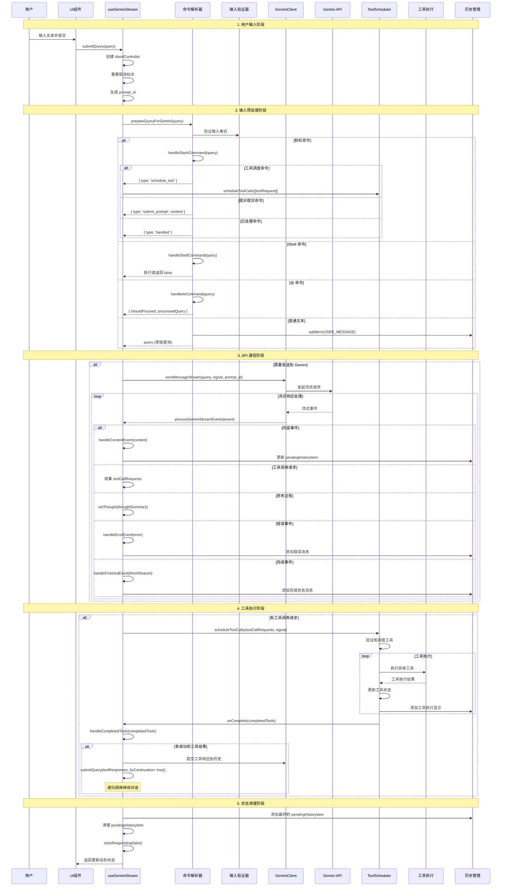
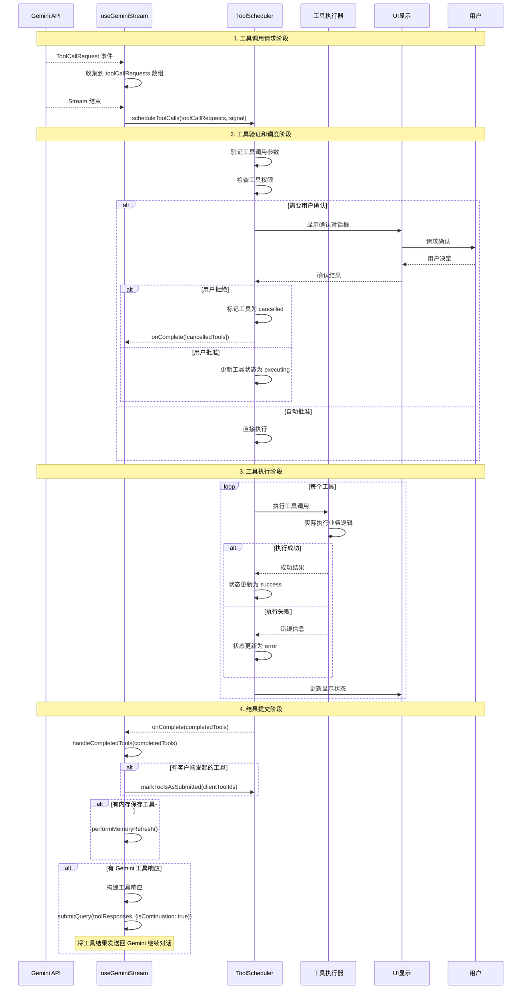
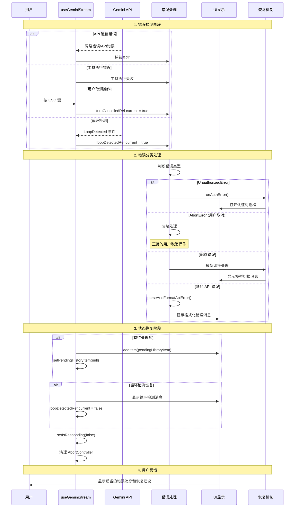
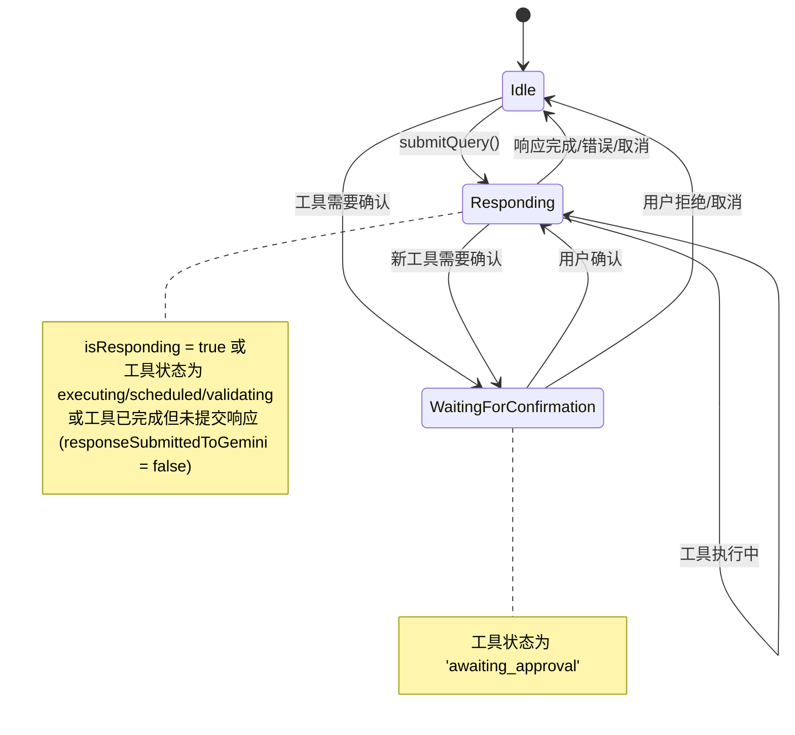

# useGeminiStream Hook 深度架构分析

## 概述

`useGeminiStream` 是 Gemini CLI 的核心 React Hook，负责管理 AI 流式对话、工具调用、用户交互和响应处理的完整生命周期。该 Hook 整合了用户输入处理、命令解析、API 流式通信、工具执行调度和 UI 状态管理，是整个 CLI 应用的核心协调器。

## 系统架构概览

### 核心组件关系

- **useGeminiStream**: 主 Hook，协调所有功能模块
- **GeminiClient**: 与 Google Gemini API 通信的客户端
- **useReactToolScheduler**: 工具调用管理和执行调度器
- **useShellCommandProcessor**: Shell 命令处理器
- **AtCommandProcessor**: @ 命令处理器
- **SlashCommandProcessor**: 斜杠命令处理器
- **StreamingState**: 流式状态管理枚举
- **HistoryManager**: 对话历史管理
- **ConsoleLogger**: 日志记录系统

### 数据流架构

```mermaid
graph TB
    subgraph "Input Layer"
        UI[用户输入]
        Slash[斜杠命令]
        At[@ 命令]
        Shell[Shell 命令]
    end
    
    subgraph "Processing Layer"
        UGS[useGeminiStream]
        Parser[命令解析器]
        Validator[输入验证器]
    end
    
    subgraph "Communication Layer"
        GC[GeminiClient]
        Stream[流式响应]
        Events[事件处理]
    end
    
    subgraph "Execution Layer"
        TS[ToolScheduler]
        Tools[工具执行]
        Results[结果处理]
    end
    
    subgraph "State Layer"
        History[对话历史]
        Pending[待处理项]
        Status[流式状态]
    end
    
    UI --> UGS
    Slash --> Parser
    At --> Parser
    Shell --> Parser
    Parser --> UGS
    Validator --> UGS
    UGS --> GC
    GC --> Stream
    Stream --> Events
    Events --> UGS
    UGS --> TS
    TS --> Tools
    Tools --> Results
    Results --> UGS
    UGS --> History
    UGS --> Pending
    UGS --> Status
```

## 完整交互流程分析

### 1. 用户输入到 AI 响应的完整流程



### 2. 工具调用生命周期管理



### 3. 错误处理和恢复机制



## 详细实现分析

### 1. Hook 初始化和依赖管理

#### 1.1 状态管理结构

```typescript
// 核心状态定义
const [initError, setInitError] = useState<string | null>(null);
const [isResponding, setIsResponding] = useState<boolean>(false);
const [thought, setThought] = useState<ThoughtSummary | null>(null);
const [pendingHistoryItemRef, setPendingHistoryItem] = useStateAndRef<HistoryItemWithoutId | null>(null);

// Ref 管理
const abortControllerRef = useRef<AbortController | null>(null);
const turnCancelledRef = useRef(false);
const processedMemoryToolsRef = useRef<Set<string>>(new Set());
const loopDetectedRef = useRef(false);
```

**状态设计特点**:
- **双重状态管理**: `useStateAndRef` 同时提供 state 和 ref 访问
- **取消控制**: `AbortController` 支持请求中断
- **内存优化**: 使用 `useRef` 存储不需要触发重渲染的数据
- **错误恢复**: 完整的错误状态跟踪

#### 1.2 依赖注入和服务初始化

```typescript
// 会话统计服务
const { startNewPrompt, getPromptCount } = useSessionStats();

// 日志服务
const logger = useLogger();

// Git 服务（条件性初始化）
const gitService = useMemo(() => {
  if (!config.getProjectRoot()) {
    return;
  }
  return new GitService(config.getProjectRoot());
}, [config]);

// 工具调度器初始化
const [toolCalls, scheduleToolCalls, markToolsAsSubmitted] = useReactToolScheduler(
  async (completedToolCallsFromScheduler) => {
    // 工具完成回调处理
  },
  config,
  setPendingHistoryItem,
  getPreferredEditor,
);
```

**依赖管理特色**:
- **懒加载**: Git 服务仅在有项目根目录时初始化
- **回调注入**: 工具调度器接收完成回调
- **服务解耦**: 各服务独立初始化，降低耦合度

### 2. 流式状态计算系统

#### 2.1 状态枚举定义

```typescript
enum StreamingState {
  Idle,                    // 空闲状态
  Responding,              // 响应中
  WaitingForConfirmation,  // 等待用户确认
}
```

#### 2.2 动态状态计算

```typescript
const streamingState = useMemo(() => {
  // 优先级1: 等待确认状态
  if (toolCalls.some((tc) => tc.status === 'awaiting_approval')) {
    return StreamingState.WaitingForConfirmation;
  }
  
  // 优先级2: 响应中状态
  if (
    isResponding ||
    toolCalls.some(
      (tc) =>
        tc.status === 'executing' ||
        tc.status === 'scheduled' ||
        tc.status === 'validating' ||
        ((tc.status === 'success' ||
          tc.status === 'error' ||
          tc.status === 'cancelled') &&
          !(tc as TrackedCompletedToolCall | TrackedCancelledToolCall)
            .responseSubmittedToGemini),
    )
  ) {
    return StreamingState.Responding;
  }
  
  // 默认: 空闲状态
  return StreamingState.Idle;
}, [isResponding, toolCalls]);
```

**状态计算逻辑**:
- **优先级排序**: 确认 > 响应 > 空闲
- **工具状态感知**: 考虑所有工具调用的状态
- **响应提交跟踪**: 区分工具完成和响应提交

### 3. 输入处理和命令预处理

#### 3.1 查询预处理管道

```typescript
const prepareQueryForGemini = useCallback(
  async (
    query: PartListUnion,
    userMessageTimestamp: number,
    abortSignal: AbortSignal,
    prompt_id: string,
  ): Promise<{
    queryToSend: PartListUnion | null;
    shouldProceed: boolean;
  }> => {
    // 1. 取消检查
    if (turnCancelledRef.current) {
      return { queryToSend: null, shouldProceed: false };
    }
    
    // 2. 空输入检查
    if (typeof query === 'string' && query.trim().length === 0) {
      return { queryToSend: null, shouldProceed: false };
    }

    let localQueryToSendToGemini: PartListUnion | null = null;

    if (typeof query === 'string') {
      const trimmedQuery = query.trim();
      
      // 3. 用户行为日志记录
      logUserPrompt(
        config,
        new UserPromptEvent(
          trimmedQuery.length,
          prompt_id,
          config.getContentGeneratorConfig()?.authType,
          trimmedQuery,
        ),
      );
      
      // 4. 斜杠命令处理
      const slashCommandResult = await handleSlashCommand(trimmedQuery);
      if (slashCommandResult) {
        return handleSlashCommandResult(slashCommandResult, prompt_id);
      }

      // 5. Shell 模式处理
      if (shellModeActive && handleShellCommand(trimmedQuery, abortSignal)) {
        return { queryToSend: null, shouldProceed: false };
      }

      // 6. @ 命令处理
      if (isAtCommand(trimmedQuery)) {
        const atCommandResult = await handleAtCommand({
          query: trimmedQuery,
          config,
          addItem,
          onDebugMessage,
          messageId: userMessageTimestamp,
          signal: abortSignal,
        });
        if (!atCommandResult.shouldProceed) {
          return { queryToSend: null, shouldProceed: false };
        }
        localQueryToSendToGemini = atCommandResult.processedQuery;
      } else {
        // 7. 普通查询处理
        addItem(
          { type: MessageType.USER, text: trimmedQuery },
          userMessageTimestamp,
        );
        localQueryToSendToGemini = trimmedQuery;
      }
    } else {
      // 8. 函数响应处理（工具调用返回值）
      localQueryToSendToGemini = query;
    }

    return { queryToSend: localQueryToSendToGemini, shouldProceed: true };
  },
  [config, addItem, onDebugMessage, handleShellCommand, handleSlashCommand, logger, shellModeActive, scheduleToolCalls],
);
```

**预处理管道特点**:
- **多层次验证**: 从简单验证到复杂命令处理
- **命令优先级**: 斜杠 > Shell > @ > 普通文本
- **状态追踪**: 完整的用户行为日志
- **中断支持**: 支持任意阶段的操作取消

### 4. 流式事件处理系统

#### 4.1 事件处理器架构

```typescript
const processGeminiStreamEvents = useCallback(
  async (
    stream: AsyncIterable<GeminiEvent>,
    userMessageTimestamp: number,
    signal: AbortSignal,
  ): Promise<StreamProcessingStatus> => {
    let geminiMessageBuffer = '';
    const toolCallRequests: ToolCallRequestInfo[] = [];
    
    for await (const event of stream) {
      switch (event.type) {
        case ServerGeminiEventType.Thought:
          setThought(event.value);
          break;
          
        case ServerGeminiEventType.Content:
          geminiMessageBuffer = handleContentEvent(
            event.value,
            geminiMessageBuffer,
            userMessageTimestamp,
          );
          break;
          
        case ServerGeminiEventType.ToolCallRequest:
          toolCallRequests.push(event.value);
          break;
          
        case ServerGeminiEventType.UserCancelled:
          handleUserCancelledEvent(userMessageTimestamp);
          break;
          
        case ServerGeminiEventType.Error:
          handleErrorEvent(event.value, userMessageTimestamp);
          break;
          
        case ServerGeminiEventType.LoopDetected:
          loopDetectedRef.current = true;
          break;
          
        // ... 其他事件类型
      }
    }
    
    // 批量调度工具调用
    if (toolCallRequests.length > 0) {
      scheduleToolCalls(toolCallRequests, signal);
    }
    
    return StreamProcessingStatus.Completed;
  },
  [handleContentEvent, handleUserCancelledEvent, handleErrorEvent, scheduleToolCalls],
);
```

#### 4.2 内容事件处理和消息分割

```typescript
const handleContentEvent = useCallback(
  (
    eventValue: ContentEvent['value'],
    currentGeminiMessageBuffer: string,
    userMessageTimestamp: number,
  ): string => {
    if (turnCancelledRef.current) {
      return '';
    }
    
    let newGeminiMessageBuffer = currentGeminiMessageBuffer + eventValue;
    
    // 消息类型初始化
    if (
      pendingHistoryItemRef.current?.type !== 'gemini' &&
      pendingHistoryItemRef.current?.type !== 'gemini_content'
    ) {
      if (pendingHistoryItemRef.current) {
        addItem(pendingHistoryItemRef.current, userMessageTimestamp);
      }
      setPendingHistoryItem({ type: 'gemini', text: '' });
      newGeminiMessageBuffer = eventValue;
    }
    
    // 性能优化的消息分割
    const splitPoint = findLastSafeSplitPoint(newGeminiMessageBuffer);
    if (splitPoint === newGeminiMessageBuffer.length) {
      // 继续累积内容
      setPendingHistoryItem((item) => ({
        type: item?.type as 'gemini' | 'gemini_content',
        text: newGeminiMessageBuffer,
      }));
    } else {
      // 分割长消息以优化渲染性能
      const beforeText = newGeminiMessageBuffer.substring(0, splitPoint);
      const afterText = newGeminiMessageBuffer.substring(splitPoint);
      
      addItem(
        {
          type: pendingHistoryItemRef.current?.type as 'gemini' | 'gemini_content',
          text: beforeText,
        },
        userMessageTimestamp,
      );
      setPendingHistoryItem({ type: 'gemini_content', text: afterText });
      newGeminiMessageBuffer = afterText;
    }
    
    return newGeminiMessageBuffer;
  },
  [addItem, pendingHistoryItemRef, setPendingHistoryItem],
);
```

**消息分割机制**:
- **性能考虑**: 避免单个组件渲染过长内容
- **安全分割**: `findLastSafeSplitPoint` 确保不破坏 Markdown 结构
- **静态渲染**: 分割后的前部分可以静态渲染，提高性能

### 5. 工具调用管理和生命周期

#### 5.1 工具完成处理

```typescript
const handleCompletedTools = useCallback(
  async (completedToolCallsFromScheduler: TrackedToolCall[]) => {
    if (isResponding) {
      return; // 防止在响应中处理工具完成
    }

    // 1. 筛选可提交的工具
    const completedAndReadyToSubmitTools = completedToolCallsFromScheduler.filter(
      (tc: TrackedToolCall): tc is TrackedCompletedToolCall | TrackedCancelledToolCall => {
        const isTerminalState =
          tc.status === 'success' ||
          tc.status === 'error' ||
          tc.status === 'cancelled';

        if (isTerminalState) {
          const completedOrCancelledCall = tc as TrackedCompletedToolCall | TrackedCancelledToolCall;
          return completedOrCancelledCall.response?.responseParts !== undefined;
        }
        return false;
      },
    );

    // 2. 处理客户端发起的工具
    const clientTools = completedAndReadyToSubmitTools.filter(
      (t) => t.request.isClientInitiated,
    );
    if (clientTools.length > 0) {
      markToolsAsSubmitted(clientTools.map((t) => t.request.callId));
    }

    // 3. 处理内存保存工具
    const newSuccessfulMemorySaves = completedAndReadyToSubmitTools.filter(
      (t) =>
        t.request.name === 'save_memory' &&
        t.status === 'success' &&
        !processedMemoryToolsRef.current.has(t.request.callId),
    );

    if (newSuccessfulMemorySaves.length > 0) {
      void performMemoryRefresh();
      newSuccessfulMemorySaves.forEach((t) =>
        processedMemoryToolsRef.current.add(t.request.callId),
      );
    }

    // 4. 处理 Gemini 工具
    const geminiTools = completedAndReadyToSubmitTools.filter(
      (t) => !t.request.isClientInitiated,
    );

    if (geminiTools.length === 0) {
      return;
    }

    // 5. 全部取消的特殊处理
    const allToolsCancelled = geminiTools.every((tc) => tc.status === 'cancelled');

    if (allToolsCancelled) {
      // 手动添加取消的工具响应到历史
      const responsesToAdd = geminiTools.flatMap(
        (toolCall) => toolCall.response.responseParts,
      );
      const combinedParts: Part[] = [];
      for (const response of responsesToAdd) {
        if (Array.isArray(response)) {
          combinedParts.push(...response);
        } else if (typeof response === 'string') {
          combinedParts.push({ text: response });
        } else {
          combinedParts.push(response);
        }
      }
      geminiClient.addHistory({
        role: 'user',
        parts: combinedParts,
      });
      markToolsAsSubmitted(geminiTools.map((toolCall) => toolCall.request.callId));
      return;
    }

    // 6. 正常工具响应提交
    const responsesToSend: PartListUnion[] = geminiTools.map(
      (toolCall) => toolCall.response.responseParts,
    );
    markToolsAsSubmitted(geminiTools.map((toolCall) => toolCall.request.callId));

    // 7. 递归提交继续对话
    if (!modelSwitchedFromQuotaError) {
      submitQuery(
        mergePartListUnions(responsesToSend),
        { isContinuation: true },
        geminiTools[0].request.prompt_id,
      );
    }
  },
  [
    isResponding,
    submitQuery,
    markToolsAsSubmitted,
    geminiClient,
    performMemoryRefresh,
    modelSwitchedFromQuotaError,
  ],
);
```

**工具处理特点**:
- **状态筛选**: 只处理真正完成的工具
- **分类处理**: 客户端工具、内存工具、Gemini 工具分别处理
- **去重机制**: 防止重复处理相同的内存保存工具
- **递归对话**: 工具完成后自动继续对话流程

### 6. 特殊事件处理函数

#### 6.1 完成原因处理

```typescript
const handleFinishedEvent = useCallback(
  (event: ServerGeminiFinishedEvent, userMessageTimestamp: number) => {
    const finishReason = event.value;

    const finishReasonMessages: Record<FinishReason, string | undefined> = {
      [FinishReason.FINISH_REASON_UNSPECIFIED]: undefined,
      [FinishReason.STOP]: undefined,
      [FinishReason.MAX_TOKENS]: 'Response truncated due to token limits.',
      [FinishReason.SAFETY]: 'Response stopped due to safety reasons.',
      [FinishReason.RECITATION]: 'Response stopped due to recitation policy.',
      [FinishReason.LANGUAGE]: 'Response stopped due to unsupported language.',
      [FinishReason.BLOCKLIST]: 'Response stopped due to forbidden terms.',
      [FinishReason.PROHIBITED_CONTENT]: 'Response stopped due to prohibited content.',
      [FinishReason.SPII]: 'Response stopped due to sensitive personally identifiable information.',
      [FinishReason.OTHER]: 'Response stopped for other reasons.',
      [FinishReason.MALFORMED_FUNCTION_CALL]: 'Response stopped due to malformed function call.',
      [FinishReason.IMAGE_SAFETY]: 'Response stopped due to image safety violations.',
      [FinishReason.UNEXPECTED_TOOL_CALL]: 'Response stopped due to unexpected tool call.',
    };

    const message = finishReasonMessages[finishReason];
    if (message) {
      addItem({
        type: 'info',
        text: `⚠️  ${message}`,
      }, userMessageTimestamp);
    }
  },
  [addItem],
);
```

**完成原因处理特点**:
- **全覆盖**: 处理所有可能的 `FinishReason` 枚举值
- **用户友好**: 将技术性的完成原因转换为用户可理解的消息
- **条件显示**: 只有需要用户注意的完成原因才显示消息
- **统一格式**: 使用警告emoji（⚠️）标识所有异常完成情况

### 7. 键盘交互和用户取消

#### 7.1 ESC 键取消机制

```typescript
useInput((_input, key) => {
  if (streamingState === StreamingState.Responding && key.escape) {
    if (turnCancelledRef.current) {
      return; // 防止重复取消
    }
    
    turnCancelledRef.current = true;
    abortControllerRef.current?.abort(); // 中止网络请求
    
    // 保存当前待处理项
    if (pendingHistoryItemRef.current) {
      addItem(pendingHistoryItemRef.current, Date.now());
    }
    
    // 添加取消消息
    addItem(
      {
        type: MessageType.INFO,
        text: 'Request cancelled.',
      },
      Date.now(),
    );
    
    // 清理状态
    setPendingHistoryItem(null);
    setIsResponding(false);
  }
});
```

**取消机制特点**:
- **状态检查**: 仅在响应状态下允许取消
- **重复防护**: 防止多次取消操作
- **网络中断**: 通过 AbortController 中止请求
- **状态清理**: 完整的状态重置和清理

### 8. 检查点和恢复系统

#### 8.1 可恢复工具调用保存

```typescript
useEffect(() => {
  const saveRestorableToolCalls = async () => {
    if (!config.getCheckpointingEnabled()) {
      return;
    }
    
    // 筛选可恢复的工具调用
    const restorableToolCalls = toolCalls.filter(
      (toolCall) =>
        (toolCall.request.name === 'replace' ||
          toolCall.request.name === 'write_file') &&
        toolCall.status === 'awaiting_approval',
    );

    if (restorableToolCalls.length > 0) {
      const checkpointDir = config.getProjectTempDir()
        ? path.join(config.getProjectTempDir(), 'checkpoints')
        : undefined;

      if (!checkpointDir) return;

      // 创建检查点目录
      try {
        await fs.mkdir(checkpointDir, { recursive: true });
      } catch (error) {
        if (!isNodeError(error) || error.code !== 'EEXIST') {
          onDebugMessage(`Failed to create checkpoint directory: ${getErrorMessage(error)}`);
          return;
        }
      }

      // 为每个工具调用创建检查点
      for (const toolCall of restorableToolCalls) {
        const filePath = toolCall.request.args['file_path'] as string;
        if (!filePath) continue;

        try {
          // 创建 Git 快照
          let commitHash = await gitService?.createFileSnapshot(
            `Snapshot for ${toolCall.request.name}`,
          );

          if (!commitHash) {
            commitHash = await gitService?.getCurrentCommitHash();
          }

          if (!commitHash) {
            onDebugMessage(`Failed to create snapshot for ${filePath}. Skipping restorable tool call.`);
            continue;
          }

          // 保存检查点文件
          const timestamp = new Date().toISOString().replace(/:/g, '-').replace(/\./g, '_');
          const toolName = toolCall.request.name;
          const fileName = path.basename(filePath);
          const toolCallWithSnapshotFileName = `${timestamp}-${fileName}-${toolName}.json`;
          const clientHistory = await geminiClient?.getHistory();
          const toolCallWithSnapshotFilePath = path.join(checkpointDir, toolCallWithSnapshotFileName);

          await fs.writeFile(
            toolCallWithSnapshotFilePath,
            JSON.stringify(
              {
                history,
                clientHistory,
                toolCall: {
                  name: toolCall.request.name,
                  args: toolCall.request.args,
                },
                commitHash,
                filePath,
              },
              null,
              2,
            ),
          );
        } catch (error) {
          onDebugMessage(`Failed to write restorable tool call file: ${getErrorMessage(error)}`);
        }
      }
    }
  };
  saveRestorableToolCalls();
}, [toolCalls, config, onDebugMessage, gitService, history, geminiClient]);
```

**检查点系统特点**:
- **选择性保存**: 仅保存文件操作相关的工具调用
- **Git 集成**: 创建 Git 快照以支持回滚
- **完整上下文**: 保存对话历史、工具调用参数等完整信息
- **错误容忍**: 单个检查点失败不影响其他操作

### 9. 内存管理和性能优化

#### 9.1 消息合并和分割策略

```typescript
export function mergePartListUnions(list: PartListUnion[]): PartListUnion {
  const resultParts: PartListUnion = [];
  for (const item of list) {
    if (Array.isArray(item)) {
      resultParts.push(...item);
    } else {
      resultParts.push(item);
    }
  }
  return resultParts;
}
```

#### 9.2 待处理项优化

```typescript
const pendingHistoryItems = [
  pendingHistoryItemRef.current,
  pendingToolCallGroupDisplay,
].filter((i) => i !== undefined && i !== null);
```

**性能优化策略**:
- **智能合并**: 避免创建过多的小消息片段
- **引用过滤**: 仅渲染有效的待处理项
- **状态最小化**: 减少不必要的状态更新

## 高级特性分析

### 1. 流式状态管理

#### 状态转换图



### 2. 错误处理策略

#### 2.1 错误分类处理

```typescript
// 错误处理优先级和策略
const errorHandlingStrategy = {
  UnauthorizedError: {
    priority: 'HIGH',
    action: 'onAuthError()', // 重新认证
    recovery: 'automatic',
  },
  AbortError: {
    priority: 'LOW',
    action: 'ignore', // 用户主动取消
    recovery: 'none',
  },
  QuotaError: {
    priority: 'MEDIUM',
    action: 'modelSwitch', // 切换模型
    recovery: 'automatic',
  },
  NetworkError: {
    priority: 'MEDIUM',
    action: 'displayError', // 显示错误
    recovery: 'manual',
  },
  LoopDetected: {
    priority: 'HIGH',
    action: 'stopExecution', // 停止执行
    recovery: 'manual',
  },
};
```

#### 2.2 错误恢复机制

```typescript
// 统一错误处理和恢复
const handleError = (error: Error, context: string) => {
  // 1. 错误日志记录
  console.error(`Error in ${context}:`, error);
  
  // 2. 状态清理
  setIsResponding(false);
  if (pendingHistoryItemRef.current) {
    addItem(pendingHistoryItemRef.current, Date.now());
    setPendingHistoryItem(null);
  }
  
  // 3. 用户反馈
  addItem(
    {
      type: MessageType.ERROR,
      text: parseAndFormatApiError(
        getErrorMessage(error),
        config.getContentGeneratorConfig()?.authType,
        undefined,
        config.getModel(),
        DEFAULT_GEMINI_FLASH_MODEL,
      ),
    },
    Date.now(),
  );
};
```

### 3. 内存和资源管理

#### 3.1 引用管理策略

```typescript
// 防止内存泄漏的引用管理
const cleanupRefs = useCallback(() => {
  // 清理 AbortController
  if (abortControllerRef.current) {
    abortControllerRef.current.abort();
    abortControllerRef.current = null;
  }
  
  // 重置标志位
  turnCancelledRef.current = false;
  loopDetectedRef.current = false;
  
  // 清理处理过的内存工具集合
  processedMemoryToolsRef.current.clear();
}, []);
```

#### 3.2 组件卸载清理

```typescript
// 组件卸载时的清理逻辑
useEffect(() => {
  return () => {
    cleanupRefs();
    // 取消所有进行中的工具调用
    // 清理事件监听器
    // 释放其他资源
  };
}, [cleanupRefs]);
```

## API 接口设计

### 1. Hook 接口定义

```typescript
export const useGeminiStream = (
  geminiClient: GeminiClient,                    // Gemini API 客户端
  history: HistoryItem[],                       // 对话历史
  addItem: UseHistoryManagerReturn['addItem'],  // 历史添加函数
  setShowHelp: React.Dispatch<React.SetStateAction<boolean>>, // 帮助显示控制
  config: Config,                               // 配置对象
  onDebugMessage: (message: string) => void,    // 调试消息回调
  handleSlashCommand: (cmd: PartListUnion) => Promise<SlashCommandProcessorResult | false>, // 斜杠命令处理器
  shellModeActive: boolean,                     // Shell 模式状态
  getPreferredEditor: () => EditorType | undefined, // 编辑器获取函数
  onAuthError: () => void,                      // 认证错误回调
  performMemoryRefresh: () => Promise<void>,    // 内存刷新函数
  modelSwitchedFromQuotaError: boolean,         // 配额错误标志
  setModelSwitchedFromQuotaError: React.Dispatch<React.SetStateAction<boolean>>, // 配额错误设置
) => {
  return {
    streamingState: StreamingState,             // 当前流式状态
    submitQuery: (query: PartListUnion, options?: { isContinuation: boolean }, prompt_id?: string) => Promise<void>, // 查询提交函数
    initError: string | null,                   // 初始化错误
    pendingHistoryItems: (HistoryItemWithoutId | undefined)[], // 待处理历史项
    thought: ThoughtSummary | null,             // 当前思考内容
  };
};
```

根据代码分析，`useGeminiStream` Hook 实际返回的对象结构为：

```typescript
return {
  streamingState,          // 当前流式状态 (StreamingState 枚举)
  submitQuery,             // 提交查询的函数
  initError,               // 初始化错误 (目前始终为 null)
  pendingHistoryItems,     // 待处理的历史项数组
  thought,                 // 当前的思考摘要
};
```

**返回值说明**:
- `streamingState`: 动态计算的当前流式状态
- `submitQuery`: 主要的查询提交函数，支持选项参数
- `initError`: 预留的初始化错误字段，当前实现中未使用
- `pendingHistoryItems`: 过滤后的待处理项数组，包含当前待处理项和工具组显示
- `thought`: 来自 Gemini 的思考过程摘要，可能为 null


### 2. 类型定义

```typescript
// 流式处理状态
enum StreamProcessingStatus {
  Completed,      // 处理完成
  UserCancelled,  // 用户取消
  Error,          // 处理错误
}

// 查询选项
interface QueryOptions {
  isContinuation: boolean; // 是否为继续对话
}

// 思考摘要
interface ThoughtSummary {
  content: string;
  confidence?: number;
}
```

## 扩展性和可维护性

### 1. 插件化支持

```typescript
// 可扩展的事件处理器
interface StreamEventHandler {
  type: ServerGeminiEventType;
  handler: (event: GeminiEvent, context: EventHandlerContext) => Promise<void>;
}

// 注册自定义事件处理器
const registerEventHandler = (handler: StreamEventHandler) => {
  eventHandlers.set(handler.type, handler.handler);
};
```

### 2. 中间件模式

```typescript
// 查询预处理中间件
interface QueryPreprocessor {
  process: (query: PartListUnion, context: QueryContext) => Promise<QueryProcessResult>;
  priority: number;
}

// 中间件链
const preprocessorChain: QueryPreprocessor[] = [
  slashCommandProcessor,
  shellCommandProcessor,
  atCommandProcessor,
].sort((a, b) => a.priority - b.priority);
```

### 3. 测试友好设计

```typescript
// 依赖注入支持测试
interface GeminiStreamDependencies {
  geminiClient: GeminiClient;
  logger: Logger;
  gitService?: GitService;
  toolScheduler: ToolScheduler;
}

// 测试用的 mock 实现
const createMockDependencies = (): GeminiStreamDependencies => ({
  geminiClient: new MockGeminiClient(),
  logger: new MockLogger(),
  toolScheduler: new MockToolScheduler(),
});
```

## 性能指标和监控

### 1. 关键性能指标

```typescript
// 性能监控指标
interface PerformanceMetrics {
  responseTime: number;        // 响应时间
  tokenCount: number;          // 令牌数量
  toolExecutionTime: number;   // 工具执行时间
  messageCount: number;        // 消息数量
  errorRate: number;           // 错误率
}

// 性能数据收集
const collectMetrics = (): PerformanceMetrics => {
  return {
    responseTime: Date.now() - requestStartTime,
    tokenCount: currentTokenCount,
    toolExecutionTime: totalToolExecutionTime,
    messageCount: history.length,
    errorRate: errorCount / totalRequests,
  };
};
```

### 2. 内存使用监控

```typescript
// 内存使用情况
const monitorMemoryUsage = () => {
  const memoryInfo = {
    historySize: history.length,
    pendingItemsCount: pendingHistoryItems.length,
    toolCallsCount: toolCalls.length,
    processedMemoryToolsCount: processedMemoryToolsRef.current.size,
  };
  
  // 内存清理建议
  if (memoryInfo.historySize > 1000) {
    console.warn('Large history detected, consider implementing history compression');
  }
};
```

## 最佳实践和使用建议

### 1. 错误处理最佳实践

```typescript
// 推荐的错误处理模式
const safeExecute = async <T>(
  operation: () => Promise<T>,
  fallback: T,
  context: string,
): Promise<T> => {
  try {
    return await operation();
  } catch (error) {
    console.error(`Error in ${context}:`, error);
    onDebugMessage(`Operation failed in ${context}: ${getErrorMessage(error)}`);
    return fallback;
  }
};
```

### 2. 状态管理最佳实践

```typescript
// 状态更新的原子性保证
const atomicStateUpdate = useCallback((updates: Partial<StreamState>) => {
  setState(prevState => ({
    ...prevState,
    ...updates,
    lastUpdated: Date.now(),
  }));
}, []);
```

### 3. 性能优化建议

```typescript
// 组件渲染优化
const OptimizedComponent = React.memo(({ items }: { items: HistoryItem[] }) => {
  // 仅渲染可见项
  const visibleItems = useMemo(
    () => items.slice(-50), // 最近50项
    [items]
  );
  
  return (
    <VirtualizedList
      items={visibleItems}
      renderItem={renderHistoryItem}
    />
  );
});
```

## 总结

### 系统优势

1. **完整的生命周期管理**: 从用户输入到 AI 响应的全流程覆盖
2. **强大的工具集成**: 与 React Tool Scheduler 的无缝集成
3. **健壮的错误处理**: 多层次的错误检测和恢复机制
4. **高性能设计**: 消息分割、状态优化、内存管理
5. **灵活的扩展性**: 中间件模式、插件化支持
6. **用户体验**: 流式响应、取消操作、进度反馈

### 技术创新

1. **流式状态计算**: 基于工具状态的动态状态计算
2. **智能消息分割**: 性能优化的消息渲染策略
3. **工具生命周期管理**: 完整的工具调用跟踪和状态管理
4. **检查点系统**: Git 集成的操作恢复机制
5. **多层次命令处理**: 斜杠、Shell、@ 命令的统一处理

### 架构特点

1. **单一职责**: 每个函数都有明确的职责边界
2. **依赖注入**: 通过参数注入外部依赖
3. **事件驱动**: 基于事件的异步处理模式
4. **状态分离**: 清晰的状态管理和数据流
5. **测试友好**: 易于模拟和测试的架构设计

`useGeminiStream` Hook 是 Gemini CLI 的核心组件，体现了现代 React 应用中复杂状态管理、异步处理和用户交互的最佳实践。其设计不仅满足了当前的功能需求，还为未来的功能扩展和性能优化提供了坚实的架构基础。