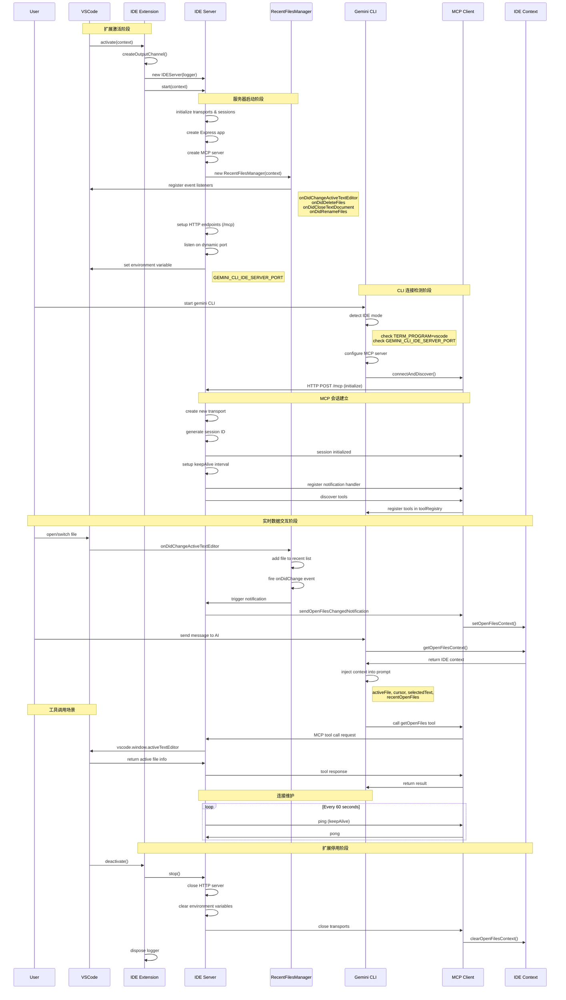
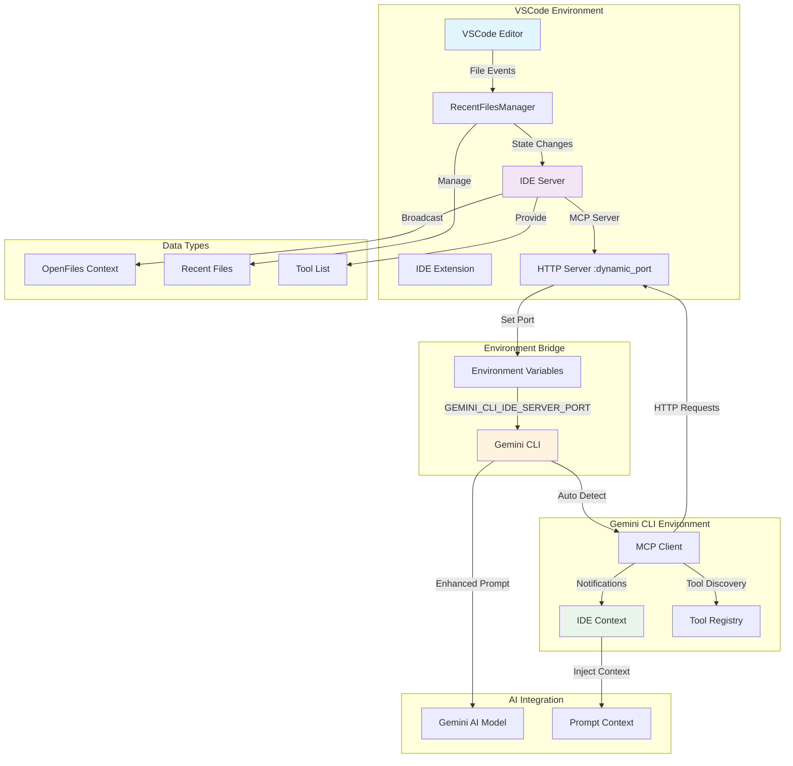
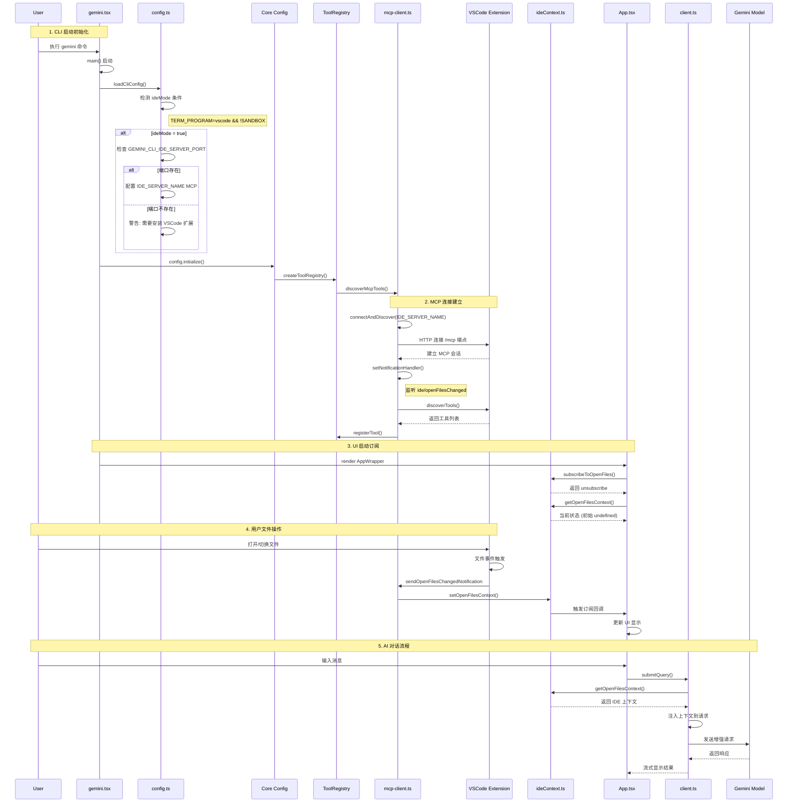

# VSCode IDE Companion 项目深度分析

## 项目概述

`@/vscode-ide-companion` 是 gemini-cli monorepo 中的一个核心组件，作为 VSCode 扩展提供了 IDE 与 Gemini CLI 之间的桥梁功能。该项目通过实现 Model Context Protocol (MCP) 服务器，使 Gemini CLI 能够感知并利用 IDE 的上下文信息，从而提供更智能、更个性化的 AI 辅助功能。

### 项目基本信息

- **包名**: `gemini-cli-vscode-ide-companion`
- **发布者**: Google
- **版本**: 0.1.13
- **VSCode 引擎**: ^1.101.0
- **激活方式**: `onStartupFinished`（IDE 启动时自动激活）

## 核心架构分析

### 1. 主要组件结构

#### 1.1 入口模块 (`extension.ts`)

```typescript
export async function activate(context: vscode.ExtensionContext) {
  logger = vscode.window.createOutputChannel('Gemini CLI IDE Companion');
  ideServer = new IDEServer(logger);
  await ideServer.start(context);
}

export function deactivate() {
  return ideServer.stop();
}
```

**功能职责**：
- 扩展生命周期管理
- 创建日志输出通道
- 初始化和启动 IDE 服务器
- 资源清理和优雅关闭

#### 1.2 IDE 服务器 (`IDEServer` 类)

**核心功能**：
- **MCP 服务器实现**: 基于 Model Context Protocol 提供标准化的通信接口
- **HTTP 服务器**: 使用 Express 框架提供 RESTful API 端点
- **会话管理**: 支持多客户端连接和会话隔离
- **文件状态同步**: 实时监控和广播 IDE 文件状态变化

**技术特点**：
```typescript
// MCP 服务器配置
const mcpServer = new McpServer(
  {
    name: 'gemini-cli-companion-mcp-server',
    version: '1.0.0',
  },
  { capabilities: { logging: {} } }
);

// HTTP 传输层
const transport = new StreamableHTTPServerTransport({
  sessionIdGenerator: () => randomUUID(),
  onsessioninitialized: (sessionId) => {
    transports[sessionId] = transport;
  }
});
```

#### 1.3 文件状态管理器 (`RecentFilesManager`)

**设计特点**：
- **LRU 缓存策略**: 最多保存 10 个最近访问的文件
- **时间过滤**: 只保留 5 分钟内访问的文件
- **事件驱动**: 监听文件打开、关闭、删除、重命名事件
- **自动清理**: 过期文件自动移除

**实现细节**：
```typescript
interface RecentFile {
  uri: vscode.Uri;
  timestamp: number;
}

export const MAX_FILES = 10;
export const MAX_FILE_AGE_MINUTES = 5;
```

**事件处理机制**：
```typescript
// 文件状态变化监听
const editorWatcher = vscode.window.onDidChangeActiveTextEditor(/* ... */);
const fileWatcher = vscode.workspace.onDidDeleteFiles(/* ... */);
const closeWatcher = vscode.workspace.onDidCloseTextDocument(/* ... */);
const renameWatcher = vscode.workspace.onDidRenameFiles(/* ... */);
```

### 2. 通信协议与集成

#### 2.1 MCP 协议集成

**端点配置**：
- **POST `/mcp`**: 处理 MCP 消息和工具调用
- **GET `/mcp`**: 处理会话请求和保持连接

**会话管理**：
```typescript
const MCP_SESSION_ID_HEADER = 'mcp-session-id';

// 会话初始化逻辑
if (!sessionId && isInitializeRequest(req.body)) {
  transport = new StreamableHTTPServerTransport({
    sessionIdGenerator: () => randomUUID(),
    // ...
  });
}
```

**保活机制**：
```typescript
const keepAlive = setInterval(() => {
  try {
    transport.send({ jsonrpc: '2.0', method: 'ping' });
  } catch (e) {
    clearInterval(keepAlive);
  }
}, 60000); // 每 60 秒发送心跳
```

#### 2.2 与主 CLI 的通信

**环境变量传递**：
```typescript
const IDE_SERVER_PORT_ENV_VAR = 'GEMINI_CLI_IDE_SERVER_PORT';

// 启动时设置端口信息
context.environmentVariableCollection.replace(
  IDE_SERVER_PORT_ENV_VAR,
  port.toString()
);
```

**主 CLI 侧集成**：
```typescript
// packages/cli/src/config/config.ts
if (ideMode) {
  const companionPort = process.env.GEMINI_CLI_IDE_SERVER_PORT;
  if (companionPort) {
    const httpUrl = `http://localhost:${companionPort}/mcp`;
    mcpServers[IDE_SERVER_NAME] = new MCPServerConfig(/* ... */);
  }
}
```

#### 2.3 实时状态通知

**文件状态广播**：
```typescript
function sendOpenFilesChangedNotification(
  transport: StreamableHTTPServerTransport,
  logger: vscode.OutputChannel,
  recentFilesManager: RecentFilesManager
) {
  const editor = vscode.window.activeTextEditor;
  const filePath = editor ? editor.document.uri.fsPath : '';
  
  const notification: JSONRPCNotification = {
    jsonrpc: '2.0',
    method: 'ide/openFilesChanged',
    params: {
      activeFile: filePath,
      recentOpenFiles: recentFilesManager.recentFiles,
    },
  };
  transport.send(notification);
}
```

## 工作流程深度分析

### 1. 完整生命周期概览

VSCode IDE Companion 的工作流程可以分为五个主要阶段：**扩展激活**、**服务器启动**、**CLI 连接**、**数据交互**和**资源清理**。每个阶段都有明确的职责和精心设计的错误处理机制。

### 2. 详细工作流程分析

#### 2.1 扩展激活阶段

**触发条件**：
- VSCode 启动完成后自动激活（`activationEvents: ["onStartupFinished"]`）
- 无需用户手动干预

**执行步骤**：
```typescript
export async function activate(context: vscode.ExtensionContext) {
  // 1. 创建专用日志通道
  logger = vscode.window.createOutputChannel('Gemini CLI IDE Companion');
  logger.appendLine('Starting Gemini CLI IDE Companion server...');
  
  // 2. 初始化 IDE 服务器实例
  ideServer = new IDEServer(logger);
  
  // 3. 启动服务器（异步操作）
  try {
    await ideServer.start(context);
  } catch (err) {
    const message = err instanceof Error ? err.message : String(err);
    logger.appendLine(`Failed to start IDE server: ${message}`);
  }
}
```

**关键特性**：
- **非阻塞启动**：即使服务器启动失败，扩展也不会阻止 VSCode 正常运行
- **详细日志记录**：所有关键步骤都有日志输出，便于问题诊断
- **优雅错误处理**：捕获并记录启动异常，不影响 IDE 稳定性

#### 2.2 服务器启动阶段

**核心组件初始化**：
```typescript
async start(context: vscode.ExtensionContext) {
  // 1. 保存上下文引用
  this.context = context;
  
  // 2. 初始化传输层管理
  const transports: { [sessionId: string]: StreamableHTTPServerTransport } = {};
  const sessionsWithInitialNotification = new Set<string>();
  
  // 3. 创建 Express 应用
  const app = express();
  app.use(express.json());
  
  // 4. 创建 MCP 服务器
  const mcpServer = createMcpServer();
  
  // 5. 初始化文件状态管理器
  const recentFilesManager = new RecentFilesManager(context);
}
```

**MCP 服务器配置**：
```typescript
const createMcpServer = () => {
  const server = new McpServer(
    {
      name: 'gemini-cli-companion-mcp-server',
      version: '1.0.0',
    },
    { capabilities: { logging: {} } }
  );
  
  // 注册核心工具
  server.registerTool('getOpenFiles', {
    description: '(IDE Tool) Get the path of the file currently active in VS Code.',
    inputSchema: {},
  }, async () => {
    // 实现获取当前活动文件的逻辑
  });
  
  return server;
};
```

**HTTP 端点配置**：
- **POST `/mcp`**：处理 MCP 协议消息、工具调用和会话初始化
- **GET `/mcp`**：处理会话维护和状态查询

**动态端口分配**：
```typescript
this.server = app.listen(0, () => {
  const address = (this.server as HTTPServer).address();
  if (address && typeof address !== 'string') {
    const port = address.port;
    // 通过环境变量向 CLI 传递端口信息
    context.environmentVariableCollection.replace(
      IDE_SERVER_PORT_ENV_VAR,
      port.toString()
    );
    this.logger.appendLine(`IDE server listening on port ${port}`);
  }
});
```

#### 2.3 文件状态监控机制

**事件监听器注册**：
```typescript
const recentFilesManager = new RecentFilesManager(context);

// 监听活动编辑器变化
const editorWatcher = vscode.window.onDidChangeActiveTextEditor((editor) => {
  if (editor) {
    this.add(editor.document.uri);
  }
});

// 监听文件系统事件
const fileWatcher = vscode.workspace.onDidDeleteFiles((event) => {
  for (const uri of event.files) {
    this.remove(uri);
  }
});

const closeWatcher = vscode.workspace.onDidCloseTextDocument((document) => {
  this.remove(document.uri);
});

const renameWatcher = vscode.workspace.onDidRenameFiles((event) => {
  for (const { oldUri, newUri } of event.files) {
    this.remove(oldUri, false);
    this.add(newUri);
  }
});
```

**状态变化广播**：
```typescript
const disposable = recentFilesManager.onDidChange(() => {
  // 向所有连接的传输层广播文件状态变化
  for (const transport of Object.values(transports)) {
    sendOpenFilesChangedNotification(
      transport,
      this.logger,
      recentFilesManager,
    );
  }
});
```

#### 2.4 CLI 连接检测与配置

**IDE 模式自动检测**：
```typescript
// packages/cli/src/config/config.ts
const ideMode =
  (argv.ideMode ?? settings.ideMode ?? false) &&
  !inSandbox() &&
  process.env.TERM_PROGRAM === 'vscode';
```

**连接配置生成**：
```typescript
if (ideMode) {
  const companionPort = process.env.GEMINI_CLI_IDE_SERVER_PORT;
  if (companionPort) {
    const httpUrl = `http://localhost:${companionPort}/mcp`;
    mcpServers[IDE_SERVER_NAME] = new MCPServerConfig(
      undefined, // command
      undefined, // args
      undefined, // env
      undefined, // cwd
      undefined, // url
      httpUrl, // httpUrl
      undefined, // headers
      undefined, // tcp
      undefined, // timeout
      false, // trust
      'IDE connection', // description
      undefined, // includeTools
      undefined, // excludeTools
    );
  }
}
```

#### 2.5 MCP 协议会话管理

**会话初始化**：
```typescript
app.post('/mcp', async (req: Request, res: Response) => {
  const sessionId = req.headers[MCP_SESSION_ID_HEADER] as string | undefined;
  
  if (!sessionId && isInitializeRequest(req.body)) {
    // 创建新会话
    transport = new StreamableHTTPServerTransport({
      sessionIdGenerator: () => randomUUID(),
      onsessioninitialized: (newSessionId) => {
        this.logger.appendLine(`New session initialized: ${newSessionId}`);
        transports[newSessionId] = transport;
      },
    });
    
    // 建立心跳机制
    const keepAlive = setInterval(() => {
      try {
        transport.send({ jsonrpc: '2.0', method: 'ping' });
      } catch (e) {
        clearInterval(keepAlive);
      }
    }, 60000);
    
    // 会话清理处理
    transport.onclose = () => {
      clearInterval(keepAlive);
      if (transport.sessionId) {
        sessionsWithInitialNotification.delete(transport.sessionId);
        delete transports[transport.sessionId];
      }
    };
    
    mcpServer.connect(transport);
  }
});
```

#### 2.6 实时数据同步

**上下文通知格式**：
```typescript
function sendOpenFilesChangedNotification(
  transport: StreamableHTTPServerTransport,
  logger: vscode.OutputChannel,
  recentFilesManager: RecentFilesManager
) {
  const editor = vscode.window.activeTextEditor;
  const filePath = editor ? editor.document.uri.fsPath : '';
  
  const notification: JSONRPCNotification = {
    jsonrpc: '2.0',
    method: 'ide/openFilesChanged',
    params: {
      activeFile: filePath,
      recentOpenFiles: recentFilesManager.recentFiles,
    },
  };
  transport.send(notification);
}
```

**CLI 端接收处理**：
```typescript
// packages/core/src/tools/mcp-client.ts
if (mcpServerName === IDE_SERVER_NAME) {
  mcpClient.setNotificationHandler(
    OpenFilesNotificationSchema,
    (notification) => {
      ideContext.setOpenFilesContext(notification.params);
    },
  );
}
```

### 3. 序列图：完整工作流程



### 4. 关键时序特性分析

#### 4.1 异步启动策略

**非阻塞设计原则**：
- VSCode 扩展激活采用异步模式，即使 IDE 服务器启动失败也不影响 IDE 正常运行
- 服务器启动过程中的错误会被捕获并记录，但不会抛出到 VSCode 主进程
- 动态端口分配确保与其他应用无冲突

**启动时序保证**：
```typescript
// 确保组件按正确顺序初始化
async start(context: vscode.ExtensionContext) {
  // 1. 先初始化核心组件
  const mcpServer = createMcpServer();
  const recentFilesManager = new RecentFilesManager(context);
  
  // 2. 建立事件监听机制
  const disposable = recentFilesManager.onDidChange(() => {
    // 状态变化处理逻辑
  });
  
  // 3. 最后启动网络服务器
  this.server = app.listen(0, () => {
    // 服务器就绪后设置环境变量
  });
}
```

#### 4.2 连接生命周期管理

**连接建立阶段**：
1. **环境检测**：CLI 检查 `TERM_PROGRAM` 和端口环境变量
2. **配置生成**：动态创建 MCP 服务器配置
3. **连接初始化**：发送 MCP 初始化请求
4. **会话建立**：分配唯一会话 ID，建立传输通道
5. **工具发现**：枚举可用工具并注册到工具注册表

**连接维护机制**：
```typescript
// 心跳保活
const keepAlive = setInterval(() => {
  try {
    transport.send({ jsonrpc: '2.0', method: 'ping' });
  } catch (e) {
    // 连接断开时自动清理资源
    clearInterval(keepAlive);
    // 清理会话状态
    sessionsWithInitialNotification.delete(sessionId);
    delete transports[sessionId];
  }
}, 60000);
```

**优雅断开处理**：
```typescript
transport.onclose = () => {
  clearInterval(keepAlive);
  if (transport.sessionId) {
    this.logger.appendLine(`Session closed: ${transport.sessionId}`);
    // 清理服务器端状态
    sessionsWithInitialNotification.delete(transport.sessionId);
    delete transports[transport.sessionId];
  }
};

// CLI 端错误处理
mcpClient.onerror = (error) => {
  console.error(`MCP ERROR (${mcpServerName}):`, error.toString());
  updateMCPServerStatus(mcpServerName, MCPServerStatus.DISCONNECTED);
  if (mcpServerName === IDE_SERVER_NAME) {
    ideContext.clearOpenFilesContext();
  }
};
```

#### 4.3 实时数据同步机制

**事件驱动架构**：
```typescript
// VSCode 事件 -> RecentFilesManager -> IDE Server -> MCP Client -> IDE Context
vscode.window.onDidChangeActiveTextEditor -> 
  recentFilesManager.add() -> 
  onDidChange.fire() -> 
  sendOpenFilesChangedNotification() -> 
  ideContext.setOpenFilesContext()
```

**数据一致性保证**：
- **原子性操作**：文件状态更新和通知发送在同一事务中完成
- **去重机制**：相同文件的重复添加会被合并，避免冗余通知
- **时间窗口控制**：只保留最近 5 分钟的文件记录，自动清理过期数据

#### 4.4 错误恢复与容错设计

**多层错误处理**：
```typescript
// 扩展级别
try {
  await ideServer.start(context);
} catch (err) {
  logger.appendLine(`Failed to start IDE server: ${message}`);
}

// 服务器级别
try {
  await transport.handleRequest(req, res, req.body);
} catch (error) {
  this.logger.appendLine(`Error handling MCP request: ${errorMessage}`);
  if (!res.headersSent) {
    res.status(500).json({ /* 标准错误响应 */ });
  }
}

// 传输级别
const keepAlive = setInterval(() => {
  try {
    transport.send({ jsonrpc: '2.0', method: 'ping' });
  } catch (e) {
    clearInterval(keepAlive); // 自动清理
  }
}, 60000);
```

**故障隔离策略**：
- **组件独立性**：各组件失败不会影响其他组件正常运行
- **资源清理**：确保异常情况下的资源释放和状态重置
- **日志完整性**：详细记录所有关键操作和错误状态

### 5. 性能优化时序

#### 5.1 启动性能优化

**延迟初始化**：
- 只有在检测到 IDE 模式时才启动服务器
- 使用动态端口避免端口冲突检测开销
- 异步组件初始化减少阻塞时间

**资源预分配**：
```typescript
// 预先创建传输层容器
const transports: { [sessionId: string]: StreamableHTTPServerTransport } = {};
const sessionsWithInitialNotification = new Set<string>();
```

#### 5.2 运行时性能优化

**批量通知机制**：
```typescript
// 文件状态变化时向所有连接批量发送通知
const disposable = recentFilesManager.onDidChange(() => {
  for (const transport of Object.values(transports)) {
    sendOpenFilesChangedNotification(transport, this.logger, recentFilesManager);
  }
});
```

**智能缓存策略**：
- LRU 算法管理最近文件列表
- 时间窗口自动清理过期数据
- 增量更新减少数据传输量

### 6. 数据流架构图

为了更清晰地展示数据在各组件间的流动，下面是系统的数据流架构图：



### 7. 完整集成流程分析

基于对源码的深入分析，VSCode IDE Companion 与 Gemini CLI 的完整集成流程包含以下关键阶段：

#### 7.1 CLI 启动与配置检测阶段

**1. gemini.tsx 启动流程**：
```typescript
export async function main() {
  const workspaceRoot = process.cwd();
  const settings = loadSettings(workspaceRoot);
  const argv = await parseArguments();
  const extensions = loadExtensions(workspaceRoot);
  
  // 关键：创建配置对象
  const config = await loadCliConfig(settings.merged, extensions, sessionId, argv);
  
  // 初始化配置，触发工具发现
  await config.initialize();
}
```

**2. config.ts 中的 ideMode 检测逻辑**：
```typescript
const ideMode =
  (argv.ideMode ?? settings.ideMode ?? false) &&
  process.env.TERM_PROGRAM === 'vscode' &&
  !process.env.SANDBOX;

if (ideMode) {
  const companionPort = process.env.GEMINI_CLI_IDE_SERVER_PORT;
  if (companionPort) {
    // 配置 IDE MCP 服务器
    mcpServers[IDE_SERVER_NAME] = new MCPServerConfig(/* ... */);
  } else {
    logger.warn('Could not connect to IDE. Make sure you have the companion VS Code extension installed...');
  }
}
```

**检测条件详解**：
- `ideMode` 设置或命令行参数启用
- 运行环境必须是 VSCode (`TERM_PROGRAM === 'vscode'`)
- 不在沙盒模式下运行 (`!process.env.SANDBOX`)
- VSCode 扩展必须已启动并设置端口环境变量

#### 7.2 工具注册表初始化阶段

**Core Config 的 initialize 流程**：
```typescript
async initialize(): Promise<void> {
  this.getFileService();
  if (this.getCheckpointingEnabled()) {
    await this.getGitService();
  }
  // 关键：创建工具注册表并发现工具
  this.toolRegistry = await this.createToolRegistry();
}

async createToolRegistry(): Promise<ToolRegistry> {
  const registry = new ToolRegistry(this);
  // 注册核心工具
  registerCoreTool(LSTool, this);
  registerCoreTool(ReadFileTool, this);
  // ... 其他核心工具
  
  // 发现 MCP 工具
  await registry.discoverTools();
  return registry;
}
```

**tool-registry.ts 的发现流程**：
```typescript
async discoverTools(): Promise<void> {
  // 清理之前发现的工具
  for (const tool of this.tools.values()) {
    if (tool instanceof DiscoveredTool || tool instanceof DiscoveredMCPTool) {
      this.tools.delete(tool.name);
    }
  }
  
  await this.discoverAndRegisterToolsFromCommand();
  
  // 发现 MCP 服务器工具
  await discoverMcpTools(
    this.config.getMcpServers() ?? {},
    this.config.getMcpServerCommand(),
    this,
    this.config.getDebugMode(),
  );
}
```

#### 7.3 MCP 连接建立与工具发现

**mcp-client.ts 的连接流程**：
```typescript
export async function connectAndDiscover(
  mcpServerName: string,
  mcpServerConfig: MCPServerConfig,
  toolRegistry: ToolRegistry,
  debugMode: boolean,
): Promise<void> {
  updateMCPServerStatus(mcpServerName, MCPServerStatus.CONNECTING);
  
  const mcpClient = await connectToMcpServer(mcpServerName, mcpServerConfig, debugMode);
  updateMCPServerStatus(mcpServerName, MCPServerStatus.CONNECTED);
  
  // 设置错误处理
  mcpClient.onerror = (error) => {
    console.error(`MCP ERROR (${mcpServerName}):`, error.toString());
    updateMCPServerStatus(mcpServerName, MCPServerStatus.DISCONNECTED);
    if (mcpServerName === IDE_SERVER_NAME) {
      ideContext.clearOpenFilesContext();
    }
  };
  
  // 关键：为 IDE 服务器设置通知处理器
  if (mcpServerName === IDE_SERVER_NAME) {
    mcpClient.setNotificationHandler(
      OpenFilesNotificationSchema,
      (notification) => {
        ideContext.setOpenFilesContext(notification.params);
      },
    );
  }
  
  // 发现并注册工具
  const tools = await discoverTools(mcpServerName, mcpServerConfig, mcpClient);
  for (const tool of tools) {
    toolRegistry.registerTool(tool);
  }
}
```

#### 7.4 UI 订阅与状态同步

**App.tsx 中的订阅逻辑**：
```typescript
const [openFiles, setOpenFiles] = useState<OpenFiles | undefined>();

useEffect(() => {
  // 订阅 IDE 上下文变化
  const unsubscribe = ideContext.subscribeToOpenFiles(setOpenFiles);
  // 设置初始值
  setOpenFiles(ideContext.getOpenFilesContext());
  return unsubscribe;
}, []);
```

**ideContext.ts 的状态管理**：
```typescript
function setOpenFilesContext(newOpenFiles: OpenFiles): void {
  openFilesContext = newOpenFiles;
  notifySubscribers(); // 通知所有订阅者
}

function subscribeToOpenFiles(subscriber: OpenFilesSubscriber): () => void {
  subscribers.add(subscriber);
  return () => {
    subscribers.delete(subscriber);
  };
}
```

#### 7.5 AI 对话时的上下文注入

**client.ts 中的上下文增强**：
```typescript
if (this.config.getIdeMode()) {
  const openFiles = ideContext.getOpenFilesContext();
  if (openFiles) {
    const contextParts: string[] = [];
    
    // 构建活动文件信息
    if (openFiles.activeFile) {
      contextParts.push(
        `This is the file that the user was most recently looking at:\n- Path: ${openFiles.activeFile}`
      );
      if (openFiles.cursor) {
        contextParts.push(
          `This is the cursor position in the file:\n- Cursor Position: Line ${openFiles.cursor.line}, Character ${openFiles.cursor.character}`
        );
      }
      if (openFiles.selectedText) {
        contextParts.push(
          `This is the selected text in the active file:\n- ${openFiles.selectedText}`
        );
      }
    }
    
    // 构建最近文件列表
    if (openFiles.recentOpenFiles && openFiles.recentOpenFiles.length > 0) {
      const recentFiles = openFiles.recentOpenFiles
        .map((file) => `- ${file.filePath}`)
        .join('\n');
      contextParts.push(
        `Here are files the user has recently opened, with the most recent at the top:\n${recentFiles}`
      );
    }
    
    // 将上下文注入到请求中
    if (contextParts.length > 0) {
      request = [
        { text: contextParts.join('\n') },
        ...(Array.isArray(request) ? request : [request]),
      ];
    }
  }
}
```

#### 7.6 扩展安装与故障排除

**ideCommand.ts 的安装流程**：
```typescript
{
  name: 'install',
  action: async (context) => {
    // 检查 VSCode 是否安装
    if (!isVSCodeInstalled()) {
      context.ui.addItem({
        type: 'error',
        text: `VS Code command-line tool "${VSCODE_COMMAND}" not found in your PATH.`,
      }, Date.now());
      return;
    }
    
    // 查找 VSIX 文件
    let vsixFiles = glob.sync(path.join(bundleDir, '*.vsix'));
    if (vsixFiles.length === 0) {
      // 开发环境中查找
      vsixFiles = glob.sync(devPath);
    }
    
    // 执行安装
    const command = `${VSCODE_COMMAND} --install-extension ${vsixPath} --force`;
    child_process.execSync(command, { stdio: 'pipe' });
    
    context.ui.addItem({
      type: 'info',
      text: 'VS Code companion extension installed successfully. Restart gemini-cli in a fresh terminal window.',
    }, Date.now());
  },
}
```

### 8. 完整集成时序图

以下是基于源码分析的完整集成时序图：



### 9. 关键数据结构流转

#### 9.1 OpenFiles 上下文数据

**数据结构定义**：
```typescript
interface OpenFiles {
  activeFile: string;                    // 当前活动文件路径
  selectedText?: string;                 // 选中的文本内容
  cursor?: {                            // 光标位置
    line: number;
    character: number;
  };
  recentOpenFiles?: Array<{             // 最近文件列表
    filePath: string;
    timestamp: number;
  }>;
}
```

**数据流转路径**：
1. **VSCode → RecentFilesManager**: 文件操作事件触发状态更新
2. **RecentFilesManager → IDEServer**: 状态变化触发通知机制
3. **IDEServer → MCP Client**: JSON-RPC 通知传输
4. **MCP Client → IDE Context**: 上下文数据存储
5. **IDE Context → Gemini CLI**: 提示词注入增强

#### 9.2 MCP 工具调用数据

**工具调用请求格式**：
```json
{
  "jsonrpc": "2.0",
  "id": "unique_request_id",
  "method": "tools/call",
  "params": {
    "name": "getOpenFiles",
    "arguments": {}
  }
}
```

**工具响应格式**：
```json
{
  "jsonrpc": "2.0",
  "id": "unique_request_id",
  "result": {
    "content": [
      {
        "type": "text",
        "text": "Active file: /path/to/current/file.ts"
      }
    ]
  }
}
```

#### 9.3 状态通知数据

**IDE 状态变化通知**：
```json
{
  "jsonrpc": "2.0",
  "method": "ide/openFilesChanged",
  "params": {
    "activeFile": "/Users/developer/project/src/main.ts",
    "recentOpenFiles": [
      {
        "filePath": "/Users/developer/project/src/main.ts",
        "timestamp": 1703123456789
      },
      {
        "filePath": "/Users/developer/project/src/utils.ts",
        "timestamp": 1703123446789
      }
    ]
  }
}
```

## 在 Monorepo 中的作用

### 1. 智能上下文提供

#### 1.1 文件上下文感知

**当前活动文件信息**：
- 文件路径
- 光标位置（行号和列号）
- 选中的文本内容

**最近文件历史**：
- 最近 5 分钟内访问的文件列表
- 文件访问时间戳
- 自动过期清理

#### 1.2 上下文注入机制

在主 CLI 的 `client.ts` 中，IDE 上下文被自动注入到用户提示中：

```typescript
if (this.config.getIdeMode()) {
  const openFiles = ideContext.getOpenFilesContext();
  if (openFiles) {
    const contextParts: string[] = [];
    
    // 活动文件信息
    if (openFiles.activeFile) {
      contextParts.push(
        `This is the file that the user was most recently looking at:\n- Path: ${openFiles.activeFile}`
      );
      
      // 光标位置
      if (openFiles.cursor) {
        contextParts.push(
          `This is the cursor position in the file:\n- Cursor Position: Line ${openFiles.cursor.line}, Character ${openFiles.cursor.character}`
        );
      }
      
      // 选中文本
      if (openFiles.selectedText) {
        contextParts.push(
          `This is the selected text in the active file:\n- ${openFiles.selectedText}`
        );
      }
    }
    
    // 最近文件列表
    if (openFiles.recentOpenFiles && openFiles.recentOpenFiles.length > 0) {
      const recentFiles = openFiles.recentOpenFiles
        .map((file) => `- ${file.filePath}`)
        .join('\n');
      contextParts.push(
        `Here are files the user has recently opened, with the most recent at the top:\n${recentFiles}`
      );
    }
  }
}
```

### 2. MCP 工具注册

#### 2.1 内置工具

**`getOpenFiles` 工具**：
```typescript
server.registerTool(
  'getOpenFiles',
  {
    description: '(IDE Tool) Get the path of the file currently active in VS Code.',
    inputSchema: {},
  },
  async () => {
    const activeEditor = vscode.window.activeTextEditor;
    const filePath = activeEditor ? activeEditor.document.uri.fsPath : '';
    
    if (filePath) {
      return {
        content: [{ type: 'text', text: `Active file: ${filePath}` }],
      };
    } else {
      return {
        content: [
          {
            type: 'text',
            text: 'No file is currently active in the editor.',
          },
        ],
      };
    }
  }
);
```

#### 2.2 工具发现与连接

主 CLI 通过 MCP 客户端自动发现和连接 IDE 服务器：

```typescript
// packages/core/src/tools/mcp-client.ts
export async function connectAndDiscover(
  mcpServerName: string,
  mcpServerConfig: MCPServerConfig,
  toolRegistry: ToolRegistry,
  debugMode: boolean
): Promise<void> {
  // ...
  
  if (mcpServerName === IDE_SERVER_NAME) {
    mcpClient.setNotificationHandler(
      OpenFilesNotificationSchema,
      (notification) => {
        ideContext.setOpenFilesContext(notification.params);
      },
    );
  }
  
  const tools = await discoverTools(mcpServerName, mcpServerConfig, mcpClient);
  for (const tool of tools) {
    toolRegistry.registerTool(tool);
  }
}
```

### 3. IDE 模式激活条件

#### 3.1 自动检测机制

```typescript
// packages/cli/src/config/config.ts
const ideMode =
  (argv.ideMode ?? settings.ideMode ?? false) &&
  !inSandbox() &&
  process.env.TERM_PROGRAM === 'vscode';
```

**激活条件**：
1. 用户显式启用 `ideMode` 或命令行参数指定
2. 不在沙盒模式下运行
3. 运行环境为 VSCode 集成终端 (`TERM_PROGRAM === 'vscode'`)
4. IDE Companion 扩展已安装并运行

#### 3.2 连接状态管理

**状态监控**：
```typescript
// packages/cli/src/ui/commands/ideCommand.ts
export const ideCommand = (config: Config | null): SlashCommand | null => {
  return {
    subCommands: [
      {
        name: 'status',
        action: () => {
          const status = getMCPServerStatus(IDE_SERVER_NAME);
          switch (status) {
            case MCPServerStatus.CONNECTED:
              return { content: `🟢 Connected` };
            case MCPServerStatus.CONNECTING:
              return { content: `🔄 Initializing...` };
            case MCPServerStatus.DISCONNECTED:
            default:
              return { content: `🔴 Disconnected` };
          }
        },
      },
    ],
  };
};
```

## 技术栈与构建系统

### 1. 开发技术栈

#### 1.1 核心依赖

**运行时依赖**：
```json
{
  "@modelcontextprotocol/sdk": "^1.15.1",  // MCP 协议实现
  "cors": "^2.8.5",                        // 跨域支持
  "express": "^5.1.0",                     // HTTP 服务器
  "zod": "^3.25.76"                        // 数据验证
}
```

**开发依赖**：
```json
{
  "@types/vscode": "^1.101.0",             // VSCode API 类型定义
  "esbuild": "^0.25.3",                    // 构建工具
  "typescript": "^5.8.3",                  // TypeScript 编译器
  "vitest": "^3.2.4"                       // 测试框架
}
```

#### 1.2 TypeScript 配置

**独立配置策略**：
```json
{
  "compilerOptions": {
    "module": "NodeNext",
    "moduleResolution": "NodeNext",
    "target": "ES2022",
    "lib": ["ES2022", "dom"],
    "sourceMap": true,
    "rootDir": "src",
    "strict": true
  }
}
```

**设计考虑**：
- 不继承根配置，因为 VSCode 扩展环境特殊
- 使用现代 ES Modules 支持
- 包含 DOM 类型以支持可能的 webview 交互
- 严格类型检查确保扩展稳定性

### 2. 构建与打包系统

#### 2.1 ESBuild 配置

```javascript
// esbuild.js
const ctx = await esbuild.context({
  entryPoints: ['src/extension.ts'],
  bundle: true,
  format: 'cjs',                    // CommonJS 格式（VSCode 要求）
  minify: production,
  sourcemap: !production,
  platform: 'node',
  outfile: 'dist/extension.js',
  external: ['vscode'],             // VSCode API 外部化
  plugins: [esbuildProblemMatcherPlugin],
});
```

**关键特性**：
- **单文件打包**: 将所有依赖打包成单个 `extension.js`
- **VSCode API 外部化**: 避免打包 VSCode 内置 API
- **问题匹配器**: 集成 VSCode 的构建问题检测
- **开发模式**: 支持 watch 模式和 source map

#### 2.2 构建脚本

```json
{
  "scripts": {
    "vscode:prepublish": "npm run check-types && npm run lint && node esbuild.js --production",
    "build": "npm run compile",
    "compile": "npm run check-types && npm run lint && node esbuild.js",
    "watch": "npm-run-all -p watch:*",
    "watch:esbuild": "node esbuild.js --watch",
    "watch:tsc": "tsc --noEmit --watch --project tsconfig.json",
    "package": "vsce package --no-dependencies"
  }
}
```

**流水线说明**：
1. **类型检查**: `tsc --noEmit` 验证类型正确性
2. **代码质量**: ESLint 检查代码规范
3. **构建打包**: ESBuild 生成最终产物
4. **扩展打包**: `vsce` 生成 `.vsix` 安装包

### 3. 开发调试支持

#### 3.1 VSCode 调试配置

```json
// .vscode/launch.json
{
  "configurations": [
    {
      "name": "Run Extension",
      "type": "extensionHost",
      "request": "launch",
      "args": ["--extensionDevelopmentPath=${workspaceFolder}"],
      "outFiles": ["${workspaceFolder}/out/**/*.js"],
      "preLaunchTask": "${defaultBuildTask}"
    }
  ]
}
```

**调试流程**：
1. 自动执行预构建任务
2. 启动扩展开发宿主
3. 加载当前工作区的扩展代码
4. 支持断点调试和热重载

#### 3.2 构建任务配置

```json
// .vscode/tasks.json
{
  "tasks": [
    {
      "type": "npm",
      "script": "watch",
      "problemMatcher": "$tsc-watch",
      "isBackground": true,
      "group": {
        "kind": "build",
        "isDefault": true
      }
    }
  ]
}
```

## 测试策略与质量保证

### 1. 单元测试架构

#### 1.1 测试框架选择

**Vitest 配置优势**：
- 与 ESBuild 生态系统集成良好
- 原生 TypeScript 支持
- 快速的热重载和并行执行
- Jest 兼容 API

#### 1.2 Mock 策略

**VSCode API Mock**：
```typescript
vi.mock('vscode', () => ({
  EventEmitter: vi.fn(() => ({
    event: vi.fn(),
    fire: vi.fn(),
    dispose: vi.fn(),
  })),
  window: {
    onDidChangeActiveTextEditor: vi.fn(),
  },
  workspace: {
    onDidDeleteFiles: vi.fn(),
    onDidCloseTextDocument: vi.fn(),
    onDidRenameFiles: vi.fn(),
  },
  Uri: {
    file: (path: string) => ({ fsPath: path }),
  },
}));
```

**测试隔离策略**：
- 每个测试用例独立的 `ExtensionContext`
- 自动清理 Mock 状态
- 时间控制测试（`vi.useFakeTimers()`）

#### 1.3 核心测试场景

**RecentFilesManager 测试覆盖**：

```typescript
describe('RecentFilesManager', () => {
  // 基本功能测试
  it('adds a file to the list', () => { /* ... */ });
  it('moves an existing file to the top', () => { /* ... */ });
  it('does not exceed the max number of files', () => { /* ... */ });
  
  // 事件处理测试
  it('fires onDidChange when a file is added', () => { /* ... */ });
  it('removes a file when it is closed', () => { /* ... */ });
  it('removes a file when it is deleted', () => { /* ... */ });
  it('updates the file when it is renamed', () => { /* ... */ });
  
  // 时间相关测试
  it('prunes files older than the max age', () => {
    vi.useFakeTimers();
    // 测试文件过期清理逻辑
    vi.useRealTimers();
  });
});
```

### 2. 集成测试策略

#### 2.1 与主 CLI 的集成验证

**连接状态测试**：
```typescript
// packages/cli/src/config/config.test.ts
describe('loadCliConfig ideMode', () => {
  it('should be true when settings.ideMode is true and TERM_PROGRAM is vscode', () => {
    process.env.TERM_PROGRAM = 'vscode';
    process.env.GEMINI_CLI_IDE_SERVER_PORT = '3000';
    const settings: Settings = { ideMode: true };
    expect(config.getIdeMode()).toBe(true);
  });
  
  it('should add _ide_server when ideMode is true', () => {
    // 验证 MCP 服务器配置正确添加
  });
});
```

#### 2.2 MCP 协议兼容性测试

**工具注册验证**：
- 验证 `getOpenFiles` 工具正确注册
- 测试 MCP 消息格式兼容性
- 验证会话管理逻辑

### 3. 持续集成与代码质量

#### 3.1 CI/CD 流水线

```json
{
  "test": "vitest run",
  "test:ci": "vitest run --coverage"
}
```

**质量门禁**：
1. TypeScript 编译检查
2. ESLint 代码规范检查
3. 单元测试覆盖率要求
4. 构建产物验证

#### 3.2 代码覆盖率

**覆盖率配置**：
- 使用 V8 提供商进行覆盖率收集
- 生成多种格式报告（HTML、JSON、LCOV）
- PR 中自动展示覆盖率变化

## 部署与发布流程

### 1. 扩展打包

#### 1.1 VSIX 生成

```bash
npm run package  # 执行 vsce package --no-dependencies
```

**打包配置**：
```json
// .vscodeignore
**
!dist/
../
../../
!LICENSE
!assets/
```

**包含内容**：
- 编译后的 `dist/extension.js`
- 扩展图标 `assets/icon.png`
- 许可证文件
- 包元数据

#### 1.2 版本管理

**语义化版本控制**：
- 当前版本：0.1.13
- 主版本：重大架构变更
- 次版本：新功能添加
- 修订版本：错误修复

### 2. 发布渠道

#### 2.1 VSCode Marketplace

**发布配置**：
```json
{
  "publisher": "google",
  "repository": {
    "type": "git",
    "url": "https://github.com/google-gemini/gemini-cli.git",
    "directory": "packages/vscode-ide-companion"
  }
}
```

#### 2.2 企业内部分发

**本地安装支持**：
```bash
code --install-extension gemini-cli-vscode-ide-companion-0.1.13.vsix
```

## 性能优化与监控

### 1. 性能优化策略

#### 1.1 内存管理

**文件缓存优化**：
```typescript
// 限制缓存大小和时间
export const MAX_FILES = 10;
export const MAX_FILE_AGE_MINUTES = 5;

// 自动清理过期文件
get recentFiles(): Array<{ filePath: string; timestamp: number }> {
  const now = Date.now();
  const maxAgeInMs = MAX_FILE_AGE_MINUTES * 60 * 1000;
  return this.files
    .filter((file) => now - file.timestamp < maxAgeInMs)
    .map((file) => ({
      filePath: file.uri.fsPath,
      timestamp: file.timestamp,
    }));
}
```

#### 1.2 网络优化

**连接复用**：
- 单一 HTTP 服务器处理多个会话
- WebSocket 长连接减少握手开销
- 心跳机制维持连接活性

**数据压缩**：
- 最小化传输的文件信息
- 只传输必要的上下文数据
- 增量更新而非全量同步

#### 1.3 构建优化

**ESBuild 优化**：
```javascript
{
  bundle: true,           // 减少文件数量
  minify: production,     // 生产环境压缩
  external: ['vscode'],   // 避免重复打包
  format: 'cjs',         // 兼容 VSCode 要求
}
```

### 2. 监控与诊断

#### 2.1 日志系统

**结构化日志**：
```typescript
export async function activate(context: vscode.ExtensionContext) {
  logger = vscode.window.createOutputChannel('Gemini CLI IDE Companion');
  logger.appendLine('Starting Gemini CLI IDE Companion server...');
  // ...
}
```

**日志级别**：
- 启动/关闭事件
- 连接状态变化
- 错误和异常信息
- 性能关键路径

#### 2.2 错误处理

**健壮性设计**：
```typescript
try {
  await transport.handleRequest(req, res, req.body);
} catch (error) {
  const errorMessage = error instanceof Error ? error.message : 'Unknown error';
  this.logger.appendLine(`Error handling MCP request: ${errorMessage}`);
  if (!res.headersSent) {
    res.status(500).json({
      jsonrpc: '2.0',
      error: { code: -32603, message: 'Internal server error' },
      id: null,
    });
  }
}
```

**故障恢复**：
- 自动重连机制
- 优雅降级处理
- 资源清理保证

## 未来发展方向

### 1. 功能扩展

#### 1.1 更丰富的上下文信息

**潜在增强**：
- 当前项目的 Git 状态
- 运行中的调试会话信息
- 终端命令历史
- 工作区文件结构

#### 1.2 更多 IDE 支持

**扩展方向**：
- IntelliJ IDEA 插件
- Vim/Neovim 集成
- Emacs 支持
- 通用 LSP 适配器

### 2. 技术演进

#### 2.1 协议升级

**MCP 协议增强**：
- 更高效的二进制协议
- 流式数据传输
- 批量操作支持

#### 2.2 性能优化

**架构改进**：
- WebAssembly 核心组件
- 更智能的缓存策略
- 多线程处理支持

### 3. 集成深化

#### 3.1 AI 模型集成

**本地模型支持**：
- 客户端推理能力
- 隐私保护增强
- 离线工作模式

#### 3.2 工具链集成

**开发工具生态**：
- CI/CD 平台集成
- 项目管理工具连接
- 代码审查系统对接

## 总结

VSCode IDE Companion 项目在 gemini-cli monorepo 中扮演着关键的桥梁角色，通过以下方式显著提升了 AI 辅助开发的体验：

### 核心价值

1. **智能上下文感知**: 自动收集和传递 IDE 状态信息，使 AI 能够提供更精准的建议
2. **无缝集成体验**: 用户无需手动配置，扩展自动检测并建立与 CLI 的连接
3. **实时状态同步**: 文件变化、光标移动等状态实时反映给 AI 系统
4. **标准化通信**: 基于 MCP 协议确保与其他工具的兼容性

### 技术优势

1. **现代化架构**: 使用 TypeScript + ESBuild + Vitest 构建的高质量代码库
2. **性能优化**: 智能缓存、连接复用、增量更新等优化策略
3. **健壮性设计**: 完善的错误处理、日志记录、资源管理机制
4. **开发友好**: 完整的调试支持、热重载、自动化测试

### 生态系统贡献

1. **扩展 AI 能力边界**: 为 Gemini CLI 提供丰富的 IDE 上下文
2. **提升开发效率**: 减少手动信息输入，提高 AI 响应准确性
3. **促进标准化**: 推动 MCP 协议在 IDE 集成中的应用
4. **模块化设计**: 为其他 IDE 的类似集成提供参考架构

该项目体现了现代软件开发中 AI 与传统开发工具深度融合的趋势，为开发者提供了更智能、更高效的编程助手体验。 